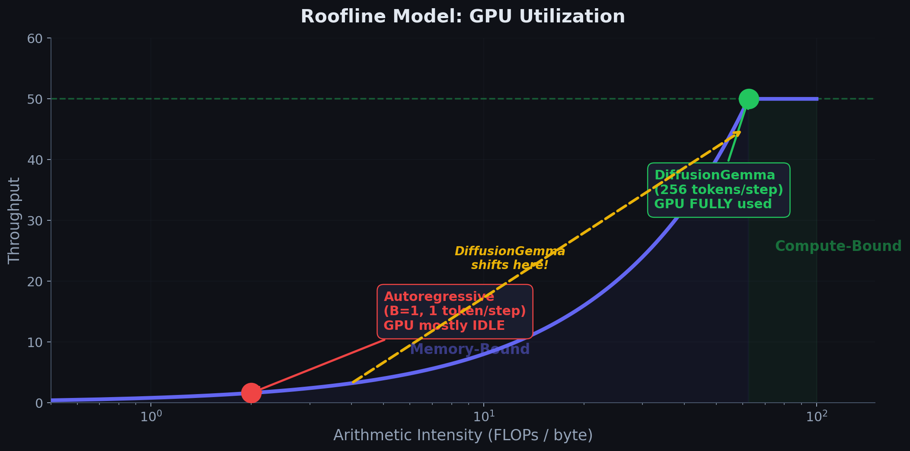

# Chapter 1: Autoregressive vs. Diffusion — Why a New Paradigm?


---

## 1.1 How Autoregressive LLMs Generate Text

An autoregressive language model generates text **one token at a time**, left to right. Given a prompt $x_{1:n}$, it predicts:

$$
p(x_{n+1} \mid x_1, x_2, \ldots, x_n)
$$

The full sequence probability factorizes as:

$$
p(x_1, x_2, \ldots, x_N) = \prod_{i=1}^{N} p(x_i \mid x_1, \ldots, x_{i-1})
$$

```
  Step 1        Step 2        Step 3        Step 4
┌─────────┐  ┌─────────┐  ┌─────────┐  ┌─────────┐
│  "The"  │  │  "The"  │  │  "The"  │  │  "The"  │
│         │→ │  "cat"  │→ │  "cat"  │→ │  "cat"  │
│         │  │         │  │  "sat"  │  │  "sat"  │
│         │  │         │  │         │  │  "on"   │
└─────────┘  └─────────┘  └─────────┘  └─────────┘
  1 token      2 tokens     3 tokens     4 tokens
```

Each forward pass through the model produces **exactly one new token**. To generate $N$ tokens, you need $N$ sequential forward passes.

---

## 1.2 The Memory-Bound Bottleneck

### The Arithmetic Intensity Problem

Modern GPUs have two key resources:

| Resource | What it measures |
|----------|-----------------|
| **Compute** (FLOPS) | How fast the chip can multiply matrices |
| **Memory bandwidth** (GB/s) | How fast it can load model weights from HBM |

The **arithmetic intensity** of an operation is:

$$
\text{Arithmetic Intensity} = \frac{\text{FLOPs (computation)}}{\text{Bytes loaded from memory}}
$$

For a single autoregressive decoding step with batch size $B$:
- **Weights loaded**: $W$ bytes (entire model, loaded once per step)
- **Computation**: $O(B \times d_{\text{model}}^2)$ FLOPs per layer (matrix-vector multiply)
- **Arithmetic intensity**: $\propto \frac{B \cdot d^2}{W}$

When $B = 1$ (single user), the arithmetic intensity is **extremely low**. The GPU spends most of its time **waiting for weights to arrive from memory**, not computing.

### The Roofline Model



The roofline model visualizes this tradeoff:

```
  Throughput
  (FLOPS)
       │
  Peak ┤·····························─────────────────
       │                           ╱
       │                         ╱
       │                       ╱   Compute-Bound
       │                     ╱     Region
       │    Memory-Bound   ╱
       │    Region       ╱
       │               ╱
       │             ╱
       │           ╱
       │         ╱
       │       ╱
       │     ╱
       │   ╱
       │ ╱
       ├──────────────────────────────────────────────
       │          ↑                Arithmetic Intensity
       │     Ridge Point
       │   (B ≈ 256 for
       │    typical GPUs)
```

**Key insight**: For a single user ($B = 1$), autoregressive decoding sits deep in the memory-bound region. The GPU is **massively underutilized**.

### Quantifying the Waste

For a model with $P$ parameters in float16:

$$
\text{Time per token (memory-bound)} = \frac{2P \text{ bytes}}{\text{Memory Bandwidth (bytes/s)}}
$$

For a model with $P = 26 \times 10^9$ parameters on a TPU v5e with ~800 GB/s bandwidth:

$$
\text{Time per token} = \frac{2 \times 26 \times 10^9}{800 \times 10^9} \approx 65 \text{ ms}
$$

But the actual compute needed for $B=1$ is a tiny fraction of what the chip can do. The GPU could handle $B = 256$ users in roughly the same time:

$$
\text{Time per token}(B=256) \approx \text{Time per token}(B=1)
$$

This means **~255/256 of the compute capacity is wasted** for a single user!

### Detailed Latency Calculation

The roofline model tells us *why* autoregressive decoding is slow; let's quantify *how* slow with a concrete example: generating **256 tokens** on a single GPU/TPU.

#### Autoregressive Model (Gemma 4 26B)

Each decoding step must load the full model weights from HBM before doing a tiny amount of matrix math:

$$
\text{Weight loading time per step} = \frac{2 \times 26 \times 10^9 \text{ bytes}}{800 \times 10^9 \text{ bytes/s}} \approx 65 \text{ ms}
$$

For 256 tokens generated sequentially:

$$
\text{Base time} = 256 \times 65 \text{ ms} = 16{,}640 \text{ ms} \approx 16.6 \text{ seconds}
$$

But this is a **lower bound**. The KV cache grows with each step, so attention cost increases:

| Step $i$ | Tokens in KV cache | Extra attention overhead |
|----------|-------------------|--------------------------|
| 1 | 1 | negligible |
| 64 | 64 | ~6.4 ms |
| 128 | 128 | ~12.8 ms |
| 256 | 256 | ~25.6 ms |

A more precise estimate accounts for this growing attention cost:

$$
\text{Total time} \approx \sum_{i=1}^{256} \left(65 + 0.1 \cdot i\right) \text{ ms} = 16{,}640 + 0.1 \times \frac{256 \times 257}{2} \approx 16{,}640 + 3{,}289 \approx 20{,}000 \text{ ms}
$$

**Final estimate: ~20 seconds** to generate 256 tokens for a single user on a TPU v5e-class accelerator.

```
  AR latency breakdown (256 tokens, single user):

  Weight loading:  ████████████████████████████████  16.6s  (83%)
  KV attention:    ██████                             3.3s  (17%)
                   ─────────────────────────────────────────
  Total:                                              ~20s
```

#### DiffusionGemma (Same Hardware, Same User)

DiffusionGemma processes **all 256 tokens simultaneously** at each step. This changes the arithmetic intensity dramatically:

- **Each step**: Full model forward pass over $L = 256$ tokens
- **Batch-like behavior**: $B_{\text{eff}} = 256$ even for one user
- **Compute-bound**: The GPU finally does real work instead of waiting on memory

Naively, one might think each step costs $256 \times 65$ ms. But because all 256 tokens share the same weight load, the per-step cost is closer to a **single** weight load plus compute for 256 positions:

$$
\text{Time per step} \approx 65 \text{ ms (weights)} + 35 \text{ ms (attention over 256 tokens)} \approx 100 \text{ ms}
$$

With $S = 16$ diffusion steps:

$$
\text{Total time} = 16 \times 100 \text{ ms} = 1{,}600 \text{ ms} \approx 1.6 \text{ seconds}
$$

**Speedup: ~10× for a single user** ($20 \text{ s} / 1.6 \text{ s} \approx 12.5\times$, conservatively quoted as ~10×).

```
  Side-by-side (256 tokens, 1 user, Gemma 4 26B class):

  Autoregressive:  ●●●●●●●●●●●●●●●●●●●●  ~20 seconds
  DiffusionGemma:  ●●                    ~1.6 seconds
                   └─ 10× faster ─┘
```

| Metric | Autoregressive | DiffusionGemma |
|--------|----------------|----------------|
| Forward passes | 256 | 16 |
| Tokens per pass | 1 | 256 |
| Bottleneck | Memory (weight loading) | Compute (fully utilized) |
| Latency (256 tokens) | ~20 s | ~1.6 s |
| Speedup | 1× | **~10×** |

> **Caveat**: These are illustrative numbers for a single user on one accelerator. Multi-user batching narrows the AR gap (see Section 1.6). But for latency-critical single-user scenarios — local inference, edge devices, interactive applications — the diffusion advantage is decisive.

---

## 1.3 The DiffusionGemma Insight

**What if we used that idle compute for a single user?**

Instead of generating 1 token per step for 256 users, generate **256 tokens per step for 1 user**.

```
  ┌──────────────────────────────────────────────────┐
  │              AUTOREGRESSIVE (B=256)               │
  │                                                    │
  │  User 1:  [tok₁]                                  │
  │  User 2:  [tok₁]                                  │
  │  User 3:  [tok₁]        1 token × 256 users       │
  │    ...       ...         = 256 tokens total        │
  │  User 256: [tok₁]                                 │
  └──────────────────────────────────────────────────┘

                        vs.

  ┌──────────────────────────────────────────────────┐
  │              DIFFUSION (B=1, L=256)               │
  │                                                    │
  │  User 1:  [tok₁ tok₂ tok₃ ... tok₂₅₆]           │
  │                                                    │
  │           256 tokens × 1 user                      │
  │           = 256 tokens total                       │
  └──────────────────────────────────────────────────┘
```

Same compute budget, radically different allocation!

---

## 1.4 How Diffusion Generates Text (High-Level)

DiffusionGemma starts with a **canvas** of $L = 256$ random tokens and refines them over $S$ steps:

```
  Step 0 (Pure Noise):
  ┌───┬───┬───┬───┬───┬───┬───┬───┬───┬───┐
  │ @ │ % │ z │ ! │ q │ ∆ │ 9 │ ¥ │ m │ & │  ... (256 random tokens)
  └───┴───┴───┴───┴───┴───┴───┴───┴───┴───┘

  Step 1 (First refinement):
  ┌───┬───┬───┬───┬───┬───┬───┬───┬───┬───┐
  │The│cat│ z │on │ q │mat│ 9 │ ¥ │ m │ . │
  └───┴───┴───┴───┴───┴───┴───┴───┴───┴───┘
       ✓   ✓       ✓       ✓               ✓   (some tokens corrected)

  Step 2 (Second refinement):
  ┌───┬───┬───┬───┬───┬───┬───┬───┬───┬───┐
  │The│cat│sat│on │the│mat│and│ ¥ │ m │ . │
  └───┴───┴───┴───┴───┴───┴───┴───┴───┴───┘
                                               (more tokens corrected)

  Step S (Converged):
  ┌───┬───┬───┬───┬───┬───┬───┬───┬───┬───┐
  │The│cat│sat│on │the│mat│and│pu-│rr-│ed.│
  └───┴───┴───┴───┴───┴───┴───┴───┴───┴───┘
                                               (all tokens finalized)
```

### Comparison: Steps vs. Tokens

| Model | Forward Passes | Tokens Generated | Ratio |
|-------|----------------|------------------|-------|
| Autoregressive | $N$ | $N$ | 1:1 |
| DiffusionGemma | $S$ (e.g. 8–64) | $L = 256$ | 1:32 to 1:4 |

For 256 tokens with $S = 16$ steps, DiffusionGemma uses **16x fewer forward passes** than an autoregressive model.

### The Quality-Speed Tradeoff

Fewer forward passes is only half the story. The number of diffusion steps $S$ creates a **quality–speed knob** that autoregressive models don't have:

- **More steps $S$** → better quality, but slower
- **Fewer steps $S$** → faster, but lower quality

Autoregressive models have no equivalent dial: you always need exactly $N$ steps for $N$ tokens. DiffusionGemma can stop early when the canvas has converged.

**Approximate quality vs. steps** (illustrative, task-dependent):

| Steps $S$ | Quality (approx.) | Time (at ~100 ms/step) |
|-----------|-------------------|------------------------|
| 4 | 70% | 400 ms |
| 8 | 85% | 800 ms |
| 16 | 95% | 1.6 s |
| 32 | 99% | 3.2 s |
| 64 | 99.5% | 6.4 s |

```
  Quality
  (%) │
  100 ┤                              ╭────────  diminishing returns
   99 ┤                         ╭────╯
   95 ┤                    ╭────╯
   85 ┤              ╭────╯
   70 ┤         ╭────╯
      ┤    ╭────╯
      └────┴────┴────┴────┴────┴────┴────┴── Steps (S)
           4    8   16   32   64
```

**Key insight: diminishing returns.** Most tokens converge in the first few steps. Steps 17–64 polish the last few uncertain positions. This is why **adaptive stopping** is so powerful: if 240 of 256 tokens are already stable after step 8, why burn 8 more full passes?

DiffusionGemma's adaptive stopping monitors per-token confidence and halts refinement when the canvas is "good enough." In practice:

$$
\text{Effective steps} \ll S_{\max} \quad \text{for most prompts}
$$

This means the real latency is often closer to the $S = 8$ row (~800 ms) than the $S = 16$ row (~1.6 s), while retaining $S = 16$-level quality. The quality–speed curve is not fixed — it bends further with adaptive stopping.

| Strategy | Steps used | Quality | Time |
|----------|-----------|---------|------|
| Fixed $S = 16$ | 16 | 95% | 1.6 s |
| Fixed $S = 8$ | 8 | 85% | 800 ms |
| Adaptive (avg.) | ~10 | ~93% | ~1.0 s |

Compare to autoregressive: **no knob at all** — 256 tokens always costs 256 passes and ~20 seconds, regardless of how "easy" the completion is.

---


## 1.5 Fundamental Tradeoffs

```
┌──────────────────────┬────────────────────┬────────────────────────┐
│     Property         │   Autoregressive   │    DiffusionGemma      │
├──────────────────────┼────────────────────┼────────────────────────┤
│ Tokens per step      │        1           │        L (256)         │
│ Forward passes for   │        N           │     S ≪ N              │
│   N tokens           │                    │                        │
│ Single-user latency  │     High           │     Low                │
│ Multi-user throughput│     High           │     Lower              │
│ Compute utilization  │     Low (B=1)      │     High               │
│ Hardware bottleneck  │   Memory-bound     │   Compute-bound        │
│ Self-correction      │     No             │     Yes (re-noising)   │
│ Attention type       │     Causal         │   Bidirectional        │
│ Generation order     │   Left-to-right    │   All-at-once          │
└──────────────────────┴────────────────────┴────────────────────────┘
```

### The Self-Correction Advantage

Perhaps the most underappreciated advantage of diffusion is **self-correction**: the ability to revise tokens that were "wrong" in an earlier step. Autoregressive models are irrevocably committed to every token they emit.

#### A Concrete Example

**Prompt**: *"Write a sentence about the ocean."*

**Step 1** (first refinement — canvas still noisy, but structure emerging):

```
┌─────┬─────┬─────┬─────┬─────┬─────┬─────┬─────┬─────┬─────┐
│ The │ cat │ sat │ on  │ the │ rug │ and │play-│ ed  │  .  │
└─────┴─────┴─────┴─────┴─────┴─────┴─────┴─────┴─────┴─────┘
  ✓           ✓                 ✗     ✗     ✗
```

The model has produced a grammatically plausible sentence — but it's about a **cat on a rug**, not the ocean. Early diffusion steps often latch onto high-frequency patterns ("The cat sat on...") before the prompt fully propagates.

**Step 2** (bidirectional attention sees the full canvas + prompt):

The model attends to **all 256 positions simultaneously**. It sees:
- The prompt says "ocean"
- "rug" and "played" contradict the prompt
- "The" and "sat" are fine scaffolding

```
┌─────┬─────┬─────┬─────┬─────┬─────┬──────┬────────┬─────┬─────┐
│ The │ cat │ sat │ on  │ the │shore│ and  │crashed │waves│  .  │
└─────┴─────┴─────┴─────┴─────┴─────┴──────┴────────┴─────┴─────┘
  ✓           ✓                 ✓ FIXED  ✓ FIXED  ✓ FIXED
```

**Corrections made**:
- `rug` → `shore` (context-appropriate)
- `played` → `crashed` (ocean-appropriate verb)
- Added `waves` (completes the ocean theme)

**Step 3** (polish):

```
┌─────┬─────┬──────┬─────┬─────┬──────┬─────┬────────┬──────┬─────┐
│ The │ cat │ sat  │ on  │ the │shore │ and │watched │waves │crash│
└─────┴─────┴──────┴─────┴─────┴──────┴─────┴────────┴──────┴─────┘
```

Final output: *"The cat sat on the shore and watched waves crash."* — coherent, prompt-aligned, self-corrected.

#### What Would Autoregressive Do?

In an AR model, generation is left-to-right and **irreversible**:

```
  Step 1:  "The"
  Step 2:  "The cat"
  Step 3:  "The cat sat"
  Step 4:  "The cat sat on"
  Step 5:  "The cat sat on the"
  Step 6:  "The cat sat on the rug"    ← committed! can't undo
  Step 7:  "The cat sat on the rug and"
  Step 8:  "The cat sat on the rug and played"  ← wrong, but stuck
```

Once "rug" is generated at step 6, the model **cannot go back**. Causal attention means token 6 never sees tokens 7–256. The best it can do is steer the *remaining* tokens toward damage control ("...but then walked to the ocean"), producing an awkward sentence.

```
  AR:   The → cat → sat → on → the → rug → and → played
                                      ↑
                                   POINT OF NO RETURN

  Diffusion:
        Step 1:  ... rug ... played ...     (wrong)
        Step 2:  ... shore ... crashed ...  (corrected!)
                   ↑ bidirectional re-evaluation
```

#### Why Bidirectional Attention Enables This

| Property | Autoregressive | DiffusionGemma |
|----------|----------------|----------------|
| Attention | Causal (left only) | Bidirectional (full canvas) |
| Token commitment | Immediate, permanent | Deferred until convergence |
| Error recovery | Impossible (can only compensate forward) | Native (re-noise and refine) |
| Global coherence | Local (each token sees only prefix) | Global (each token sees everything) |

Self-correction is not a bug workaround — it is a **fundamental architectural advantage** of the diffusion paradigm. The model gets multiple passes over the full sequence, each time with complete context, gradually sculpting noise into coherent text.

---

## 1.6 When to Use Which?

- **Autoregressive**: Serving **many users** simultaneously (chatbots, API endpoints). Memory-bound decoding is amortized across large batch sizes.
- **Diffusion**: Serving a **single user** with maximum speed (local inference, edge devices, latency-critical applications). Compute-bound generation exploits all available hardware.

### Historical Context

Diffusion for language did not appear overnight. It emerged from a decade of image diffusion research, then adapted to discrete state spaces:

```
  Timeline: From Pixels to Tokens
  ═══════════════════════════════════════════════════════════════

  2020 ──●── DDPM (Ho et al.)
         │    Denoising diffusion for images. Gaussian noise,
         │    ε-prediction, ELBO training. The foundation.
         │
  2021 ──●── D3PM (Austin et al.)
         │    First discrete diffusion. Transition matrices
         │    over categorical states. Proved diffusion works
         │    beyond continuous spaces.
         │
  2024 ──●── MDLM (Sahoo et al.)
         │    Masked diffusion for language. Absorbing state
         │    "[MASK]" as noise. Simple, scalable training.
         │
  2024 ──●── UDLM (Ou et al.)
         │    Uniform state diffusion. All tokens equally
         │    likely as noise — no special mask token.
         │
  2025 ──●── Block Diffusion (Arriola et al.)
         │    Multi-canvas generation. Blocks of tokens
         │    refined in parallel with cross-block attention.
         │
  2025 ──●── DiffusionGemma
              First practical diffusion LLM at scale.
              Gemma architecture + discrete diffusion +
              adaptive stopping. Production-ready latency.
```

| Year | Work | Key Contribution |
|------|------|------------------|
| 2020 | DDPM (Ho et al.) | Gaussian diffusion, noise prediction, image generation |
| 2021 | D3PM (Austin et al.) | Discrete state spaces, transition matrices |
| 2024 | MDLM (Sahoo et al.) | Masked diffusion language models |
| 2024 | UDLM (Ou et al.) | Uniform noise for discrete diffusion |
| 2025 | Block Diffusion (Arriola et al.) | Multi-canvas parallel refinement |
| 2025 | DiffusionGemma | Scaled diffusion LLM with practical inference speed |

**The arc**: Each step removed a barrier:
1. **DDPM** proved diffusion generates high-quality samples (images)
2. **D3PM** proved it works on discrete/categorical data (theoretical)
3. **MDLM / UDLM** proved it works for text (small-scale experiments)
4. **Block Diffusion** proved parallel canvas refinement scales
5. **DiffusionGemma** proved it works at LLM scale with competitive latency

DiffusionGemma stands on this lineage. It doesn't replace the autoregressive paradigm — it complements it, optimized for a different point on the latency–throughput spectrum. The historical thread from Ho et al. (2020) to DiffusionGemma (2025) is the story of taking a beautiful image-generation idea and patiently adapting it until it could compete with GPT-class models on text.

---

**Next**: [02_Diffusion_Fundamentals/01_forward_diffusion.md](../../02_Diffusion_Fundamentals/01_forward_diffusion/) — The mathematical foundations of diffusion.
