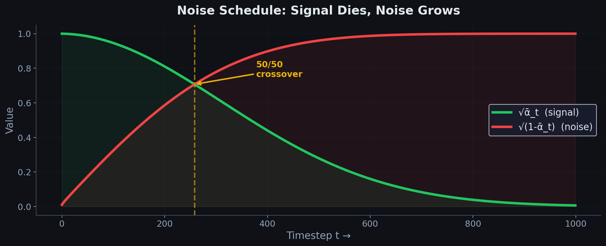

# Chapter 2.1: Forward Diffusion — Adding Noise Mathematically

> *"To learn to denoise, first learn to noise."*


---

## 2.1.1 The Core Idea

Forward diffusion is a **fixed** (non-learned) process that gradually destroys data by adding noise. Starting from clean data $x_0$, we produce a sequence of increasingly noisy versions:

$$
x_0 \rightarrow x_1 \rightarrow x_2 \rightarrow \cdots \rightarrow x_T
$$

where $x_T$ is approximately pure noise.

```
  x₀ (clean)     x₁           x₂           ...        x_T (noise)
  ┌──────────┐  ┌──────────┐  ┌──────────┐           ┌──────────┐
  │ 🖼️ Clear │→│ Slightly │→│  More    │→  ...  →│  Pure    │
  │  Image   │  │  Fuzzy   │  │  Fuzzy   │           │  Static  │
  └──────────┘  └──────────┘  └──────────┘           └──────────┘
       ↓              ↓             ↓                      ↓
   Signal: 100%   Signal: 90%  Signal: 75%           Signal: ~0%
   Noise:  0%     Noise:  10%  Noise:  25%           Noise:  ~100%
```

---

## 2.1.2 Mathematical Formulation

### The Noise Schedule

We define a **variance schedule** $\{\beta_1, \beta_2, \ldots, \beta_T\}$ where each $\beta_t \in (0, 1)$. Typical values: $\beta_1 = 10^{-4}$, $\beta_T = 0.02$.

### Single-Step Forward Process

At each step, a small amount of Gaussian noise is added:

$$
\boxed{q(x_t \mid x_{t-1}) = \mathcal{N}\left(x_t;\; \sqrt{1 - \beta_t}\, x_{t-1},\; \beta_t \mathbf{I}\right)}
$$

**Breaking this down:**

| Component | Meaning |
|-----------|---------|
| $\sqrt{1 - \beta_t}\, x_{t-1}$ | The mean — slightly scaled-down version of the previous step |
| $\beta_t \mathbf{I}$ | The variance — how much noise to add |
| $\sqrt{1 - \beta_t}$ | Scaling factor ensures the variance doesn't explode |

**Step-by-step** for a single pixel/dimension value $x$:

1. Start with $x_{t-1} = 0.8$ and $\beta_t = 0.01$
2. Compute mean: $\mu = \sqrt{1 - 0.01} \times 0.8 = \sqrt{0.99} \times 0.8 \approx 0.996 \times 0.8 = 0.797$
3. Compute std: $\sigma = \sqrt{0.01} = 0.1$
4. Sample: $x_t \sim \mathcal{N}(0.797,\; 0.01)$

```
  Probability
       │
       │      ╭──╮
       │     ╱    ╲          β_t = 0.01
       │    ╱      ╲         Very tight distribution
       │   ╱        ╲        (barely noisy)
       │  ╱          ╲
       │ ╱            ╲
       │╱              ╲
       ├───────┼────────────
              0.797
           (mean ≈ x_{t-1})
```

---

## 2.1.3 The Key Trick: Jumping to Any Timestep

Computing $x_t$ step-by-step from $x_0$ through $x_1, x_2, \ldots, x_{t-1}$ is expensive during training. The **reparameterization trick** lets us jump directly from $x_0$ to any $x_t$.

### Deriving the Closed-Form

Define:

$$
\alpha_t = 1 - \beta_t \qquad \text{and} \qquad \bar{\alpha}_t = \prod_{s=1}^{t} \alpha_s
$$

**Step-by-step derivation:**

**Step 1.** From the single-step formula, we can write (using the reparameterization trick $x = \mu + \sigma \cdot \epsilon$):

$$
x_t = \sqrt{\alpha_t}\, x_{t-1} + \sqrt{1 - \alpha_t}\, \epsilon_{t-1}, \qquad \epsilon_{t-1} \sim \mathcal{N}(0, \mathbf{I})
$$

**Step 2.** Substitute $x_{t-1}$ recursively:

$$
x_{t-1} = \sqrt{\alpha_{t-1}}\, x_{t-2} + \sqrt{1 - \alpha_{t-1}}\, \epsilon_{t-2}
$$

Plugging in:

$$
x_t = \sqrt{\alpha_t}\left(\sqrt{\alpha_{t-1}}\, x_{t-2} + \sqrt{1 - \alpha_{t-1}}\, \epsilon_{t-2}\right) + \sqrt{1 - \alpha_t}\, \epsilon_{t-1}
$$

$$
= \sqrt{\alpha_t \alpha_{t-1}}\, x_{t-2} + \sqrt{\alpha_t(1 - \alpha_{t-1})}\, \epsilon_{t-2} + \sqrt{1 - \alpha_t}\, \epsilon_{t-1}
$$

**Step 3.** Since the sum of two independent Gaussians $\mathcal{N}(0, \sigma_1^2) + \mathcal{N}(0, \sigma_2^2) = \mathcal{N}(0, \sigma_1^2 + \sigma_2^2)$:

$$
\text{Combined variance} = \alpha_t(1 - \alpha_{t-1}) + (1 - \alpha_t) = 1 - \alpha_t \alpha_{t-1}
$$

**Step 4.** Continuing this recursion all the way to $x_0$:

$$
\boxed{q(x_t \mid x_0) = \mathcal{N}\left(x_t;\; \sqrt{\bar{\alpha}_t}\, x_0,\; (1 - \bar{\alpha}_t)\mathbf{I}\right)}
$$

Or equivalently:

$$
\boxed{x_t = \sqrt{\bar{\alpha}_t}\, x_0 + \sqrt{1 - \bar{\alpha}_t}\, \epsilon, \qquad \epsilon \sim \mathcal{N}(0, \mathbf{I})}
$$



### Visual: What $\bar{\alpha}_t$ Controls

```
  1.0 ─┤ ●                            ┌─────────────────────┐
       │  ●                           │  √ᾱ_t  = signal     │
  0.8 ─┤   ●                          │  √(1-ᾱ_t) = noise   │
       │    ●●                         └─────────────────────┘
  0.6 ─┤      ●●
       │        ●●●
  0.4 ─┤           ●●●
       │              ●●●●
  0.2 ─┤                  ●●●●●
       │                        ●●●●●●●●●●
  0.0 ─┤──────────────────────────────────●●●●●●
       └──┬──┬──┬──┬──┬──┬──┬──┬──┬──┬──┬──→ t
          0  100 200 300 400 500 ... 1000

                  ᾱ_t (cumulative product)
```

As $t \rightarrow T$, $\bar{\alpha}_t \rightarrow 0$, meaning:
- Signal coefficient $\sqrt{\bar{\alpha}_t} \rightarrow 0$ (original data vanishes)
- Noise coefficient $\sqrt{1 - \bar{\alpha}_t} \rightarrow 1$ (pure noise remains)

### Why the Reparameterization Trick Works

The closed-form formula is not just a computational shortcut — it is what makes **end-to-end training** possible.

**The key insight**: sampling $x_t \sim q(x_t \mid x_0)$ is mathematically identical to computing:

$$
x_t = \sqrt{\bar{\alpha}_t}\, x_0 + \sqrt{1 - \bar{\alpha}_t}\, \epsilon, \qquad \epsilon \sim \mathcal{N}(0, \mathbf{I})
$$

The randomness is isolated in $\epsilon$, which is **independent of the model parameters $\theta$**. Everything else is a deterministic function.

**Why this matters for backpropagation**

During training, we need $\nabla_\theta \mathcal{L}$ to flow through the noisy input $x_t$ into the network. Consider two ways to produce $x_t$:

```
  WITHOUT reparameterization (broken for gradients)
  ┌─────────────────────────────────────────────────────────┐
  │                                                         │
  │   x₀ ──→ [Sample x_t ~ N(√ᾱ_t·x₀, (1-ᾱ_t)I)] ──→ x_t │
  │                    ↑                                    │
  │              STOCHASTIC NODE                            │
  │              (non-differentiable)                       │
  │                                                         │
  │   ∇_θ cannot flow through the sampling operation        │
  └─────────────────────────────────────────────────────────┘

  WITH reparameterization (gradients work)
  ┌─────────────────────────────────────────────────────────┐
  │                                                         │
  │   x₀ ──┐                                                │
  │        ├──→ [√ᾱ_t·x₀ + √(1-ᾱ_t)·ε] ──→ x_t ──→ ε_θ   │
  │   ε ───┘         ↑                              ↑       │
  │            DETERMINISTIC                    MODEL θ     │
  │            (differentiable)                               │
  │                                                         │
  │   ε is fixed per forward pass; gradients flow           │
  │   through x_t into θ via the deterministic path         │
  └─────────────────────────────────────────────────────────┘
```

| Approach | Expression | Differentiable w.r.t. $\theta$? |
|----------|------------|-----------------------------------|
| Direct sampling | $x_t \sim \mathcal{N}(\mu, \sigma^2)$ | No — sampling is a black box |
| Reparameterization | $x_t = \mu + \sigma \cdot \epsilon$ | Yes — ordinary function composition |

**Without the trick**: $x_t$ is drawn from a distribution. The mapping from parameters to $x_t$ is stochastic; backpropagation has no path through the random draw.

**With the trick**: $x_t$ is an explicit arithmetic expression. $\epsilon$ is sampled once, detached from $\theta$, and treated as a fixed input. The network sees $x_t$ as a deterministic function of $x_0$ and $\epsilon$, and standard autograd computes $\nabla_\theta \mathcal{L}$ without issue.

This is the same principle used in VAEs (Kingma & Welling, 2014) and reparameterized policy gradients — isolate randomness into an external noise variable, keep the rest differentiable.

---

## 2.1.4 Numerical Example

Let's trace through with a 1D example:

| Quantity | Value |
|----------|-------|
| $x_0$ | 3.0 (clean data point) |
| $T$ | 4 steps |
| $\beta_t$ | [0.1, 0.2, 0.3, 0.5] |

**Computing $\alpha_t$ and $\bar{\alpha}_t$:**

| $t$ | $\beta_t$ | $\alpha_t = 1 - \beta_t$ | $\bar{\alpha}_t = \prod \alpha_s$ | $\sqrt{\bar{\alpha}_t}$ | $\sqrt{1 - \bar{\alpha}_t}$ |
|---------|--------------|-------------------------------|-------------------------------------|---------------------------|-------------------------------|
| 0 | — | — | 1.0 | 1.0 | 0.0 |
| 1 | 0.1 | 0.9 | 0.9 | 0.949 | 0.316 |
| 2 | 0.2 | 0.8 | 0.72 | 0.849 | 0.529 |
| 3 | 0.3 | 0.7 | 0.504 | 0.710 | 0.704 |
| 4 | 0.5 | 0.5 | 0.252 | 0.502 | 0.865 |

**Sampling $x_t$ directly from $x_0 = 3.0$:**

$$
x_t = \sqrt{\bar{\alpha}_t} \cdot 3.0 + \sqrt{1 - \bar{\alpha}_t} \cdot \epsilon
$$

```
  x₀ = 3.0    x₁ ≈ 2.85 + noise    x₂ ≈ 2.55 + noise    x₃ ≈ 2.13 + noise    x₄ ≈ 1.51 + noise
    │              │                     │                     │                     │
    │  signal=3.0  │  signal=2.85        │  signal=2.55        │  signal=2.13        │  signal=1.51
    │  noise=0.0   │  noise~0.32ε        │  noise~0.53ε        │  noise~0.70ε        │  noise~0.87ε
    ▼              ▼                     ▼                     ▼                     ▼
  Clean        Barely noisy          Moderately noisy      Very noisy           Mostly noise
```

### Multi-Dimensional Example

Real data is rarely 1D. Let's extend the closed-form formula to a 2D point and see how signal and noise interact per dimension.

**Setup:**

| Quantity | Value |
|----------|-------|
| $x_0$ | $[3.0,\; -1.0]$ (2D data point) |
| $\bar{\alpha}_t$ | 0.5 |
| $\epsilon$ | $[0.8,\; -0.3]$ (fixed noise draw) |

**Compute $x_t$:**

$$
x_t = \sqrt{\bar{\alpha}_t}\, x_0 + \sqrt{1 - \bar{\alpha}_t}\, \epsilon = \sqrt{0.5}\, [3.0,\; -1.0] + \sqrt{0.5}\, [0.8,\; -0.3]
$$

$$
= [0.707 \times 3.0,\; 0.707 \times (-1.0)] + [0.707 \times 0.8,\; 0.707 \times (-0.3)]
$$

$$
= [2.121,\; -0.707] + [0.566,\; -0.212] = \mathbf{[2.687,\; -0.919]}
$$

**Interpretation**: the 2D point moves toward the origin while noise pushes it around.

- Dimension 0: signal pulls from 3.0 toward 0 (scaled to 2.121), noise adds +0.566 → lands at 2.687.
- Dimension 1: signal pulls from −1.0 toward 0 (scaled to −0.707), noise adds −0.212 → lands at −0.919.
- Each dimension is corrupted **independently** (diagonal covariance $\beta_t \mathbf{I}$).

```
  2D FORWARD DIFFUSION (ᾱ_t = 0.5)
  ┌────────────────────────────────────────────────────────┐
  │                                                        │
  │   y                                                    │
  │   3 ┤                                                  │
  │     │         x₀ = (3.0, -1.0) ●                       │
  │   2 ┤              ╲                                   │
  │     │               ╲  signal path (toward origin)     │
  │   1 ┤                ╲                                 │
  │     │                 ╲    x_t = (2.69, -0.92) ●       │
  │   0 ┼────────────────────────── x                    │
  │     │                                                  │
  │  -1 ┤                                                  │
  │                                                        │
  │   Signal shrinks x₀ by √0.5 ≈ 0.707; noise perturbs   │
  └────────────────────────────────────────────────────────┘
```

**Distribution over multiple $\epsilon$ draws** (same $x_0$, same $\bar{\alpha}_t = 0.5$):

| Draw | $\epsilon$ | $x_t = \sqrt{0.5}\, x_0 + \sqrt{0.5}\, \epsilon$ |
|------|------------|-----------------------------------------------------|
| 1 | $[0.8,\; -0.3]$ | $[2.687,\; -0.919]$ |
| 2 | $[-0.5,\; 1.2]$ | $[1.768,\; -1.273]$ |
| 3 | $[0.0,\; 0.0]$ | $[2.121,\; -0.707]$ |
| 4 | $[-1.1,\; -0.9]$ | $[1.390,\; -1.343]$ |
| 5 | $[0.3,\; 0.6]$ | $[2.333,\; -0.495]$ |

Each draw produces a different $x_t$, but all are centered around the **signal-only** point $\sqrt{0.5}\, x_0 = [2.121,\; -0.707]$. The spread is controlled by $\sqrt{1 - \bar{\alpha}_t} = \sqrt{0.5} \approx 0.707$ per dimension.

---

## 2.1.5 Why This Design?

1. **Tractable**: $q(x_t \mid x_0)$ is a simple Gaussian — easy to sample from.
2. **Closed-form**: No need to simulate the chain step-by-step during training.
3. **Known endpoint**: As $T \rightarrow \infty$, $x_T \sim \mathcal{N}(0, \mathbf{I})$ — pure standard Gaussian noise.
4. **Gradual**: Small $\beta_t$ ensures each step makes a tiny change, which the reverse process can learn to undo.

### The Signal-to-Noise Decomposition

The closed-form forward formula has a natural interpretation as a weighted sum of **signal** and **noise**:

$$
x_t = \underbrace{\sqrt{\bar{\alpha}_t}\, x_0}_{\text{signal component}} + \underbrace{\sqrt{1 - \bar{\alpha}_t}\, \epsilon}_{\text{noise component}}
$$

#### Signal and Noise Power

For a $d$-dimensional vector, define:

$$
\text{Signal power} = \bar{\alpha}_t\, \|x_0\|^2
$$

$$
\text{Noise power} = (1 - \bar{\alpha}_t)\, \|\epsilon\|^2, \qquad \mathbb{E}[\|\epsilon\|^2] = d
$$

The expected noise power is $(1 - \bar{\alpha}_t)\, d$. The **signal-to-noise ratio** at step $t$ is:

$$
\boxed{\text{SNR}(t) = \frac{\bar{\alpha}_t}{1 - \bar{\alpha}_t}}
$$

This ratio is independent of dimension $d$ — it depends only on the schedule.

#### SNR for the 1D Numerical Example ($\beta = [0.1, 0.2, 0.3, 0.5]$)

| $t$ | $\bar{\alpha}_t$ | Signal coeff. $\sqrt{\bar{\alpha}_t}$ | Noise coeff. $\sqrt{1 - \bar{\alpha}_t}$ | $\text{SNR}(t)$ | SNR (dB) |
|-----|------------------|----------------------------------------|------------------------------------------|-----------------|----------|
| 0 | 1.000 | 1.000 | 0.000 | $\infty$ | $+\infty$ |
| 1 | 0.900 | 0.949 | 0.316 | 9.00 | +9.5 dB |
| 2 | 0.720 | 0.849 | 0.529 | 2.57 | +4.1 dB |
| 3 | 0.504 | 0.710 | 0.704 | 1.02 | +0.1 dB |
| 4 | 0.252 | 0.502 | 0.865 | 0.34 | −4.7 dB |

SNR in decibels: $\text{SNR}_{\text{dB}} = 10 \log_{10}(\text{SNR})$.

```
  Signal vs. Noise Power (1D, ||x₀||² = 9.0)
  ┌────────────────────────────────────────────────────────┐
  │                                                        │
  │  t=1:  signal = 0.9 × 9 = 8.1   noise ≈ 0.1 × 1 = 0.1 │
  │        ████████████████████████████████████░░           │
  │                                                        │
  │  t=2:  signal = 0.72 × 9 = 6.48  noise ≈ 0.28        │
  │        ██████████████████████████████░░░░░░░░         │
  │                                                        │
  │  t=4:  signal = 0.25 × 9 = 2.25  noise ≈ 0.75        │
  │        ████████████░░░░░░░░░░░░░░░░░░░░░░░░░░         │
  │                                                        │
  │  ████ = signal power    ░░░░ = noise power            │
  └────────────────────────────────────────────────────────┘
```

**Reading the table:**

- At $t = 1$: SNR = 9.0 — the signal is 9× stronger than noise. $x_t$ is barely corrupted.
- At $t = 3$: SNR ≈ 1.0 — signal and noise are equal power. Denoising is genuinely hard.
- At $t = 4$: SNR = 0.34 — noise dominates. The model must infer $x_0$ from mostly random input.

The forward process is a **controlled SNR ramp** from $+\infty$ (clean) to $0$ (pure noise). The reverse process walks back up this ramp.

---

## 2.1.6 Common Noise Schedules

The choice of $\{\beta_t\}$ (or equivalently $\{\bar{\alpha}_t\}$) shapes the SNR curve and strongly affects training and generation quality. Three schedules dominate the literature.

### Linear Schedule (Ho et al., 2020)

$\beta_t$ increases linearly from $\beta_1$ to $\beta_T$:

$$
\beta_t = \beta_1 + \frac{t - 1}{T - 1}(\beta_T - \beta_1)
$$

Typical: $\beta_1 = 10^{-4}$, $\beta_T = 0.02$, $T = 1000$.

| $t$ | $\beta_t$ (approx.) | $\bar{\alpha}_t$ (approx.) |
|-----|---------------------|----------------------------|
| 0 | — | 1.000 |
| $T/4 = 250$ | 0.005 | 0.984 |
| $T/2 = 500$ | 0.010 | 0.951 |
| $3T/4 = 750$ | 0.015 | 0.899 |
| $T = 1000$ | 0.020 | 0.841 |

Noise is added **slowly at first, faster later**. SNR decays gradually in the early steps, then accelerates.

### Cosine Schedule (Nichol & Dhariwal, 2021)

Define $\bar{\alpha}_t$ directly via a cosine curve:

$$
\bar{\alpha}_t = \frac{f(t)}{f(0)}, \qquad f(t) = \cos^2\!\left(\frac{t/T + s}{1 + s} \cdot \frac{\pi}{2}\right)
$$

with offset $s = 0.008$. Then $\beta_t = 1 - \bar{\alpha}_t / \bar{\alpha}_{t-1}$.

| $t$ | $\bar{\alpha}_t$ (approx.) |
|-----|----------------------------|
| 0 | 1.000 |
| $T/4 = 250$ | 0.974 |
| $T/2 = 500$ | 0.851 |
| $3T/4 = 750$ | 0.531 |
| $T = 1000$ | 0.006 |

**Key property**: near $t = 0$, $\bar{\alpha}_t$ changes very slowly (preserving signal longer), then drops sharply in the middle. This avoids too much destruction in early steps.

### Log-Linear Schedule (DiffusionGemma)

The simplest schedule — $\bar{\alpha}_t$ decays linearly in $t$:

$$
\bar{\alpha}_t = 1 - \frac{t}{T}
$$

In continuous time ($t \in [0, 1]$): $\bar{\alpha}_t = 1 - t$.

| $t$ | $\bar{\alpha}_t$ |
|-----|------------------|
| 0 | 1.000 |
| $T/4$ | 0.750 |
| $T/2$ | 0.500 |
| $3T/4$ | 0.250 |
| $T$ | 0.000 |

SNR: $\text{SNR}(t) = \frac{1 - t/T}{t/T}$, which at $t = T/2$ gives exactly 1.0 (equal signal and noise).

### Comparing the Three Schedules

```
  ᾱ_t (signal retention)
  1.0 ─┤●
       │ ●●                          Linear ───
       │   ●●                        Cosine ···
  0.8 ─┤     ●●●                     Log-linear ═══
       │        ●●●●
  0.6 ─┤           ●●●●
       │               ●●●●
  0.4 ─┤                   ●●●●
       │                       ●●●●●
  0.2 ─┤                           ●●●●●●
       │                                 ●●●●●●●
  0.0 ─┤──────────────────────────────────────●●●
       └──┬────┬────┬────┬────┬────┬────┬────→ t
          0   T/4  T/2 3T/4  T
```

| Schedule | $\bar{\alpha}_t$ at $T/2$ | Near $t = 0$ | Near $t = T$ |
|----------|---------------------------|--------------|--------------|
| Linear | 0.951 | Slow decay | Moderate endpoint |
| Cosine | 0.851 | Very slow (preserves signal) | Sharp drop to ~0 |
| Log-linear | 0.500 | Steady linear decay | Reaches exactly 0 |

### Why DiffusionGemma Uses Log-Linear

1. **Simplicity**: $\bar{\alpha}_t = 1 - t$ requires no hyperparameter tuning ($\beta_1$, $\beta_T$, cosine offset $s$). One line of code.

2. **Symmetric SNR ramp**: SNR decreases steadily from $\infty$ to $0$. No region where signal is preserved too long (cosine) or destroyed too fast (linear endpoint).

3. **Natural fit for discrete diffusion**: In masked diffusion, $\bar{\alpha}_t$ represents the **fraction of tokens kept unmasked**. A linear decay means "mask 25% more tokens per quarter of the timeline" — an intuitive corruption rate.

4. **Continuous-time compatibility**: With $t \in [0, 1]$, the schedule $\sigma(t) = -\log(1 - t)$ pairs cleanly with the ELBO weight $\sigma'(t) = 1/(1 - t)$ used in DiffusionGemma's training objective.

5. **Works well empirically**: For text, where corruption is masking (not Gaussian noise), the precise shape of $\bar{\alpha}_t$ matters less than for images. Log-linear provides a robust default without schedule engineering.

---

**Next**: [02_reverse_diffusion.md](../../02_reverse_diffusion/02_reverse_diffusion/) — Learning to undo the noise.
