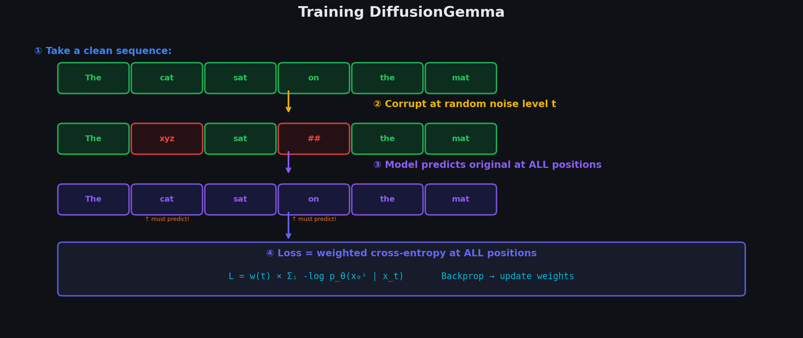

# Chapter 2.3: The Diffusion Objective — ELBO and Training Loss

> *"The variational bound tells us exactly what to optimize."*

---

## 2.3.1 The Evidence Lower Bound (ELBO)

We want to maximize $\log p_\theta(x_0)$, the log-likelihood of the data. Since this is intractable, we derive a **variational lower bound**.

### Derivation Step by Step

**Step 1.** Start with the log-likelihood and introduce the forward process via importance sampling:

$$
\log p_\theta(x_0) = \log \int p_\theta(x_{0:T})\, dx_{1:T}
$$

$$
= \log \int \frac{p_\theta(x_{0:T})}{q(x_{1:T} \mid x_0)} q(x_{1:T} \mid x_0)\, dx_{1:T}
$$

**Step 2.** Apply Jensen's inequality ($\log \mathbb{E}[X] \geq \mathbb{E}[\log X]$):

$$
\log p_\theta(x_0) \geq \mathbb{E}_{q(x_{1:T} \mid x_0)}\left[\log \frac{p_\theta(x_{0:T})}{q(x_{1:T} \mid x_0)}\right]
$$

**Step 3.** Expand the joint distributions:

$$
p_\theta(x_{0:T}) = p(x_T) \prod_{t=1}^{T} p_\theta(x_{t-1} \mid x_t)
$$

$$
q(x_{1:T} \mid x_0) = \prod_{t=1}^{T} q(x_t \mid x_{t-1})
$$

**Step 4.** Substitute and decompose into individual terms:

$$
\boxed{-\text{ELBO} = \underbrace{\text{KL}\big(q(x_T \mid x_0)\, \|\, p(x_T)\big)}_{L_T\text{ (prior loss)}} + \sum_{t=2}^{T} \underbrace{\text{KL}\big(q(x_{t-1} \mid x_t, x_0)\, \|\, p_\theta(x_{t-1} \mid x_t)\big)}_{L_{t-1}\text{ (denoising loss)}} - \underbrace{\mathbb{E}_q\left[\log p_\theta(x_0 \mid x_1)\right]}_{L_0\text{ (reconstruction loss)}}}
$$

### Visual Decomposition of the ELBO

```
  ┌─────────────────────────────────────────────────────────┐
  │                     ELBO DECOMPOSITION                   │
  │                                                          │
  │   L_T:   KL(q(x_T|x₀) || p(x_T))                      │
  │          ↳ Does the final noisy distribution             │
  │            match the prior N(0,I)?                       │
  │          ↳ Fixed, no parameters to learn                 │
  │          ↳ ≈ 0 if schedule is good                       │
  │                                                          │
  │   L_{t-1}: KL(q(x_{t-1}|x_t,x₀) || p_θ(x_{t-1}|x_t)) │
  │          ↳ Can the model's reverse step match            │
  │            the true reverse posterior?                    │
  │          ↳ This is the MAIN training signal              │
  │          ↳ One term for each t = 2, ..., T               │
  │                                                          │
  │   L_0:   -E_q[log p_θ(x₀|x₁)]                         │
  │          ↳ Can the model reconstruct clean data          │
  │            from the barely-noisy x₁?                     │
  │          ↳ Essentially a reconstruction loss             │
  └─────────────────────────────────────────────────────────┘
```

### Step-by-Step Numerical Example of the ELBO

Let's make the decomposition concrete with a tiny 1D problem: $T = 3$ steps, clean data $x_0 = 2.0$, and variance schedule $\beta = [0.1, 0.2, 0.4]$.

**Setup: compute $\alpha_t$ and $\bar{\alpha}_t$**

| $t$ | $\beta_t$ | $\alpha_t = 1 - \beta_t$ | $\bar{\alpha}_t = \prod_{s=1}^{t} \alpha_s$ |
|-----|-----------|--------------------------|-----------------------------------------------|
| 1 | 0.1 | 0.9 | 0.9 |
| 2 | 0.2 | 0.8 | 0.72 |
| 3 | 0.4 | 0.6 | 0.432 |

**Sample the forward chain with fixed noise $\epsilon = 0.5$**

Using $x_t = \sqrt{\bar{\alpha}_t}\, x_0 + \sqrt{1 - \bar{\alpha}_t}\, \epsilon$:

| $t$ | $\sqrt{\bar{\alpha}_t}$ | $\sqrt{1 - \bar{\alpha}_t}$ | $x_t$ |
|-----|-------------------------|-----------------------------|-------|
| 1 | 0.949 | 0.316 | $0.949 \times 2.0 + 0.316 \times 0.5 = \mathbf{2.056}$ |
| 2 | 0.849 | 0.529 | $0.849 \times 2.0 + 0.529 \times 0.5 = \mathbf{1.963}$ |
| 3 | 0.657 | 0.754 | $0.657 \times 2.0 + 0.754 \times 0.5 = \mathbf{1.691}$ |

We now have a full trajectory: $x_0 = 2.0 \rightarrow x_1 = 2.056 \rightarrow x_2 = 1.963 \rightarrow x_3 = 1.691$.

---

**Term 1: $L_T$ — prior matching**

$L_T = \text{KL}\big(q(x_3 \mid x_0)\, \|\, \mathcal{N}(0, 1)\big)$

The forward marginal is $q(x_3 \mid x_0) = \mathcal{N}(\sqrt{\bar{\alpha}_3}\, x_0,\; 1 - \bar{\alpha}_3)$:

$$
\mu_q = \sqrt{0.432} \times 2.0 = 1.315, \qquad \sigma_q^2 = 1 - 0.432 = 0.568
$$

For two 1D Gaussians $\mathcal{N}(\mu_1, \sigma_1^2)$ and $\mathcal{N}(\mu_2, \sigma_2^2)$, the KL divergence is:

$$
\text{KL} = \log\frac{\sigma_2}{\sigma_1} + \frac{\sigma_1^2 + (\mu_1 - \mu_2)^2}{2\sigma_2^2} - \frac{1}{2}
$$

With $p(x_T) = \mathcal{N}(0, 1)$, so $\mu_2 = 0$, $\sigma_2 = 1$:

$$
L_T = \log(1) - \log(\sqrt{0.568}) + \frac{0.568 + 1.315^2}{2 \times 1} - \frac{1}{2}
$$

$$
= 0 - (-0.285) + \frac{0.568 + 1.728}{2} - 0.5 = 0.285 + 1.148 - 0.5 = \mathbf{0.933}
$$

**Interpretation**: $L_T$ is large here because $T = 3$ is too small — $x_3$ still carries signal ($\bar{\alpha}_3 = 0.432$), so it hasn't converged to $\mathcal{N}(0, 1)$ yet. With $T = 1000$ and a good schedule, this term is negligible.

---

**Term 2: $L_1$ — denoising at $t = 2$ (one of the $L_{t-1}$ terms)**

We compute $\text{KL}\big(q(x_1 \mid x_2, x_0)\, \|\, p_\theta(x_1 \mid x_2)\big)$.

**True posterior** $q(x_1 \mid x_2, x_0) = \mathcal{N}(\tilde{\mu}_2,\, \tilde{\beta}_2)$:

$$
\tilde{\beta}_2 = \frac{(1 - \bar{\alpha}_1)\beta_2}{1 - \bar{\alpha}_2} = \frac{0.1 \times 0.2}{0.28} = \mathbf{0.071}
$$

$$
\tilde{\mu}_2 = \frac{\sqrt{\alpha_2}(1 - \bar{\alpha}_1)}{1 - \bar{\alpha}_2}\, x_2 + \frac{\sqrt{\bar{\alpha}_1}\, \beta_2}{1 - \bar{\alpha}_2}\, x_0
$$

$$
= \frac{0.894 \times 0.1}{0.28} \times 1.963 + \frac{0.949 \times 0.2}{0.28} \times 2.0 = 0.626 + 1.354 = \mathbf{1.980}
$$

So the true reverse step is $q(x_1 \mid x_2, x_0) = \mathcal{N}(1.980,\; 0.071)$.

**Hypothetical model prediction**: suppose the network is slightly off and predicts $\mu_\theta(x_2, 2) = 2.050$ (with the same fixed variance $\tilde{\beta}_2 = 0.071$).

Since both distributions share variance $\tilde{\beta}_2$, the KL reduces to a squared mean difference:

$$
L_1 = \frac{1}{2\tilde{\beta}_2}\, (\tilde{\mu}_2 - \mu_\theta)^2 = \frac{1}{2 \times 0.071}\, (1.980 - 2.050)^2 = \frac{0.0049}{0.142} = \mathbf{0.035}
$$

A 0.07-unit error in the predicted mean costs 0.035 nats. This is the **main training signal** — the model must match $\tilde{\mu}_t$ at every timestep.

*(Similarly, $L_2 = \text{KL}(q(x_2 \mid x_3, x_0) \| p_\theta(x_2 \mid x_3))$ would be computed the same way for $t = 3$.)*

---

**Term 3: $L_0$ — reconstruction**

$L_0 = -\mathbb{E}_q\big[\log p_\theta(x_0 \mid x_1)\big]$

At $t = 1$, the data is barely noisy ($x_1 = 2.056$). The model predicts $x_0$ from $x_1$. Under a Gaussian decoder $p_\theta(x_0 \mid x_1) = \mathcal{N}(\hat{x}_0,\, \tilde{\beta}_1)$:

$$
\tilde{\beta}_1 = \frac{(1 - \bar{\alpha}_0)\beta_1}{1 - \bar{\alpha}_1} = \frac{1.0 \times 0.1}{0.1} = \mathbf{0.1}
$$

The true posterior mean for $x_0$ given $x_1$ is:

$$
\tilde{\mu}_1 = \frac{\sqrt{\alpha_1}(1 - \bar{\alpha}_0)}{1 - \bar{\alpha}_1}\, x_1 + \frac{\sqrt{\bar{\alpha}_0}\, \beta_1}{1 - \bar{\alpha}_1}\, x_0 = 0.9 \times 2.056 + 0.1 \times 2.0 = \mathbf{2.050}
$$

If the model predicts $\hat{x}_0 = 1.95$ (close but not exact; true $x_0 = 2.0$):

$$
L_0 = \frac{1}{2\tilde{\beta}_1}\, (\hat{x}_0 - x_0)^2 = \frac{(1.95 - 2.0)^2}{2 \times 0.1} = \frac{0.0025}{0.2} = \mathbf{0.0125}
$$

(Using the squared error form; the exact $-\log p_\theta$ includes a constant $\log(2\pi\tilde{\beta}_1)$ term that doesn't affect training.)

---

**Total ELBO (negative bound)**

| Term | Value | Role |
|------|-------|------|
| $L_T$ | 0.933 | Prior mismatch (large because $T$ is tiny) |
| $L_2$ | ~0.04 | Denoise $x_2$ from $x_3$ |
| $L_1$ | 0.035 | Denoise $x_1$ from $x_2$ |
| $L_0$ | 0.013 | Reconstruct $x_0$ from $x_1$ |
| **Total $-\text{ELBO}$** | **~1.02** | What we minimize during training |

```
  ELBO NUMERICAL WALKTHROUGH (T=3, x₀=2.0)
  ┌──────────────────────────────────────────────────────────┐
  │  x₀=2.0 ──→ x₁=2.056 ──→ x₂=1.963 ──→ x₃=1.691        │
  │                                                          │
  │  L_T = 0.933   "Is x₃ pure noise?"  → No (T too small) │
  │  L₂  ≈ 0.04    "Can model undo x₃→x₂?"                 │
  │  L₁  = 0.035   "Can model undo x₂→x₁?"  ← main signal   │
  │  L₀  = 0.013   "Can model recover x₀ from x₁?"         │
  │                                                          │
  │  Total ≈ 1.02 nats                                       │
  └──────────────────────────────────────────────────────────┘
```

---

## 2.3.2 Computing the KL Between Gaussians

Each $L_{t-1}$ term is a KL divergence between two Gaussians. For Gaussians with the same variance $\sigma^2$:

$$
\text{KL}\big(\mathcal{N}(\mu_1, \sigma^2) \| \mathcal{N}(\mu_2, \sigma^2)\big) = \frac{1}{2\sigma^2}\|\mu_1 - \mu_2\|^2
$$

This means:

$$
L_{t-1} = \frac{1}{2\tilde{\beta}_t}\left\|\tilde{\mu}_t(x_t, x_0) - \mu_\theta(x_t, t)\right\|^2
$$

Substituting the expressions for both means (from Chapter 2.2):

$$
L_{t-1} = \frac{\beta_t^2}{2\tilde{\beta}_t \alpha_t (1 - \bar{\alpha}_t)} \left\|\epsilon - \epsilon_\theta(x_t, t)\right\|^2
$$

### Why Matching Means Suffices

A crucial simplification: **the posterior variance $\tilde{\beta}_t$ is not learned**. It is a fixed function of the noise schedule:

$$
\tilde{\beta}_t = \frac{(1 - \bar{\alpha}_{t-1})\beta_t}{1 - \bar{\alpha}_t}
$$

Both the true posterior $q(x_{t-1} \mid x_t, x_0)$ and the model $p_\theta(x_{t-1} \mid x_t)$ are parameterized as Gaussians with **the same variance** $\tilde{\beta}_t$. When two Gaussians share variance $\sigma^2$, the KL divergence depends **only** on the mean difference:

$$
\text{KL}\big(\mathcal{N}(\mu_1, \sigma^2) \| \mathcal{N}(\mu_2, \sigma^2)\big) = \frac{1}{2\sigma^2}\|\mu_1 - \mu_2\|^2
$$

**Visual intuition** — two Gaussians with identical width but different centers:

```
  Probability
       │
       │      ╭──╮              ╭──╮
       │     ╱    ╲            ╱    ╲
       │    ╱  q   ╲          ╱  p_θ  ╲
       │   ╱  (true)╲        ╱ (model) ╲
       │  ╱          ╲      ╱            ╲
       │ ╱            ╲    ╱              ╲
       ├───────┼────────┼──────────────
            μ̃_t      μ_θ
            ←── d ──→

  KL = d² / (2 × β̃_t)     ← only the gap matters, not the shape
```

The wider the distributions (larger $\tilde{\beta}_t$), the **less** a given mean error is penalized. The narrower they are, the more precision is demanded. But in all cases, **only the center needs to be learned**.

**Why this is powerful:**

| What we *could* learn | What we *actually* learn |
|-----------------------|--------------------------|
| Full distribution $p_\theta(x_{t-1} \mid x_t)$ (mean + variance) | Just the mean $\mu_\theta(x_t, t)$ |
| $2d$ parameters per dimension per step | $d$ parameters per dimension per step |
| Complex density estimation | Regression: predict one vector |

The neural network outputs a single vector (noise $\epsilon$, clean data $x_0$, or velocity $v$) that **determines the mean** via a closed-form conversion. Variance is handled analytically by the schedule. This is why diffusion training reduces to elegant supervised regression rather than full generative density modeling.

---

## 2.3.3 The Simplified Loss (DDPM)

Ho et al. (2020) found that **dropping the weighting coefficient** works better in practice:

$$
\boxed{L_{\text{simple}} = \mathbb{E}_{t, x_0, \epsilon}\left[\left\|\epsilon - \epsilon_\theta\left(\sqrt{\bar{\alpha}_t}\, x_0 + \sqrt{1 - \bar{\alpha}_t}\, \epsilon,\; t\right)\right\|^2\right]}
$$

### Training Algorithm (One Step)

```
  ┌────────────────────────────────────────────────────────────┐
  │                    TRAINING STEP                            │
  │                                                             │
  │  1. Sample clean data:    x₀ ~ p_data                      │
  │                                                             │
  │  2. Sample timestep:      t ~ Uniform{1, ..., T}           │
  │                                                             │
  │  3. Sample noise:         ε ~ N(0, I)                       │
  │                                                             │
  │  4. Construct noisy data: x_t = √ᾱ_t · x₀ + √(1-ᾱ_t) · ε │
  │                                                             │
  │  5. Predict noise:        ε̂ = ε_θ(x_t, t)                  │
  │                                                             │
  │  6. Compute loss:         L = ||ε - ε̂||²                   │
  │                                                             │
  │  7. Backpropagate and update θ                              │
  └────────────────────────────────────────────────────────────┘
```

**Key insight**: The model is simply trained to predict noise! The elaborate ELBO derivation collapses to a surprisingly simple mean-squared error.

### The Three Parameterizations Compared

The simplified loss above uses **$\epsilon$-prediction**, but the network can equivalently predict three different targets. All three recover the **same** reverse-step mean $\mu_\theta$.

#### 1. $\epsilon$-prediction (DDPM default)

The network predicts the noise $\epsilon$ that was used to construct $x_t$:

$$
\hat{\epsilon} = \epsilon_\theta(x_t, t)
$$

Convert to $\mu_\theta$ via the DDPM formula:

$$
\mu_\theta(x_t, t) = \frac{1}{\sqrt{\alpha_t}}\left(x_t - \frac{\beta_t}{\sqrt{1 - \bar{\alpha}_t}}\, \hat{\epsilon}\right)
$$

Recover $x_0$ if needed:

$$
\hat{x}_0 = \frac{x_t - \sqrt{1 - \bar{\alpha}_t}\, \hat{\epsilon}}{\sqrt{\bar{\alpha}_t}}
$$

#### 2. $x_0$-prediction (DiffusionGemma)

The network directly predicts the clean data:

$$
\hat{x}_0 = f_\theta(x_t, t)
$$

Convert to $\mu_\theta$ by substituting $\hat{x}_0$ into the posterior mean formula:

$$
\mu_\theta(x_t, t) = \frac{\sqrt{\alpha_t}(1 - \bar{\alpha}_{t-1})}{1 - \bar{\alpha}_t}\, x_t + \frac{\sqrt{\bar{\alpha}_{t-1}}\, \beta_t}{1 - \bar{\alpha}_t}\, \hat{x}_0
$$

#### 3. $v$-prediction (Salimans & Ho, 2022)

The network predicts the **velocity** — a direction in the signal-noise plane:

$$
v = \sqrt{\bar{\alpha}_t}\, \epsilon - \sqrt{1 - \bar{\alpha}_t}\, x_0, \qquad \hat{v} = v_\theta(x_t, t)
$$

Recover $x_0$ and $\epsilon$ from $v$:

$$
\hat{x}_0 = \sqrt{\bar{\alpha}_t}\, x_t - \sqrt{1 - \bar{\alpha}_t}\, \hat{v}
$$

$$
\hat{\epsilon} = \sqrt{1 - \bar{\alpha}_t}\, x_t + \sqrt{\bar{\alpha}_t}\, \hat{v}
$$

Then plug into the same $\mu_\theta$ formula as $\epsilon$-prediction.

---

**Numerical example: all three agree**

Given: $x_t = 1.5$, $\bar{\alpha}_t = 0.5$, true noise $\epsilon = 0.8$. The network sees $x_t$; we work backward to find the implied clean data:

$$
x_0^{\text{(true)}} = \frac{x_t - \sqrt{1 - \bar{\alpha}_t}\, \epsilon}{\sqrt{\bar{\alpha}_t}} = \frac{1.5 - \sqrt{0.5} \times 0.8}{\sqrt{0.5}} = \frac{1.5 - 0.566}{0.707} = \mathbf{1.32}
$$

Assume $\beta_t = 0.02$ ($\alpha_t = 0.98$), $\bar{\alpha}_{t-1} = 0.51$.

| Parameterization | Network output | $\mu_\theta$ computation | Result |
|------------------|----------------|--------------------------|--------|
| $\epsilon$-pred | $\hat{\epsilon} = 0.8$ | $\frac{1}{\sqrt{0.98}}\big(1.5 - \frac{0.02}{\sqrt{0.5}} \times 0.8\big)$ | $\frac{1}{0.990}(1.5 - 0.023) = \mathbf{1.492}$ |
| $x_0$-pred | $\hat{x}_0 = 1.32$ | $\frac{\sqrt{0.98} \times 0.5}{0.5} \times 1.5 + \frac{\sqrt{0.51} \times 0.02}{0.5} \times 1.32$ | $1.470 + 0.019 \approx \mathbf{1.489}$ |
| $v$-pred | $\hat{v} = \sqrt{0.5} \times 0.8 - \sqrt{0.5} \times 1.0 = -0.141$ | Recover $\hat{\epsilon}$, then same as row 1 | $\mathbf{1.492}$ |

All three yield $\mu_\theta \approx 1.49$ (tiny differences from rounding). **The parameterization is a choice of training target, not a choice of generative behavior.**

```
  THREE PATHS TO THE SAME μ_θ
  ┌─────────────────────────────────────────────────────────────┐
  │                                                             │
  │   ε-prediction ──→ μ_θ = (1/√α_t)(x_t - β_t/√(1-ᾱ_t)·ε̂) │
  │        ↑                                                    │
  │   x₀-prediction ──→ substitute x̂₀ into posterior mean   │
  │        ↑                                                    │
  │   v-prediction ──→ recover ε̂ from v̂, then same formula   │
  │                                                             │
  │   All roads lead to the same reverse-step Gaussian         │
  └─────────────────────────────────────────────────────────────┘
```

**Why $x_0$-prediction is natural for text**

For images, "noise" is well-defined: $\epsilon$ is a real-valued perturbation. For text:

- A token is a **discrete index** (e.g., "cat" = 4523), not a real number.
- There is no meaningful "noise vector" to add or predict.
- But predicting the **clean token** (or its logits) is natural — it's exactly what language models already do.

DiffusionGemma predicts $x_0$ (clean token logits) at every step. The forward process corrupts tokens via masking rather than Gaussian noise, but the training target remains: **predict what the clean sequence should be**. This is why $x_0$-prediction is the bridge from continuous diffusion math to discrete text diffusion.

---



## 2.3.4 From Continuous to Discrete: The Bridge to Text

Everything above assumes **continuous** data (images as real-valued tensors). For **text** (discrete tokens from a vocabulary), we face a fundamental problem:

```
  CONTINUOUS (Images)                    DISCRETE (Text)
  ┌──────────────────┐                  ┌──────────────────┐
  │  pixel = 0.847   │                  │  token = "cat"   │
  │  pixel + noise   │                  │  "cat" + noise   │
  │  = 0.847 + 0.1ε  │                  │  = ???           │
  │  = 0.912         │                  │                  │
  │  (still valid!)  │                  │  (meaningless!)  │
  └──────────────────┘                  └──────────────────┘
```

You **cannot** add Gaussian noise to a token. The token "cat" is an index into a vocabulary (e.g., token ID 4523). Adding 0.1 to get 4523.1 is nonsensical.

**This is why we need Discrete Diffusion** — a fundamentally different way to define "noise" for tokens. That's what we'll cover next.

---

## 2.3.5 Summary Table: Continuous Diffusion Math

| Concept | Formula |
|---------|---------|
| Forward (single step) | $q(x_t \mid x_{t-1}) = \mathcal{N}(\sqrt{\alpha_t}\, x_{t-1},\, \beta_t \mathbf{I})$ |
| Forward (any step) | $q(x_t \mid x_0) = \mathcal{N}(\sqrt{\bar{\alpha}_t}\, x_0,\, (1-\bar{\alpha}_t)\mathbf{I})$ |
| Reverse posterior | $q(x_{t-1} \mid x_t, x_0) = \mathcal{N}(\tilde{\mu}_t,\, \tilde{\beta}_t \mathbf{I})$ |
| Posterior mean | $\tilde{\mu}_t = \frac{\sqrt{\alpha_t}(1-\bar{\alpha}_{t-1})}{1-\bar{\alpha}_t}x_t + \frac{\sqrt{\bar{\alpha}_{t-1}}\beta_t}{1-\bar{\alpha}_t}x_0$ |
| Posterior variance | $\tilde{\beta}_t = \frac{(1-\bar{\alpha}_{t-1})\beta_t}{1-\bar{\alpha}_t}$ |
| Simplified loss | $\mathbb{E}_{t,\epsilon}\left[\|\epsilon - \epsilon_\theta(x_t, t)\|^2\right]$ |

---

## 2.3.6 Signal-to-Noise Ratio (SNR) View

The diffusion loss can be understood through a single quantity: the **signal-to-noise ratio** at each timestep.

### Definition

From the forward formula $x_t = \sqrt{\bar{\alpha}_t}\, x_0 + \sqrt{1 - \bar{\alpha}_t}\, \epsilon$, the signal component has variance $\bar{\alpha}_t$ and the noise component has variance $(1 - \bar{\alpha}_t)$ (per unit-norm $x_0$ and $\epsilon$). Define:

$$
\boxed{\text{SNR}(t) = \frac{\bar{\alpha}_t}{1 - \bar{\alpha}_t}}
$$

- **High SNR** ($t$ small): signal dominates → $x_t \approx x_0$ → easy to denoise.
- **Low SNR** ($t$ large): noise dominates → $x_t \approx \epsilon$ → hard to denoise.
- **SNR $\rightarrow 0$** as $t \rightarrow T$: pure noise, maximum difficulty.

### Rewriting the Loss in Terms of SNR

The ELBO weight for the denoising term at step $t$ is:

$$
w(t) = \frac{\beta_t^2}{2\tilde{\beta}_t\, \alpha_t\, (1 - \bar{\alpha}_t)}
$$

Using $\beta_t = 1 - \alpha_t$ and the definition of $\tilde{\beta}_t$, this can be expressed as a function of $\text{SNR}(t)$ and $\text{SNR}(t-1)$:

$$
w(t) = \frac{1 - \alpha_t}{2\tilde{\beta}_t}\, \cdot\, \frac{1}{1 + \text{SNR}(t)}
$$

The loss at timestep $t$ becomes:

$$
L_{t-1} = w(t) \cdot \|\epsilon - \epsilon_\theta(x_t, t)\|^2 = w(t) \cdot \frac{1 + \text{SNR}(t)}{\text{SNR}(t)} \cdot \|\hat{x}_0 - x_0\|^2
$$

(using the identity $\|\epsilon - \epsilon_\theta\|^2 = \frac{1 + \text{SNR}(t)}{\text{SNR}(t)} \|\hat{x}_0 - x_0\|^2$).

**Key insight**: timesteps with low SNR get **higher weight** in the full ELBO (because $w(t)$ grows as $\bar{\alpha}_t \rightarrow 0$). Ho et al. dropped this weighting to get $L_{\text{simple}}$, which empirically works better — but the SNR view explains *why* different timesteps have different intrinsic difficulty.

### SNR for Our Numerical Example ($T = 3$, $\beta = [0.1, 0.2, 0.4]$)

| $t$ | $\bar{\alpha}_t$ | $1 - \bar{\alpha}_t$ | $\text{SNR}(t) = \bar{\alpha}_t / (1 - \bar{\alpha}_t)$ | Difficulty |
|-----|------------------|----------------------|---------------------------------------------------------|------------|
| 1 | 0.900 | 0.100 | **9.00** | Easy — 90% signal |
| 2 | 0.720 | 0.280 | **2.57** | Moderate |
| 3 | 0.432 | 0.568 | **0.76** | Hard — mostly noise |

```
  SNR(t) across timesteps
  │
  │  9.0 ●
  │       ╲
  │  2.6   ●
  │         ╲
  │  0.8     ●
  │
  └──────────────────→ t
     1    2    3

  High SNR = "I can still see the data"  → small denoising correction
  Low SNR  = "I'm mostly guessing"       → large denoising correction
```

In decibels: $\text{SNR}_{\text{dB}}(t) = 10 \log_{10}(\text{SNR}(t))$:

| $t$ | SNR (linear) | SNR (dB) |
|-----|--------------|----------|
| 1 | 9.00 | +9.5 dB |
| 2 | 2.57 | +4.1 dB |
| 3 | 0.76 | −1.2 dB |

### Connection to DiffusionGemma

DiffusionGemma uses a **log-linear noise schedule** in continuous time: $\bar{\alpha}_t = 1 - t$ for $t \in [0, 1]$. This directly controls SNR:

$$
\text{SNR}(t) = \frac{1 - t}{t}
$$

| $t$ | $\bar{\alpha}_t$ | $\text{SNR}(t)$ | Interpretation |
|-----|------------------|-----------------|----------------|
| 0.0 | 1.0 | $\infty$ | Clean data (no noise) |
| 0.25 | 0.75 | 3.0 | 75% signal retained |
| 0.50 | 0.50 | 1.0 | Equal signal and noise |
| 0.75 | 0.25 | 0.33 | 75% corrupted |
| 1.0 | 0.0 | 0.0 | Fully masked / pure noise |

The **scheduler** at inference time modulates the effective SNR by controlling temperature and step count — effectively choosing *how fast* we traverse this SNR curve. Early steps operate at low SNR (explore broadly), late steps at high SNR (commit to specific tokens). Understanding SNR unifies the training objective (ELBO weights) with the inference pipeline (temperature schedule).

---

**Next**: [../03_Discrete_Diffusion/01_from_continuous_to_discrete.md](../../03_Discrete_Diffusion/01_from_continuous_to_discrete/) — Adapting diffusion for discrete tokens.
