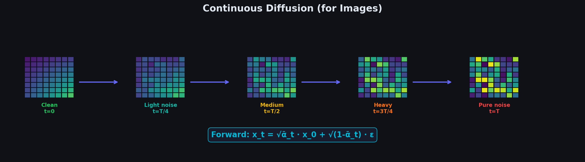

# Chapter 2 — Diffusion Fundamentals

Before we can understand how DiffusionGemma works on text, we need to understand how diffusion works in general. This chapter covers the **continuous-space** formulation (originally developed for images) — the forward process that adds noise, the reverse process that removes it, and the ELBO-based training objective that ties everything together.

---

## Topics

| # | Topic | Description |
|---|-------|-------------|
| 2.1 | [Forward Diffusion](01_forward_diffusion/) | Gaussian noise, the reparameterization trick, noise schedules ($\beta_t$, $\bar{\alpha}_t$), step-by-step numerical traces |
| 2.2 | [Reverse Diffusion](02_reverse_diffusion/) | Denoising, posterior mean and variance, score matching, DDPM vs. DDIM |
| 2.3 | [The Diffusion Objective](03_the_diffusion_objective/) | ELBO derivation from first principles, KL decomposition, the simplified $L_{\text{simple}}$ loss, SNR interpretation |

---

**Previous**: [Chapter 1 — Introduction](../01_Introduction/) · **Next**: [Chapter 3 — Discrete Diffusion](../03_Discrete_Diffusion/)
