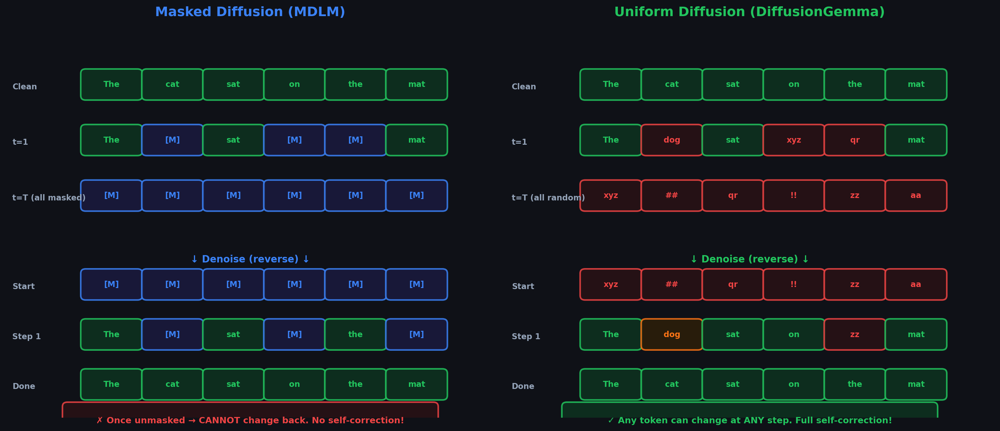

# Chapter 3.1: From Continuous to Discrete — Why Gaussian Noise Fails for Tokens



---

## 3.1.1 The Fundamental Problem

In continuous diffusion (images), noise is additive Gaussian perturbation:

$$
x_t = \sqrt{\bar{\alpha}_t}\, x_0 + \sqrt{1 - \bar{\alpha}_t}\, \epsilon, \qquad \epsilon \sim \mathcal{N}(0, \mathbf{I})
$$

This works because pixel values are **continuous** real numbers. But tokens are **discrete** categorical variables from a finite vocabulary $\mathcal{V} = \{1, 2, \ldots, K\}$.

```
  CONTINUOUS SPACE                       DISCRETE SPACE
  (Images)                               (Text)
  
  ───────●──────────── ℝ                 ● ● ● ● ● ● ● ●    {1,2,...,K}
         ↑                               ↑ ↑ ↑
      0.847                             "the" "cat" "sat"
         │                                │
    + 0.1·ε                          + 0.1·ε = ???
         │
      0.912                          No concept of "between"
    (still in ℝ)                     two tokens!
```

**Key issues:**
1. Tokens have no natural ordering ("cat" is not "between" "car" and "cap")
2. There's no continuous interpolation between token IDs
3. Adding real-valued noise to an integer gives a non-integer

---

## 3.1.2 The Solution: Transition Matrices

Instead of additive noise, we use **stochastic transitions** between tokens. At each step, a token can "jump" to another token with some probability.

### One-Hot Representation

Each token $x \in \{1, \ldots, K\}$ is represented as a one-hot vector $\mathbf{x} \in \{0, 1\}^K$:

$$
\text{token "cat" (ID=3)} \quad \rightarrow \quad \mathbf{x} = \begin{bmatrix} 0 \\ 0 \\ 1 \\ 0 \\ \vdots \\ 0 \end{bmatrix} \in \mathbb{R}^K
$$

### The Transition Matrix

A **transition matrix** $\mathbf{Q}_t \in \mathbb{R}^{K \times K}$ defines the probability of jumping from token $i$ to token $j$:

$$
[\mathbf{Q}_t]_{ij} = q(x_t = j \mid x_{t-1} = i)
$$

The forward process becomes:

$$
\boxed{q(x_t \mid x_{t-1}) = \text{Cat}(\mathbf{x}_{t-1}^\top \mathbf{Q}_t)}
$$

where $\text{Cat}$ is the categorical distribution.

```
             Token at t-1
             (one-hot: x_{t-1})
                    │
                    ▼
  ┌──────────────────────────────────┐
  │         Q_t (K × K matrix)       │
  │                                   │
  │  From\To  "a"  "the" "cat" "dog" │
  │  "a"     [0.9   0.03  0.03  0.04]│    Each row sums to 1
  │  "the"   [0.02  0.9   0.04  0.04]│    Diagonal = stay same
  │  "cat"   [0.03  0.03  0.9   0.04]│    Off-diagonal = corrupt
  │  "dog"   [0.04  0.03  0.03  0.9 ]│
  │                                   │
  └──────────────────────────────────┘
                    │
                    ▼
             Token at t
         (categorical sample)
```

### Numerical Example: One Step of Discrete Forward

We work through a single forward step with vocabulary $\mathcal{V} = \{\text{a}, \text{the}, \text{cat}, \text{dog}\}$, so $K = 4$.

#### Uniform Noise with $\beta_t = 0.2$

The standard construction (Austin et al., D3PM) is:

$$
\mathbf{Q}_t = (1 - \beta_t)\,\mathbf{I} + \frac{\beta_t}{K}\,\mathbf{1}\mathbf{1}^\top
$$

For $\beta_t = 0.2$:

$$
[\mathbf{Q}_t]_{ii} = 1 - \beta_t + \frac{\beta_t}{K} = 1 - 0.2 + \frac{0.2}{4} = 0.85, \qquad [\mathbf{Q}_t]_{ij} = \frac{\beta_t}{K} = 0.05 \quad (i \neq j)
$$

The full matrix:

$$
\mathbf{Q}_t = \begin{bmatrix}
0.85 & 0.05 & 0.05 & 0.05 \\
0.05 & 0.85 & 0.05 & 0.05 \\
0.05 & 0.05 & 0.85 & 0.05 \\
0.05 & 0.05 & 0.05 & 0.85
\end{bmatrix}
$$

#### Starting Token: **cat** (ID = 2)

One-hot representation: $\mathbf{x}_0 = [0,\; 0,\; 1,\; 0]^\top$

Apply one step of the forward process:

$$
\mathbf{x}_1^\top = \mathbf{x}_0^\top \mathbf{Q}_t = \begin{bmatrix} 0 & 0 & 1 & 0 \end{bmatrix} \mathbf{Q}_t = \begin{bmatrix} 0.05 & 0.05 & 0.85 & 0.05 \end{bmatrix}
$$

Interpretation:

| Outcome | Probability |
|---------|-------------|
| a       | 0.05        |
| the     | 0.05        |
| **cat** (stay) | **0.85** |
| dog     | 0.05        |

**Sampling:** Draw $x_1 \sim \text{Cat}([0.05, 0.05, 0.85, 0.05])$. With probability 0.85 the token stays **cat**; with probability 0.15 it jumps to a uniformly random *other* token.

#### Masked (Absorbing) Noise — How $\mathbf{Q}_t$ Differs

For masked diffusion, the vocabulary expands to $K + 1$ states (adding [MASK] as index 4). With $\beta_t = 0.2$:

$$
\mathbf{Q}_t^{\text{mask}} = \begin{bmatrix}
0.8 & 0 & 0 & 0 & 0.2 \\
0 & 0.8 & 0 & 0 & 0.2 \\
0 & 0 & 0.8 & 0 & 0.2 \\
0 & 0 & 0 & 0.8 & 0.2 \\
0 & 0 & 0 & 0 & 1.0
\end{bmatrix}
$$

Starting from **cat** (ID = 2): $\mathbf{x}_0 = [0, 0, 1, 0, 0]^\top$

$$
\mathbf{x}_1^\top = \begin{bmatrix} 0 & 0 & 0.8 & 0 & 0.2 \end{bmatrix}
$$

| Outcome | Probability |
|---------|-------------|
| a, the, dog | 0 each |
| **cat** (stay) | **0.80** |
| [MASK]  | 0.20        |

**Key difference:** Uniform noise spreads probability across all *other vocabulary tokens*. Masked noise concentrates all corruption mass on a single absorbing [MASK] state. The token can never become **dog** directly — only [MASK] or itself.

---

## 3.1.3 Cumulative Transition (Jumping to Any Step)

Just as with continuous diffusion, we want a closed-form for jumping from $x_0$ to any $x_t$:

$$
\boxed{q(x_t \mid x_0) = \text{Cat}\left(\mathbf{x}_0^\top \bar{\mathbf{Q}}_t\right), \qquad \bar{\mathbf{Q}}_t = \mathbf{Q}_1 \mathbf{Q}_2 \cdots \mathbf{Q}_t}
$$

The **cumulative transition matrix** $\bar{\mathbf{Q}}_t$ is the product of all transition matrices up to step $t$.

### Numerical Example: Jumping to Step $t = 3$

Using the same $K = 4$ vocabulary and uniform noise, suppose:

$$
\beta_1 = 0.2, \quad \beta_2 = 0.3, \quad \beta_3 = 0.4
$$

#### Step-by-Step $\mathbf{Q}_s$ Matrices

For each step, $\mathbf{Q}_s = (1-\beta_s)\mathbf{I} + (\beta_s/K)\mathbf{1}\mathbf{1}^\top$:

**$\mathbf{Q}_1$** ($\beta_1 = 0.2$): diagonal $= 0.85$, off-diagonal $= 0.05$

**$\mathbf{Q}_2$** ($\beta_2 = 0.3$): diagonal $= 0.775$, off-diagonal $= 0.075$

**$\mathbf{Q}_3$** ($\beta_3 = 0.4$): diagonal $= 0.70$, off-diagonal $= 0.10$

#### Closed Form for Uniform Noise

Because each $\mathbf{Q}_s$ has the form $\alpha_s \mathbf{I} + (1-\alpha_s)/K \cdot \mathbf{1}\mathbf{1}^\top$ with $\alpha_s = 1 - \beta_s$, the product collapses to:

$$
\boxed{[\bar{\mathbf{Q}}_t]_{ij} = \bar{\alpha}_t\,\delta_{ij} + \frac{1 - \bar{\alpha}_t}{K}}
$$

where $\bar{\alpha}_t = \prod_{s=1}^{t}(1 - \beta_s)$.

For $t = 3$:

$$
\bar{\alpha}_3 = 0.8 \times 0.7 \times 0.6 = 0.336
$$

So every entry of $\bar{\mathbf{Q}}_3$ is:

$$
[\bar{\mathbf{Q}}_3]_{ij} = 0.336 \cdot \delta_{ij} + \frac{1 - 0.336}{4} = 0.336 \cdot \delta_{ij} + 0.166
$$

$$
\bar{\mathbf{Q}}_3 = \begin{bmatrix}
0.502 & 0.166 & 0.166 & 0.166 \\
0.166 & 0.502 & 0.166 & 0.166 \\
0.166 & 0.166 & 0.502 & 0.166 \\
0.166 & 0.166 & 0.166 & 0.502
\end{bmatrix}
$$

#### Verification via Matrix Multiplication

Computing $\bar{\mathbf{Q}}_3 = \mathbf{Q}_1 \mathbf{Q}_2 \mathbf{Q}_3$ explicitly (each factor is rank-1 plus identity, so the product preserves the same structure):

$$
\mathbf{Q}_1 \mathbf{Q}_2 = \begin{bmatrix}
0.67 & 0.11 & 0.11 & 0.11 \\
0.11 & 0.67 & 0.11 & 0.11 \\
0.11 & 0.11 & 0.67 & 0.11 \\
0.11 & 0.11 & 0.11 & 0.67
\end{bmatrix}
$$

Multiplying by $\mathbf{Q}_3$ yields exactly the $\bar{\mathbf{Q}}_3$ above — confirming the closed form.

#### Efficient Training: Jump Directly to Any $t$

Instead of simulating 3 sequential corruptions, training can:

1. Sample $t \sim \mathcal{U}\{1, \ldots, T\}$
2. Compute $\bar{\alpha}_t$ from the noise schedule
3. Build $\bar{\mathbf{Q}}_t$ in closed form (one matrix, not $t$ multiplications)
4. Sample $x_t \sim \text{Cat}(\mathbf{x}_0^\top \bar{\mathbf{Q}}_t)$

For **cat** at $t=3$: $\mathbf{x}_3^\top = [0.166,\; 0.166,\; 0.502,\; 0.166]$

There is a 50.2% chance the token is still **cat**, and a 16.6% chance it became any specific other token. This single-shot corruption is mathematically identical to three sequential uniform jumps.

---

## 3.1.4 Three Types of Discrete Noise

The choice of $\mathbf{Q}_t$ defines what "noise" means for text. There are three main approaches:

```
┌───────────────────────────────────────────────────────────────────┐
│                    TYPES OF DISCRETE NOISE                        │
├────────────────┬──────────────────────────────────────────────────┤
│                │                                                  │
│  1. ABSORBING  │  Tokens transition to a special [MASK] token    │
│  (Masked)      │  "The cat sat" → "The [M] sat" → "[M] [M] [M]" │
│                │  Once masked, stays masked                       │
│                │  ↳ Used by MDLM                                  │
│                │                                                  │
├────────────────┼──────────────────────────────────────────────────┤
│                │                                                  │
│  2. UNIFORM    │  Tokens transition to any random token           │
│                │  "The cat sat" → "The dog sat" → "xyz foo bar"  │
│                │  Can transition multiple times                    │
│                │  ↳ Used by UDLM / DiffusionGemma                │
│                │                                                  │
├────────────────┼──────────────────────────────────────────────────┤
│                │                                                  │
│  3. GAUSSIAN   │  Transitions prefer "nearby" tokens in           │
│  (Embedding)   │  embedding space                                 │
│                │  "cat" → "kitten" → "dog" → "table"              │
│                │  ↳ Used by D3PM (Austin et al.)                  │
│                │                                                  │
└────────────────┴──────────────────────────────────────────────────┘
```

DiffusionGemma uses **Uniform State Diffusion**. We'll cover Masked Diffusion first (simpler), then Uniform.

---

## 3.1.5 Continuous-Time Formulation (CTMC)

Modern discrete diffusion often uses **continuous-time Markov chains** (CTMCs) rather than discrete steps. Instead of a sequence of matrices $\mathbf{Q}_1, \mathbf{Q}_2, \ldots$, we define a **rate matrix** $\mathbf{R}$ that governs instantaneous transition rates.

### The Rate Matrix

$$
\mathbf{R} \in \mathbb{R}^{K \times K}, \qquad R_{ij} \geq 0 \text{ for } i \neq j, \qquad R_{ii} = -\sum_{j \neq i} R_{ij}
$$

The transition probability over time interval $\Delta t$ is:

$$
\mathbf{Q}(\Delta t) = \exp(\mathbf{R} \cdot \Delta t)
$$

where $\exp$ is the **matrix exponential**.

The continuous-time forward process satisfies the **Kolmogorov forward equation**:

$$
\frac{d}{dt} q(x_t \mid x_0) = q(x_t \mid x_0) \cdot \mathbf{R}_t
$$

**Why continuous time?**
- Avoids choosing a fixed number of discrete steps
- Enables simpler mathematical analysis
- Allows adaptive step sizes during inference
- Connects to rich theory of Markov processes

### Deep Dive: Matrix Exponential and Why It Matters

The matrix exponential is the bridge between the infinitesimal generator $\mathbf{R}$ and finite-time transition probabilities. Understanding its behavior explains why CTMCs are the preferred formalism for modern discrete diffusion.

#### Definition via Taylor Series

For a square matrix $\mathbf{R}$:

$$
e^{\mathbf{R}t} = \mathbf{I} + \mathbf{R}t + \frac{(\mathbf{R}t)^2}{2!} + \frac{(\mathbf{R}t)^3}{3!} + \cdots = \sum_{n=0}^{\infty} \frac{(\mathbf{R}t)^n}{n!}
$$

This is the unique solution to $\frac{d}{dt}e^{\mathbf{R}t} = \mathbf{R}\,e^{\mathbf{R}t}$ with $e^{\mathbf{R} \cdot 0} = \mathbf{I}$.

#### Uniform Rate Matrix and Closed Form

For uniform noise with vocabulary size $K$, the rate matrix is:

$$
R_{ij} = \begin{cases} 1 & i \neq j \\ -(K-1) & i = j \end{cases}
$$

Equivalently: $\mathbf{R} = \mathbf{1}\mathbf{1}^\top - K\mathbf{I}$.

Because $\mathbf{R}$ is symmetric, it admits an eigendecomposition. For $K = 4$:

$$
\mathbf{R} = \begin{bmatrix}
-3 & 1 & 1 & 1 \\
1 & -3 & 1 & 1 \\
1 & 1 & -3 & 1 \\
1 & 1 & 1 & -3
\end{bmatrix}
$$

**Eigenvalues:**
- $\lambda_1 = 0$ (multiplicity 1) — eigenvector $\mathbf{v}_1 = [1,1,1,1]^\top / 2$
- $\lambda_2 = -4$ (multiplicity 3) — eigenvectors spanning the subspace $\{\mathbf{x} : \sum_i x_i = 0\}$

The matrix exponential acts on each eigenspace:

$$
e^{\mathbf{R}t} = e^{0 \cdot t}\,\mathbf{v}_1 \mathbf{v}_1^\top + e^{-4t}\,\left(\mathbf{I} - \mathbf{v}_1 \mathbf{v}_1^\top\right)
$$

Since $\mathbf{v}_1 \mathbf{v}_1^\top = \frac{1}{4}\mathbf{1}\mathbf{1}^\top$:

$$
\boxed{e^{\mathbf{R}t} = \frac{1}{K}\mathbf{1}\mathbf{1}^\top + e^{-Kt}\left(\mathbf{I} - \frac{1}{K}\mathbf{1}\mathbf{1}^\top\right)}
$$

For $K = 4$: $e^{\mathbf{R}t}$ has diagonal entries $\frac{1}{4} + \frac{3}{4}e^{-4t}$ and off-diagonal entries $\frac{1}{4} - \frac{1}{4}e^{-4t}$.

#### Limiting Behavior

**As $t \to 0$:**

$$
e^{\mathbf{R}t} \to \mathbf{I}
$$

No corruption — every token stays put. The chain hasn't had time to jump.

**As $t \to \infty$:**

$$
e^{\mathbf{R}t} \to \frac{1}{K}\mathbf{1}\mathbf{1}^\top
$$

Every row becomes $[1/K, 1/K, \ldots, 1/K]$. The token's identity is completely forgotten; the distribution is uniform over the vocabulary. This is the discrete analogue of pure Gaussian noise in image diffusion.

```
  t = 0          t = 0.5              t → ∞
  ┌─────┐        ┌─────────┐          ┌─────────┐
  │  ●  │        │ ● ● ● ● │          │ ● ● ● ● │
  │ cat │   →    │.7 .1 .1│    →     │.25 each│
  │100% │        │  .1     │          │ uniform │
  └─────┘        └─────────┘          └─────────┘
  e^{Rt} ≈ I     e^{Rt} mixed         e^{Rt} ≈ 11ᵀ/K
```

#### Why Continuous Time Is Better Than Fixed Steps

| Discrete steps ($T$ fixed) | Continuous time (CTMC) |
|---------------------------|--------------------------|
| Must choose $T$ before training | $t \in [0, 1]$ is continuous; no $T$ needed |
| $\bar{\mathbf{Q}}_t$ requires $t$ matrix multiplies (or closed form per noise type) | $e^{\mathbf{R}t}$ is direct; schedule is a function $\sigma(t)$ |
| Inference uses exactly $T$ steps | Inference can use arbitrarily fewer steps (Euler, $\tau$-leaping) |
| Changing $T$ at inference mismatches training | Adaptive step sizes are theoretically grounded |

In practice, DiffusionGemma samples $t \sim \mathcal{U}(0,1)$, computes corruption via $e^{\mathbf{R}\sigma(t)}$, and at inference may use as few as 32 steps with no retraining — a flexibility that discrete-step formulations lack.

---

## 3.1.6 Embedding Space Diffusion (D3PM)

The third noise type in Section 3.1.4 — **Gaussian / embedding-space** diffusion — was introduced by Austin et al. in **D3PM** (Discrete Denoising Diffusion Probabilistic Models). It represents an important dead end that clarifies why DiffusionGemma chose uniform noise instead.

### How D3PM Defines Transitions

Rather than treating all non-target tokens as equally likely, D3PM places each vocabulary token at a point in $\mathbb{R}^d$ (e.g., the rows of the model's embedding matrix). Transition probabilities decay with **embedding distance**:

$$
q(x_t = j \mid x_{t-1} = i) \propto \exp\!\left(-\frac{\|\mathbf{e}_i - \mathbf{e}_j\|^2}{2\sigma_t^2}\right)
$$

Tokens that are **close in embedding space** are more likely to transition to each other. The intuition: corrupt **cat** into something "nearby" like **cats** or **car**, not into **democracy**.

```
  Embedding space (2D sketch):

        kitten ●
               │  far in embedding,
        cat ●  │  close in meaning
              ╲│
               ● car     ← close in embedding,
                          different meaning!
```

### Why This Was Abandoned

The core assumption — **embedding proximity $\approx$ semantic proximity** — fails systematically for text:

| Transition | Embedding distance | Semantic relationship |
|------------|-------------------|------------------------|
| cat → car  | **Small** (3 chars differ by 1) | Unrelated meanings |
| cat → kitten | **Large** (different subword tokens) | Close meaning (hyponym) |
| their → there | **Small** (spelling similarity) | Different grammatical role |
| run → sprint | **Moderate** | Synonyms |

Embedding geometry is shaped by **co-occurrence statistics** and **subword structure**, not by semantic similarity. A diffusion process that corrupts **cat** into **car** (plausible by edit distance) teaches the model the wrong notion of "nearby corruption."

### Contrast with Uniform Noise

| Property | D3PM (Embedding) | Uniform (DiffusionGemma) |
|----------|------------------|--------------------------|
| Corruption target | Nearby in $\mathbb{R}^d$ | Any token, equally likely |
| Inductive bias | Spelling/embedding structure | None — maximally flexible |
| Self-correction | Possible (non-absorbing) | Possible (non-absorbing) |
| Practical quality | Disappointing on text generation | State-of-the-art for discrete diffusion LLMs |

Uniform noise makes no assumptions about which corruptions are "reasonable." The model must learn entirely from data which tokens are plausible replacements — a harder learning problem, but one that doesn't bake in misleading geometric priors.

D3PM's embedding approach remains intellectually appealing and works better for **small, structured vocabularies** (e.g., image pixel quantization). For open-vocabulary language modeling at scale, the community converged on **uniform state diffusion** — the path DiffusionGemma follows.

---

**Next**: [02_masked_diffusion.md](../../02_masked_diffusion/02_masked_diffusion/) — Masked Diffusion Language Models (MDLM).
