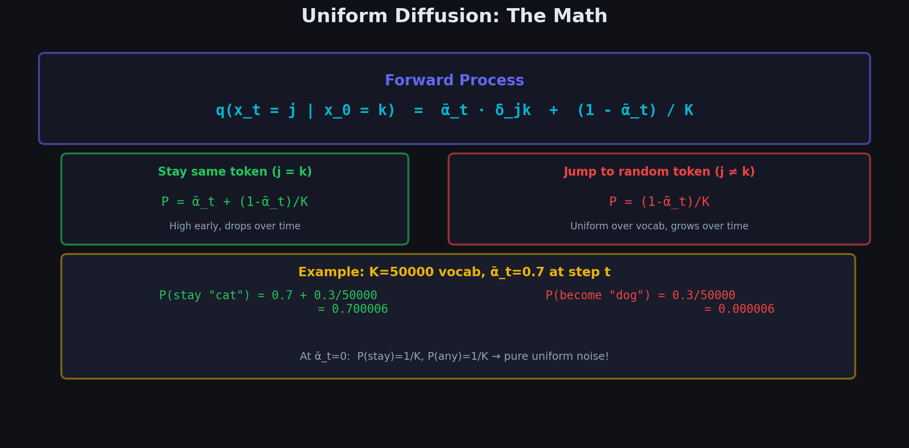
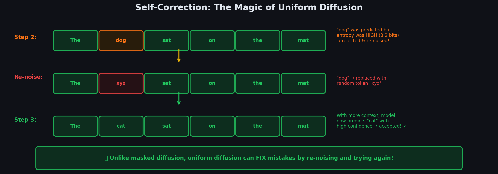

# Chapter 3.3: Uniform State Diffusion (UDLM) — The Core of DiffusionGemma

> *"Replace noise tokens not with [MASK], but with random tokens — and gain the power to self-correct."*



---

## 3.3.1 Core Idea

Instead of masking tokens (replacing with [MASK]), **Uniform State Diffusion** corrupts tokens by replacing them with **uniformly random** tokens from the vocabulary. The model must simultaneously:

1. **Detect** which tokens are noise (corrupted)
2. **Predict** what the correct tokens should be
3. **Self-correct** — change tokens it previously predicted, if new context suggests a better choice

```
  MASKED DIFFUSION                          UNIFORM STATE DIFFUSION
  ┌─────────────────────────┐              ┌─────────────────────────┐
  │ "The [M] [M] on [M] [M]"│             │ "The dog xyz on qr mat" │
  │                          │              │                          │
  │ Noise = [MASK] tokens    │              │ Noise = random tokens    │
  │ Clearly visible!         │              │ Hidden among real ones!  │
  │ (easy to locate noise)   │              │ (must DETECT noise)      │
  │                          │              │                          │
  │ ✗ Cannot fix a choice    │              │ ✓ Can fix any token      │
  │   once made              │              │   at any step            │
  └─────────────────────────┘              └─────────────────────────┘
```

---

## 3.3.2 The Uniform Transition Matrix

Each token independently transitions to a uniformly random token with probability $\beta_t$, or stays the same with probability $1 - \beta_t$:

$$
\mathbf{Q}_t^{\text{uniform}} = (1 - \beta_t)\mathbf{I} + \frac{\beta_t}{K}\mathbf{1}\mathbf{1}^\top
$$

Written explicitly for a vocabulary of size $K$:

$$
[\mathbf{Q}_t^{\text{uniform}}]_{ij} = \begin{cases}
1 - \beta_t + \frac{\beta_t}{K} & \text{if } i = j \quad \text{(stay same)} \\[6pt]
\frac{\beta_t}{K} & \text{if } i \neq j \quad \text{(jump to random token)}
\end{cases}
$$

### Numerical Example

With $K = 4$ tokens and $\beta_t = 0.2$:

$$
\mathbf{Q}_t = \begin{bmatrix}
0.85 & 0.05 & 0.05 & 0.05 \\
0.05 & 0.85 & 0.05 & 0.05 \\
0.05 & 0.05 & 0.85 & 0.05 \\
0.05 & 0.05 & 0.05 & 0.85
\end{bmatrix}
$$

```
  Token "cat" at step t-1:

  P(stay "cat") = 0.85  ████████████████████░░░░
  P(→ "the")    = 0.05  ██░░░░░░░░░░░░░░░░░░░░░
  P(→ "sat")    = 0.05  ██░░░░░░░░░░░░░░░░░░░░░
  P(→ "on")     = 0.05  ██░░░░░░░░░░░░░░░░░░░░░
```

---

## 3.3.3 Cumulative Transition (Direct Jump to Any Time)

The cumulative transition matrix is:

$$
\boxed{\bar{\mathbf{Q}}_t^{\text{uniform}} = \bar{\alpha}_t \mathbf{I} + \frac{1 - \bar{\alpha}_t}{K}\mathbf{1}\mathbf{1}^\top}
$$

where $\bar{\alpha}_t = \prod_{s=1}^{t} (1 - \beta_s)$.

**Proof sketch**: By induction. Base case: $\bar{\mathbf{Q}}_1 = \mathbf{Q}_1$. Inductive step: multiply $\bar{\mathbf{Q}}_{t-1} \cdot \mathbf{Q}_t$ and verify the structure is preserved (the product of two matrices of this form yields another of the same form).

For a specific token $x_0 = k$:

$$
q(x_t = j \mid x_0 = k) = \begin{cases}
\bar{\alpha}_t + \frac{1 - \bar{\alpha}_t}{K} & \text{if } j = k \quad \text{(still the original)} \\[6pt]
\frac{1 - \bar{\alpha}_t}{K} & \text{if } j \neq k \quad \text{(corrupted to random)}
\end{cases}
$$

### Visual: Probability Landscape Over Time

```
  P(x_t | x₀ = "cat"),  K = 50000
  
  t=0 (clean):
  "cat" ████████████████████████████████████████ 1.000
  others                                         0.000 each

  t = T/4:
  "cat" ██████████████████████████████░░░░░░░░░░ 0.750
  others ░                                       0.000005 each

  t = T/2:
  "cat" ████████████████████░░░░░░░░░░░░░░░░░░░ 0.500
  others ░                                       0.00001 each

  t = 3T/4:
  "cat" █████████░░░░░░░░░░░░░░░░░░░░░░░░░░░░░░ 0.250
  others ░░                                      0.000015 each

  t = T (pure noise):
  "cat" ░░░░░░░░░░░░░░░░░░░░░░░░░░░░░░░░░░░░░░ 0.00002
  others ░░░░░░░░░░░░░░░░░░░░░░░░░░░░░░░░░░░░░░ 0.00002 each
                                                  (≈ 1/K uniform)
```

---

## 3.3.4 CTMC Rate Matrix for Uniform Diffusion

In continuous time $t \in [0, 1]$, the rate matrix is:

$$
\mathbf{R}^{\text{uniform}} = \frac{1}{K}\mathbf{1}\mathbf{1}^\top - \mathbf{I}
$$

Written element-wise:

$$
R_{ij} = \begin{cases}
\frac{1}{K} & \text{if } i \neq j \\[4pt]
\frac{1}{K} - 1 & \text{if } i = j
\end{cases}
$$

The marginal at time $t$:

$$
q(x_t = j \mid x_0 = k) = \frac{1}{K} + \left(\delta_{jk} - \frac{1}{K}\right) e^{-\sigma(t)}
$$

where $\sigma(t)$ is the integrated rate: $\sigma(t) = \int_0^t r(s)\, ds$ with $r(s) = \frac{K}{K-1}\sigma'(s)$.

---

## 3.3.5 The Reverse Process (Denoising)

### Continuous-Time Reverse Rate

The reverse-time CTMC has rate matrix:

$$
\boxed{\bar{R}_{ij}^{\theta}(x_t, t) = R_{ji} \cdot \frac{p_\theta(x_0 = j \mid x_t)}{p_\theta(x_0 = i \mid x_t) + \epsilon}}
$$

where $R_{ji}$ is the forward rate from $j$ to $i$, and $p_\theta(x_0 \mid x_t)$ is the model's prediction of the clean token.

### Euler Discretization (Practical Reverse Step)

In practice, we discretize into $S$ steps. At each step with step size $\Delta t = 1/S$:

For each position $i$ in the canvas:

**Step 1.** Run the model to get predicted probabilities:
$$
\hat{p}_i = p_\theta(x_0^i \mid x_t), \qquad \hat{p}_i \in \mathbb{R}^K
$$

**Step 2.** Sample a candidate token from $\hat{p}_i$.

**Step 3.** Accept or reject based on confidence (entropy — more in Chapter 5.4).

**Step 4.** If rejected, **re-noise** — replace with a new uniformly random token.

```
  SINGLE DENOISING STEP (position i in canvas)
  
  ┌───────────────────────────────────────────────────┐
  │                                                     │
  │  Current token: x_t^i = "xyz" (possibly noise)     │
  │                                                     │
  │  Step 1: Model predicts distribution                │
  │     p_θ(x₀ⁱ | x_t) = [0.6, 0.15, 0.1, ...]       │
  │                         ↑cat  ↑dog  ↑sat            │
  │                                                     │
  │  Step 2: Sample "cat" (p=0.6)                       │
  │                                                     │
  │  Step 3: Check confidence                           │
  │     H(p) = 1.2 bits  < threshold? → ACCEPT         │
  │     H(p) = 3.5 bits  > threshold? → REJECT         │
  │                                                     │
  │  Step 4: If rejected, re-noise                      │
  │     x_t^i ← random token from Uniform(1,...,K)     │
  │                                                     │
  └───────────────────────────────────────────────────┘
```

---



## 3.3.6 Why Self-Correction Works

The key difference from Masked Diffusion: **no token is permanent**.

```
  STEP 1:  Model predicts "dog" for position 2 with 55% confidence
  Canvas:  "The  dog  ???  on   ???  ???"
                  ↑
                  Tentative (can be changed!)

  STEP 5:  Context has improved. Positions 3-6 now have better guesses.
  Canvas:  "The  dog  sat  on   the  mat"
                  ↑
                  Now 55% confident, BUT...
                  
  STEP 6:  Model reconsiders ALL positions with updated context.
           "dog sat on the mat" → model realizes "cat" fits better!
  Canvas:  "The  cat  sat  on   the  mat"
                  ↑
                  Changed! 92% confident now.
```

**Mathematically**, at each step the model outputs a **full probability distribution** over the vocabulary for **every** position, not just masked ones. Even positions with previously accepted tokens can change if:

$$
p_\theta(x_0^i = \text{new token} \mid x_t^{\text{updated}}) > p_\theta(x_0^i = \text{old token} \mid x_t^{\text{old}})
$$

---

## 3.3.7 The Re-noising Justification

**Q: Why replace rejected tokens with random tokens instead of keeping the old ones?**

**A: Training distribution mismatch.**

During training, the model sees canvases where noisy positions contain **uniformly random** tokens. If during inference we keep the old (non-uniform) tokens at rejected positions, the canvas distribution at step $s+1$ would differ from what the model was trained on.

```
  TRAINING:                              INFERENCE (wrong):
  Canvas at 60% noise:                   Canvas after step 3:
  ┌──────────────────────┐               ┌──────────────────────┐
  │ "The" [rand] [rand]  │               │ "The" "dog" [old]    │
  │  ↑      ↑      ↑     │               │  ↑      ↑      ↑    │
  │ real  uniform uniform│               │ real  model's  old   │
  │       random  random │               │       guess   token  │
  └──────────────────────┘               └──────────────────────┘
  
  The model expects uniform                ✗ "dog" and [old] are
  random tokens at noisy                     NOT uniformly random!
  positions. This is what it                 Distribution mismatch.
  was trained on.

  INFERENCE (correct):
  ┌──────────────────────┐
  │ "The" [rand] [rand]  │
  │  ↑      ↑      ↑     │
  │ real  NEW     NEW    │
  │       uniform uniform│
  │       random  random │
  └──────────────────────┘
  ✓ Matches training distribution
```

Formally, the training distribution at noise level $\sigma$ has:

$$
q(x_t^i \mid x_0^i \neq x_t^i) = \frac{1}{K} \quad \text{(uniform over vocabulary)}
$$

Keeping old tokens violates this assumption. Re-noising restores it.

---

## 3.3.8 Training Objective for UDLM

The continuous-time ELBO for uniform-state diffusion decomposes per-position:

$$
\boxed{\mathcal{L}_{\text{UDLM}} = \mathbb{E}_{t, x_t}\left[\sigma'(t) \sum_{i=1}^{L} w_t^i \cdot \left(-\log p_\theta(x_0^i \mid x_t)\right)\right]}
$$

where $w_t^i$ weights the loss based on whether position $i$ was corrupted:

$$
w_t^i = \begin{cases}
\frac{K-1}{K} & \text{if } x_t^i \neq x_0^i \quad \text{(corrupted)} \\[4pt]
\frac{1}{K} & \text{if } x_t^i = x_0^i \quad \text{(uncorrupted)}
\end{cases}
$$

**Key insight**: The model must predict the original token at **ALL** positions, not just corrupted ones. But the loss is weighted more heavily on corrupted positions — the model needs to figure out which tokens are noise and fix them.

---

## 3.3.9 Summary Comparison

```
┌─────────────────┬──────────────────┬──────────────────────┐
│                 │  Masked (MDLM)   │  Uniform (UDLM)     │
├─────────────────┼──────────────────┼──────────────────────┤
│ Noise token     │ [MASK] (special) │ Random vocab token   │
│ Noise visible?  │ Yes (explicit)   │ No (hidden)          │
│ Self-correction │ No               │ Yes                  │
│ Predict where?  │ Only [MASK] pos  │ All positions        │
│ Rate matrix     │ Absorbing state  │ Uniform transitions  │
│ Training        │ Easier           │ Harder               │
│ Quality         │ Good             │ Better (with tricks) │
│ Key advantage   │ Simpler          │ Can revise any token │
└─────────────────┴──────────────────┴──────────────────────┘
```

---

**Next**: [04_comparison_table.md](../../04_comparison_table/04_comparison_table/) — Full comparison across all paradigms.
