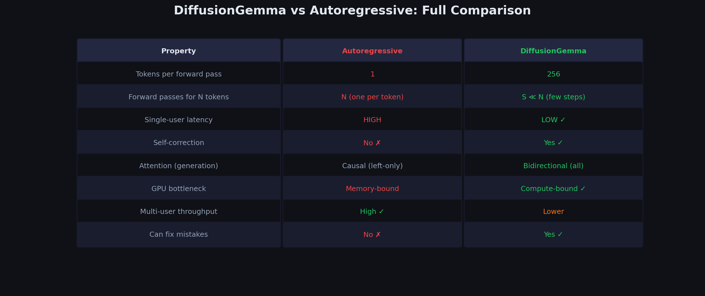

# Chapter 3.4: Comparison — Autoregressive vs. Masked Diffusion vs. Uniform Diffusion



---

## Full Comparison Table

```
┌──────────────────────┬─────────────────┬──────────────────┬───────────────────────┐
│      Property        │ Autoregressive  │ Masked Diffusion │  Uniform Diffusion    │
│                      │ (GPT, Gemma)    │ (MDLM)          │  (UDLM/DiffusionGemma)│
├──────────────────────┼─────────────────┼──────────────────┼───────────────────────┤
│ Generation order     │ Left → Right    │ Any order        │ Any order             │
│ Tokens per step      │ 1               │ Multiple         │ Multiple              │
│ Attention            │ Causal          │ Bidirectional    │ Bidirectional          │
│ Self-correction      │ ✗ No            │ ✗ No             │ ✓ Yes                 │
│ Noise type           │ N/A             │ [MASK] token     │ Random tokens         │
│ "Noise" visible?     │ N/A             │ Yes              │ No                    │
│ Training difficulty  │ Standard        │ Moderate         │ Hard                  │
│ Hardware bottleneck  │ Memory-bound    │ Compute-bound    │ Compute-bound         │
│ Single-user latency  │ High            │ Low              │ Low                   │
│ Multi-user throughput│ Excellent       │ Lower            │ Lower                 │
│ Model architecture   │ Decoder-only    │ Encoder-like     │ Encoder-like          │
│ Loss function        │ Next-token CE   │ Masked-token CE  │ Weighted all-token CE │
│ KV-cache reuse       │ ✓ Across tokens │ ✓ Across steps   │ ✓ Across steps        │
│ Pretrain from AR?    │ N/A             │ Possible         │ ✓ (DiffusionGemma)    │
└──────────────────────┴─────────────────┴──────────────────┴───────────────────────┘
```

---

## Visual: Generation Process Side-by-Side

### Autoregressive (256 tokens = 256 steps)

```
  Step 1:   [The] [   ] [   ] [   ] ... [   ]
  Step 2:   [The] [cat] [   ] [   ] ... [   ]
  Step 3:   [The] [cat] [sat] [   ] ... [   ]
  ...
  Step 256: [The] [cat] [sat] [on ] ... [ . ]
```

### Masked Diffusion (256 tokens ≈ 16 steps)

```
  Step 0:   [M M M M M M M M M M M M ... M M]    (all masked)
  Step 1:   [M M M M on M M M M M M M ... M M]    (unmask "on")
  Step 4:   [M cat M M on M mat M M M ... M M]    (unmask more)
  Step 8:   [The cat sat M on the mat and ... M]   (most unmasked)
  Step 16:  [The cat sat on the mat and purred.]   (complete)
```

### Uniform Diffusion (256 tokens ≈ 16 steps)

```
  Step 0:   [xyz foo bar qq zz aa bb cc ... ww]    (random tokens)
  Step 1:   [The foo sat qq on aa mat cc ... ww]    (some corrected)
  Step 4:   [The cat sat on on the mat cc ... ww]   (more corrected)
  Step 8:   [The cat sat on the mat and pur...]     (almost done)
  Step 10:  [The cat sat on the mat and purred.]    (converged!)
```

Notice: In uniform diffusion, steps 8→10 could still **change** earlier tokens if needed (self-correction).

---

## Mathematical Comparison of Objectives

| Model | Loss Function |
|-------|--------------|
| **Autoregressive** | $\mathcal{L} = -\sum_{i=1}^{N} \log p_\theta(x_i \mid x_{<i})$ |
| **Masked Diffusion** | $\mathcal{L} = \mathbb{E}_t\left[\sigma'(t) \sum_{i:\, x_t^i = \text{[M]}} -\log p_\theta(x_0^i \mid x_t)\right]$ |
| **Uniform Diffusion** | $\mathcal{L} = \mathbb{E}_t\left[\sigma'(t) \sum_{i=1}^{L} w_t^i \cdot (-\log p_\theta(x_0^i \mid x_t))\right]$ |

The key progression:
- Autoregressive: predict one token at a time, conditioned on all previous
- Masked: predict masked tokens, conditioned on unmasked context
- Uniform: predict ALL tokens, conditioned on a noisy canvas (some tokens correct, some random)

---

## Side-by-Side Numerical Trace on the Same Input

To make the differences concrete, we trace **one generation step** for all three paradigms on the **same** underlying sentence, using a toy vocabulary and short canvas.

### Setup

| Symbol | Value |
|--------|-------|
| Vocabulary $K$ | $\{\texttt{cat},\ \texttt{dog},\ \texttt{the},\ \texttt{sat},\ \texttt{on}\}$ (5 tokens, indices 0–4) |
| Canvas length $L$ | 6 positions |
| Target sentence | "The cat sat on the mat" |
| Approximation (no `mat` in vocab) | $\mathbf{x}_0 = [\texttt{the},\ \texttt{cat},\ \texttt{sat},\ \texttt{on},\ \texttt{the},\ \texttt{cat}]$ |

All three models share the same linguistic goal. They differ in **what they see**, **what they predict**, and **what gets locked in** after one step.

---

### Autoregressive: One Token, Conditional Chain Rule

**State before step 4** (first three tokens already generated left-to-right):

```
  Position:   1       2       3       4       5       6
  Canvas:   [the]   [cat]   [sat]   [   ]   [   ]   [   ]
```

The model predicts **only position 4**, conditioned on positions 1–3:

$$
p_\theta(x_4 \mid x_1, x_2, x_3) = \text{softmax}(\text{logits}_4)
$$

**Illustrative logits and probabilities at position 4:**

| Token | Logit | $p_\theta(\cdot \mid \texttt{the, cat, sat})$ |
|-------|-------|-----------------------------------------------|
| `on`  | 3.2   | **0.72** |
| `the` | 1.1   | 0.15 |
| `sat` | 0.4   | 0.08 |
| `dog` | -0.5  | 0.03 |
| `cat` | -1.0  | 0.02 |

**Sample** (argmax): position 4 $\leftarrow$ `on`.

```
  After step 4:
  [the] [cat] [sat] [on ] [   ] [   ]
```

**Chain rule for the first 4 tokens** (how AR training factorizes the joint):

$$
\begin{aligned}
p_\theta(\texttt{the, cat, sat, on})
  &= p_\theta(\texttt{the}) \cdot p_\theta(\texttt{cat} \mid \texttt{the}) \\
  &\quad \cdot p_\theta(\texttt{sat} \mid \texttt{the, cat}) \cdot p_\theta(\texttt{on} \mid \texttt{the, cat, sat})
\end{aligned}
$$

**Numerical chain-rule product** (illustrative conditional probabilities from a trained AR model):

| Factor | Probability |
|--------|-------------|
| $p(\texttt{the})$ | 0.40 |
| $p(\texttt{cat} \mid \texttt{the})$ | 0.55 |
| $p(\texttt{sat} \mid \texttt{the, cat})$ | 0.68 |
| $p(\texttt{on} \mid \texttt{the, cat, sat})$ | 0.72 |

$$
p_\theta(\texttt{the, cat, sat, on}) = 0.40 \times 0.55 \times 0.68 \times 0.72 = \mathbf{0.108}
$$

**Key properties after one AR step:**
- Exactly **1 token** is written.
- **Causal attention**: position 4 never sees positions 5–6.
- **No revision**: `the`, `cat`, `sat` are permanent — AR cannot undo an earlier mistake.
- **256 tokens** $\Rightarrow$ **256 sequential forward passes** (one per new token).

---

### Masked Diffusion: Partially Masked Canvas, Locked Reveals

**State at step $t$** — 3 revealed, 3 masked (`[M]` = mask token):

```
  Position:   1       2       3       4       5       6
  Canvas:   [the]   [M]     [sat]   [M]     [the]   [M]
              ↑               ↑               ↑
           LOCKED           LOCKED           LOCKED
```

The model runs **one bidirectional forward pass** and produces logits at **all** positions, but the training/sampling objective cares only about **masked** positions (2, 4, 6). Revealed tokens are **LOCKED** — they are context, not candidates for change.

**Predictions at masked positions only:**

| Pos | Context (bidirectional) | Top predictions | Sampled |
|-----|----------------------|-----------------|---------|
| 2 | `the` ··· `sat` `the` | `cat` (0.81), `dog` (0.09), `the` (0.05) | `cat` |
| 4 | `the` `cat` `sat` ··· `the` | `on` (0.76), `sat` (0.11), `the` (0.08) | `on` |
| 6 | `the` `cat` `sat` `on` `the` ··· | `cat` (0.62), `dog` (0.18), `on` (0.12) | `cat` |

**After one masked-diffusion step:**

```
  [the] [cat] [sat] [on ] [the] [cat]     ← complete sentence, all positions filled
```

**What the model computed but did NOT change:**

| Pos | Locked token | Model's prediction if it were free | Action |
|-----|--------------|-------------------------------------|--------|
| 1 | `the` | `the` (0.94) | **Ignored** — locked |
| 3 | `sat` | `sat` (0.89) | **Ignored** — locked |
| 5 | `the` | `the` (0.91) | **Ignored** — locked |

**Loss at this step** (masked diffusion objective, only masked positions contribute):

$$
\mathcal{L}_{\text{step}} = -\log p_\theta(\texttt{cat} \mid x_t) - \log p_\theta(\texttt{on} \mid x_t) - \log p_\theta(\texttt{cat} \mid x_t)
$$

$$
\mathcal{L}_{\text{step}} \approx -\log(0.81) - \log(0.76) - \log(0.62) = 0.21 + 0.27 + 0.48 = \mathbf{0.96}
$$

**Key properties after one masked step:**
- **Multiple tokens** unmasked in parallel (here, all 3 masks resolved in one pass).
- **Bidirectional attention** over the full 6-token canvas.
- **No self-correction** of revealed tokens — if position 1 were wrong, it stays wrong.
- The `[M]` token is **visible noise** — the model knows exactly which positions are missing.

---

### Uniform Diffusion: Noisy Canvas, Predictions Everywhere

**State at step $t$** — 3 corrupted, 3 still correct (random noise is **invisible** — just wrong tokens):

```
  Position:   1       2       3       4       5       6
  Canvas:   [the]   [dog]   [sat]   [qq]    [the]   [bar]
              ✓       ✗       ✓       ✗       ✓       ✗
           correct  corrupt correct corrupt correct corrupt
```

(`qq` and `bar` are out-of-vocabulary noise tokens standing in for random vocabulary draws.)

The model predicts at **ALL 6 positions** in one bidirectional pass. Unlike masked diffusion, **every** position is a candidate for change — even positions that already look correct.

**Full prediction table (all positions):**

| Pos | Current | $p(\texttt{cat})$ | $p(\texttt{dog})$ | $p(\texttt{the})$ | $p(\texttt{sat})$ | $p(\texttt{on})$ | Argmax |
|-----|---------|-------------------|-------------------|-------------------|-------------------|------------------|--------|
| 1 | `the` | 0.02 | 0.01 | **0.91** | 0.03 | 0.03 | `the` |
| 2 | `dog` | **0.84** | 0.05 | 0.04 | 0.04 | 0.03 | `cat` |
| 3 | `sat` | 0.03 | 0.02 | 0.04 | **0.87** | 0.04 | `sat` |
| 4 | `qq`  | 0.04 | 0.03 | 0.05 | 0.08 | **0.80** | `on` |
| 5 | `the` | 0.03 | 0.02 | **0.88** | 0.04 | 0.03 | `the` |
| 6 | `bar` | **0.71** | 0.08 | 0.10 | 0.06 | 0.05 | `cat` |

**Entropy at each position** ($H_i = -\sum_k p_k \log p_k$):

| Pos | Entropy $H_i$ (nats) | Interpretation |
|-----|----------------------|----------------|
| 1 | 0.38 | Very confident — likely keep `the` |
| 2 | 0.52 | Confident correction needed: `dog` → `cat` |
| 3 | 0.45 | Very confident — likely keep `sat` |
| 4 | 0.58 | Confident correction: `qq` → `on` |
| 5 | 0.49 | Very confident — likely keep `the` |
| 6 | 0.82 | Moderate uncertainty: `bar` → `cat` |

**Entropy-bounded acceptance** (DiffusionGemma sampler sketch):

Accept position $i$ if $H_i \leq B$ (budget $B$), or always accept the top-$k$ lowest-entropy positions per step.

With budget $B = 0.6$:

| Pos | $H_i \leq 0.6$? | Decision | New token |
|-----|-----------------|----------|-----------|
| 1 | ✓ (0.38) | **Accept** `the` | `the` (unchanged) |
| 2 | ✓ (0.52) | **Accept** `cat` | `cat` (corrected) |
| 3 | ✓ (0.45) | **Accept** `sat` | `sat` (unchanged) |
| 4 | ✓ (0.58) | **Accept** `on` | `on` (corrected) |
| 5 | ✓ (0.49) | **Accept** `the` | `the` (unchanged) |
| 6 | ✗ (0.82) | **Reject** — resample next step | `bar` (kept for now) |

**After one uniform-diffusion step:**

```
  [the] [cat] [sat] [on ] [the] [bar]     ← 5/6 correct; position 6 still noisy
```

**Critical difference from masked**: Position 1 (`the`) and position 3 (`sat`) **still received fresh predictions**. The model *could* have changed them if uncertain — enabling **self-correction** of earlier errors in later steps. Position 6 remains noisy because entropy exceeded the budget.

**Loss at this step** (uniform diffusion, all positions weighted):

$$
\mathcal{L}_{\text{step}} = \sum_{i=1}^{6} w_t^i \cdot \left(-\log p_\theta(x_0^i \mid x_t)\right)
$$

Corrupted positions get higher weight $w_t^i$; clean positions get lower weight — but **both** contribute gradients during training.

---

### Trace Summary: One Step, Three Behaviors

```
  SAME TARGET: [the] [cat] [sat] [on] [the] [cat]

  AUTOREGRESSIVE (step 4 of 6):
    Input:  [the] [cat] [sat] [   ] [   ] [   ]
    Predict: position 4 only → "on" (0.72)
    Output: [the] [cat] [sat] [on ] [   ] [   ]
    Locked: positions 1–3 forever

  MASKED DIFFUSION (1 step):
    Input:  [the] [M] [sat] [M] [the] [M]
    Predict: positions 2, 4, 6 only
    Output: [the] [cat] [sat] [on ] [the] [cat]
    Locked: positions 1, 3, 5 (revealed context)

  UNIFORM DIFFUSION (1 step):
    Input:  [the] [dog] [sat] [qq] [the] [bar]
    Predict: ALL 6 positions; accept 5, reject 1
    Output: [the] [cat] [sat] [on ] [the] [bar]
    Locked: nothing — every position is revisable
```

---

## When Each Model Wins — Concrete Scenarios

The comparison table lists qualitative trade-offs. Here we make them **quantitative** with latency and throughput formulas.

### Shared Notation

| Symbol | Meaning |
|--------|---------|
| $N$ | Tokens to generate (e.g., 256) |
| $S$ | Denoising steps (e.g., 16 for diffusion) |
| $t_{\text{step}}$ | Wall-clock time per forward pass (seconds) |
| $B$ | Batch size (number of concurrent sequences) |
| $P_{\text{active}}$ | Active parameters per token (4B for Gemma 4 A4B) |
| $C_{\text{fwd}}$ | FLOPs per forward pass $\approx 2 \cdot P_{\text{active}} \cdot N_{\text{tok}}$ |

---

### Scenario 1: Chatbot Serving 1000 Users Simultaneously → AR Wins

**Setup**: A production API with 1000 concurrent chat sessions, each generating $N = 256$ tokens.

**Autoregressive throughput** (with KV-cache batching):

$$
\text{Throughput}_{\text{AR}} = \frac{B \cdot \mathbb{E}[\text{tokens written per step}]}{t_{\text{step}}} = \frac{B \cdot 1}{t_{\text{step}}}
$$

With continuous batching, new users join mid-generation. At steady state with $B = 1000$:

$$
\text{Throughput}_{\text{AR}} = \frac{1000}{t_{\text{step}}} \quad \text{tokens/sec across all users}
$$

**Diffusion throughput** (each user needs $S$ full-canvas passes):

$$
\text{Throughput}_{\text{Diff}} = \frac{B \cdot L}{S \cdot t_{\text{step}}} = \frac{1000 \times 256}{16 \times t_{\text{step}}} = \frac{16{,}000}{t_{\text{step}}}
$$

Wait — diffusion writes $L$ tokens per $S$ steps, so tokens per second per user is $L / (S \cdot t_{\text{step}})$:

$$
\text{Tokens/sec/user}_{\text{Diff}} = \frac{256}{16 \cdot t_{\text{step}}} = \frac{16}{t_{\text{step}}}
$$

**Per-user token rate**: AR produces 1 token per $t_{\text{step}}$ once warmed up; diffusion produces 16 tokens/sec-equivalent but in **bursts** of 256 every $16 \cdot t_{\text{step}}$.

**Why AR wins on multi-user throughput**: KV-cache batching amortizes attention over $B$ sequences. AR systems (vLLM, TGI) maturely pack heterogeneous sequence lengths. Diffusion processes a full $L = 256$ canvas per user per step — harder to batch efficiently when sequences finish at different rates.

$$
\frac{\text{GPU utilization}_{\text{AR}}}{\text{GPU utilization}_{\text{Diff}}} \approx \frac{B_{\text{eff, AR}}}{B_{\text{eff, Diff}}} \gg 1 \quad \text{in production}
$$

**Concrete numbers** ($t_{\text{step}} = 50$ ms, 1000 users):

| Metric | Autoregressive | Uniform Diffusion |
|--------|----------------|-------------------|
| Forward passes per user | 256 | 16 |
| Time to first token | $\approx 50$ ms | $\approx 800$ ms (full first pass) |
| Total time per user | $256 \times 0.05 = 12.8$ s | $16 \times 0.05 = 0.8$ s |
| Batched server throughput | $\sim$78K tok/s (with batching) | $\sim$16K tok/s (canvas-bound) |

AR wins **server economics**: maximizing tokens/GPU-second across many users favors sequential generation with mature batching infrastructure.

---

### Scenario 2: Single User Wanting Fastest Response → Diffusion Wins

**Setup**: One user, one prompt, wants the **full 256-token response** as fast as possible.

**Autoregressive latency**:

$$
T_{\text{AR}} = N \cdot t_{\text{step}} = 256 \times 0.05 = \mathbf{12.8 \text{ seconds}}
$$

**Diffusion latency**:

$$
T_{\text{Diff}} = S \cdot t_{\text{step}} = 16 \times 0.05 = \mathbf{0.8 \text{ seconds}}
$$

**Speedup**:

$$
\frac{T_{\text{AR}}}{T_{\text{Diff}}} = \frac{N}{S} = \frac{256}{16} = \mathbf{16\times}
$$

**Why**: Diffusion generates all $L$ positions in parallel each step. AR must visit each position sequentially because $p(x_i \mid x_{<i})$ requires all prior tokens to exist.

$$
\underbrace{t_{\text{step}} + t_{\text{step}} + \cdots}_{N \text{ times}}_{\text{AR}} \quad \text{vs.} \quad \underbrace{t_{\text{step}} + t_{\text{step}} + \cdots}_{S \text{ times}}_{\text{Diff}}
$$

When $S \ll N$, diffusion wins wall-clock time for **full completion**, even though each diffusion step is more expensive (bidirectional attention over 256 tokens vs. causal attention with KV cache).

**Caveat**: Time-to-**first**-token favors AR ($t_{\text{step}}$ vs. $S_{\text{first}} \cdot t_{\text{step}}$). Diffusion wins when the user wants the **complete** response, not streaming word-by-word.

---

### Scenario 3: Coherent Long-Form Essay → AR May Be Better

**Setup**: Generate a 2000-token essay where each paragraph must flow naturally from the previous one.

**Autoregressive coherence** comes from the **exact factorization**:

$$
p(\mathbf{x}) = \prod_{i=1}^{N} p_\theta(x_i \mid x_{<i})
$$

Each token is explicitly conditioned on **all** prior tokens. There is no ambiguity about what came before — the chain is locked.

**Diffusion coherence challenge**: At step $s$, position 500 may be predicted while position 1500 is still random noise. Bidirectional attention lets position 500 "see" position 1500's noise, creating **spurious correlations**:

$$
p_\theta(x_{500} \mid \underbrace{x_1, \ldots, x_{499}}_{\text{partially clean}}, \underbrace{x_{501}, \ldots, x_{2000}}_{\text{noisy}})
$$

**Error propagation analysis**:

| Model | Error type | Recoverable? |
|-------|-----------|--------------|
| AR | Early wrong word poisons all subsequent conditioning | ✗ No — locked in |
| Masked | Wrong revealed token poisons context for all masks | ✗ No — locked in |
| Uniform | Wrong token at any position | ✓ Yes — self-corrected in later steps |

For **long-form coherence**, AR's strict left-to-right conditioning means the model never hallucinates a "future" that contradicts the past. Diffusion must learn to **ignore** noisy future positions during early steps — a harder inference problem.

**When diffusion still competes**: With uniform diffusion + self-conditioning, later steps refine global coherence. But for 2000-token essays at $S \approx 16$, each position gets only $\sim$16 refinement passes vs. AR's 2000 steps of accumulated context.

$$
\text{Coherence pressure} \propto \frac{N}{S} \quad \Rightarrow \quad \text{AR advantage grows with } N
$$

---

### Scenario 4: Code Generation with Constraints → Diffusion Wins

**Setup**: Generate a Python function where line 1 imports `numpy`, line 10 uses `np.array`, and line 20 references variable `data` defined on line 8.

**The self-correction advantage**:

```
  Step 3 (uniform diffusion):
    Line 8:  data = np.arrzy(...)     ← typo: "arrzy"
    Line 20: result = data.shape      ← consistent with typo

  Step 5 (after correction):
    Line 8:  data = np.array(...)     ← corrected!
    Line 20: result = data.shape      ← still valid, or re-corrected if needed
```

AR cannot revise line 8 after line 20 is written. If the import on line 1 was wrong, **every subsequent line** is conditioned on that error.

**Constraint satisfaction as entropy reduction**:

Define **constraint entropy** $H_{\text{constraint}}$ = uncertainty about whether the canvas satisfies all constraints (syntax, variable bindings, type checks).

| Step | $H_{\text{constraint}}$ (bits) | Action |
|------|-------------------------------|--------|
| 0 | 8.2 | Random canvas — many violations |
| 4 | 3.1 | Syntax mostly fixed, 2 variable errors |
| 8 | 0.6 | One remaining type mismatch |
| 12 | 0.1 | All constraints satisfied |

Uniform diffusion drives $H_{\text{constraint}} \rightarrow 0$ by revising **any** position. AR drives it down only by **never making mistakes** — a much harder online requirement.

**Formal sketch**: Let $C(\mathbf{x}) = 1$ if canvas $\mathbf{x}$ satisfies all constraints, 0 otherwise.

$$
P(\text{valid code} \mid \text{AR}) = \prod_{i=1}^{N} P(x_i \text{ valid} \mid x_{<i} \text{ valid}) \quad \text{(no recovery from failure)}
$$

$$
P(\text{valid code} \mid \text{Diff}) \approx 1 - (1 - p_{\text{fix}})^S \quad \text{(} S \text{ chances to fix each error)}
$$

Diffusion wins when **global consistency** matters more than **local fluency** — code, structured JSON, constraint puzzles, and fill-in-the-blank reasoning.

---

## Complexity Comparison

### Formula Reference

| Quantity | Autoregressive | Masked Diffusion | Uniform Diffusion |
|----------|----------------|------------------|-------------------|
| Forward passes to generate $N$ tokens | $N$ | $S$ | $S$ |
| Tokens predicted per pass | 1 | $\leq N$ (masked only) | $N$ (all positions) |
| Attention type | Causal | Bidirectional | Bidirectional |
| Attention complexity per layer | $O(N \cdot d)$ with KV cache | $O(N^2 \cdot d)$ | $O(N^2 \cdot d)$ |
| Training loss positions per example | 1 (next token) | $\mathbb{E}[\|\text{masked}\|]$ | $N$ (all, weighted) |

---

### Training FLOPs per Example

**Autoregressive** (one next-token prediction, sequence length $N$):

$$
\text{FLOPs}_{\text{train, AR}} \approx 2 \cdot P_{\text{active}} \cdot N = 2 \cdot 4 \times 10^9 \cdot N
$$

For $N = 256$: $\text{FLOPs}_{\text{train, AR}} \approx 2.05 \times 10^{12}$ (2.05 TFLOPs).

**Masked diffusion** (one noise level $t$, predict masked positions, full bidirectional pass):

$$
\text{FLOPs}_{\text{train, Masked}} \approx 2 \cdot P_{\text{active}} \cdot N = 2.05 \times 10^{12}
$$

Same order as AR per training step, but the loss is computed on $\sim \sigma(t) \cdot N$ masked positions (typically 30–70% of canvas).

**Uniform diffusion** (predict all $N$ positions, weighted loss):

$$
\text{FLOPs}_{\text{train, Uniform}} \approx 2 \cdot P_{\text{active}} \cdot N + \underbrace{N \cdot K \cdot d}_{\text{LM head over all positions}}
$$

LM head adds $256 \times 256{,}000 \times 5376 \approx 3.5 \times 10^{11}$ FLOPs — significant but still dominated by the transformer body. Total $\approx 2.4 \times 10^{12}$ TFLOPs per example.

**Training difficulty ranking** (same FLOPs, different gradient signal):

$$
\text{Uniform} > \text{Masked} > \text{AR} \quad \text{(gradient variance and task difficulty)}
$$

---

### Inference FLOPs per Token

**Autoregressive** — amortized over $N$ generated tokens, with KV cache:

$$
\text{FLOPs}_{\text{infer, AR per token}} \approx \frac{2 \cdot P_{\text{active}} \cdot N_{\text{seq}}}{1} \approx 2 \cdot 4 \times 10^9 \cdot 128 = 1.02 \times 10^{12}
$$

where $N_{\text{seq}}$ grows from 1 to $N$ but KV cache reduces per-step cost to $O(N_{\text{seq}})$ attention, not $O(N_{\text{seq}}^2)$. Per-token **amortized** cost stabilizes at $\sim 2 \cdot P_{\text{active}}$ FLOPs/token for long sequences.

**Diffusion** — amortized over $N$ tokens in $S$ steps:

$$
\text{FLOPs}_{\text{infer, Diff per token}} = \frac{S \cdot 2 \cdot P_{\text{active}} \cdot L}{L} = 2 \cdot P_{\text{active}} \cdot S = 2 \cdot 4 \times 10^9 \cdot 16 = 1.28 \times 10^{11}
$$

Wait, let me recalculate: total inference FLOPs = $S \times 2 \times P_{\text{active}} \times L$, per-token amortized:

$$
\frac{\text{FLOPs}_{\text{total}}}{L} = \frac{S \cdot 2 \cdot P_{\text{active}} \cdot L}{L} = 2 \cdot P_{\text{active}} \cdot S = 1.28 \times 10^{11} \text{ FLOPs/token}
$$

Compared to AR's $\sim 8 \times 10^9$ FLOPs/token (with KV cache, steady state):

$$
\frac{\text{FLOPs/token}_{\text{Diff}}}{\text{FLOPs/token}_{\text{AR}}} \approx \frac{2 \cdot P_{\text{active}} \cdot S}{2 \cdot P_{\text{active}}} = S = 16
$$

Each diffusion token "costs" 16× the FLOPs of a cached AR token — but AR needs 256 sequential passes while diffusion needs only 16. Net wall-clock FLOPs:

| Model | Total FLOPs (256 tokens) | Passes |
|-------|--------------------------|--------|
| AR (KV cached) | $\approx 256 \times 8 \times 10^9 = 2.05 \times 10^{12}$ | 256 |
| Diffusion | $\approx 16 \times 2 \times 4 \times 10^9 \times 256 = 3.28 \times 10^{13}$ | 16 |

Diffusion uses **more total FLOPs** but in **fewer sequential steps** — a classic throughput–latency trade-off exploitable on parallel hardware.

---

### Memory Usage (KV Cache)

**Autoregressive KV cache** (causal, grows with sequence length):

$$
\text{Memory}_{\text{KV, AR}} = 2 \times L_{\text{layers}} \times N_{\text{seq}} \times d_k \times n_{\text{KV-heads}} \times \texttt{sizeof}(\text{fp16})
$$

**Diffusion KV cache** (encoder cache reused across $S$ denoiser steps; canvas self-attention recomputed each step):

$$
\text{Memory}_{\text{KV, Diff}} = 2 \times L_{\text{layers}} \times n_{\text{query}} \times d_k \times \texttt{sizeof}(\text{fp16})
$$

where $n_{\text{query}}$ = encoder prompt length (fixed, independent of canvas $L$).

**Gemma 4 26B A4B — worked example** ($L_{\text{layers}} = 50$, $d_k = 128$, fp16):

| Setting | $N$ or $n$ | KV Cache Size |
|---------|------------|---------------|
| AR, 256 tokens generated | $N_{\text{seq}} = 256$ | $2 \times 50 \times 256 \times 128 \times 2 = 6.55$ MB |
| AR, 1000 tokens generated | $N_{\text{seq}} = 1000$ | $2 \times 50 \times 1000 \times 128 \times 2 = 25.6$ MB |
| Diffusion, encoder only | $n = 100$ | $2 \times 50 \times 100 \times 128 \times 2 = 2.56$ MB |
| Diffusion, canvas (no cache) | $L = 256$ | Recomputed each step — not cached |

**Key insight**: Diffusion's encoder KV cache is **tiny** (2.56 MB) and **shared across all 16 denoiser steps**. AR's cache **grows linearly** with total generated tokens. For long AR generations, memory becomes the bottleneck; diffusion's fixed encoder cache is negligible relative to 26B model weights ($\sim$52 GB in fp16).

---

### Number of Forward Passes for $N = 256$ Tokens

| Model | Forward passes | Parallelism per pass | Effective sequential depth |
|-------|---------------|---------------------|---------------------------|
| **Autoregressive** | $N = 256$ | 1 token | 256 (inherently serial) |
| **Masked Diffusion** | $S \approx 16$ | $\leq N$ masked tokens | 16 |
| **Uniform Diffusion** | $S \approx 16$ | $N$ tokens (all positions) | 16 |

**Latency formula**:

$$
T_{\text{total}} = \underbrace{(\text{\# passes})}_{\text{sequential}} \times \underbrace{t_{\text{step}}}_{\text{per pass}} \times \underbrace{\frac{1}{\text{parallelism factor}}}_{\text{hardware}}
$$

| Model | Sequential passes | $t_{\text{step}}$ (relative) | $T_{\text{total}}$ (relative) |
|-------|-------------------|-------------------------------|-------------------------------|
| AR | 256 | 1× (causal, KV cached) | $256 \times 1 = 256$ |
| Masked | 16 | 4× (bidirectional $N^2$) | $16 \times 4 = 64$ |
| Uniform | 16 | 4× (bidirectional $N^2$) | $16 \times 4 = 64$ |

Even though each diffusion step is $\sim$4× more expensive per pass (bidirectional attention over 256 tokens), the **16× fewer passes** yield a net $\sim$4× wall-clock speedup for single-user full completion.

---

### Master Comparison Table (Gemma 4 Scale, $N = 256$)

```
┌─────────────────────────┬──────────────────┬──────────────────┬───────────────────────┐
│      Metric             │ Autoregressive   │ Masked Diffusion │  Uniform Diffusion    │
├─────────────────────────┼──────────────────┼──────────────────┼───────────────────────┤
│ Forward passes          │ 256              │ ~16              │ ~16                   │
│ FLOPs per pass          │ ~8 TFLOPs (cached)│ ~41 TFLOPs      │ ~41 TFLOPs            │
│ Total inference FLOPs   │ ~2.1 PFLOPs        │ ~0.66 PFLOPs*    │ ~0.66 PFLOPs*         │
│ KV cache (100 tok enc.) │ grows: 6.5 MB+    │ fixed: 2.56 MB   │ fixed: 2.56 MB        │
│ Time to full 256 tokens │ ~12.8 s           │ ~3.2 s           │ ~3.2 s                │
│ Time to first token     │ ~50 ms            │ ~800 ms          │ ~800 ms               │
│ Self-correction         │ ✗                 │ ✗                │ ✓                     │
│ Multi-user batching     │ Excellent         │ Moderate         │ Moderate              │
│ Training difficulty     │ Standard          │ Moderate         │ Hard                  │
└─────────────────────────┴──────────────────┴──────────────────┴───────────────────────┘

* Total FLOPs lower for diffusion because each pass is over fixed canvas L,
  but each pass is wider (bidirectional). Wall-clock wins from parallelism.
```

---

**Next**: [01_gemma4_base_model](../../04_Architecture/01_gemma4_base_model/) — The Gemma 4 foundation.
