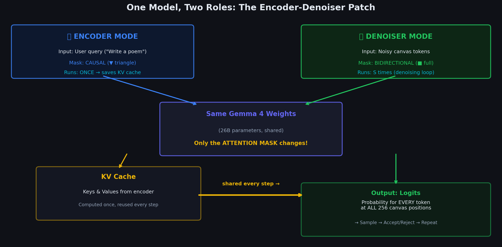

# Chapter 4.0: Bridge — From Theory to "How Do We Actually Build This?"

> *Before diving into DiffusionGemma's architecture, let's connect the dots from everything we learned in Chapters 2–3.*


---

## Where We Are Right Now

In Chapters 2–3, we learned what diffusion needs to work for text:

```
  WHAT WE LEARNED SO FAR:

  Ch 2: Diffusion = iteratively denoise something
        ┌─────────┐     ┌─────────┐     ┌─────────┐
        │  Noise   │ ──→ │  Less   │ ──→ │  Clean  │
        │          │     │  Noise  │     │  Data   │
        └─────────┘     └─────────┘     └─────────┘

  Ch 3: For text, "noise" = replace tokens with random tokens
        [rand rand rand rand] → [The rand sat rand] → [The cat sat on]
        
        This is "Uniform State Diffusion"
```

**The question now**: How do we actually build a model that can do this?

---

## The Three Things We Need

To make text diffusion work, we need **three** capabilities:

```
  ╔═══════════════════════════════════════════════════════════════════════╗
  ║                   THE THREE THINGS WE NEED                           ║
  ╠═══════════════════════════════════════════════════════════════════════╣
  ║                                                                      ║
  ║  NEED 1: UNDERSTAND THE QUERY                                       ║
  ║  ─────────────────────────────                                       ║
  ║  User says: "Write a haiku about the ocean"                          ║
  ║  The model must deeply understand this request                       ║
  ║  before it can generate anything.                                    ║
  ║                                                                      ║
  ║  → We call this the "ENCODER" role                                   ║
  ║  → Input: user's text query                                          ║
  ║  → Output: a rich representation of what the user wants              ║
  ║                                                                      ║
  ╠══════════════════════════════════════════════════════════════════════╣
  ║                                                                      ║
  ║  NEED 2: DENOISE A CANVAS                                           ║
  ║  ────────────────────────                                            ║
  ║  Given 256 random tokens and the query representation,               ║
  ║  predict what the clean tokens should be.                            ║
  ║                                                                      ║
  ║  → We call this the "DENOISER" role                                  ║
  ║  → Input: noisy canvas (256 random tokens) + query understanding    ║
  ║  → Output: predicted clean token at EVERY position                   ║
  ║                                                                      ║
  ╠══════════════════════════════════════════════════════════════════════╣
  ║                                                                      ║
  ║  NEED 3: COMMUNICATE BETWEEN ENCODER AND DENOISER                   ║
  ║  ────────────────────────────────────────────────                     ║
  ║  The denoiser must know what the encoder understood.                  ║
  ║  We need a way to pass the encoder's understanding                   ║
  ║  to the denoiser efficiently.                                        ║
  ║                                                                      ║
  ║  → We call this the "BRIDGE" mechanism                               ║
  ║  → The encoder's output feeds into the denoiser                      ║
  ║                                                                      ║
  ╚══════════════════════════════════════════════════════════════════════╝
```

---

## The Naive Approach: Two Separate Models

The simplest approach would be to train two separate models:

```
  NAIVE APPROACH (❌ Too Expensive):
  
  ┌──────────────────────────────┐
  │  MODEL A: "Encoder"          │     ┌──────────────────────────────┐
  │  (BERT-like, bidirectional)  │────▶│  MODEL B: "Denoiser"         │
  │  26B parameters              │     │  (New model, bidirectional)  │
  │  Trained from scratch        │     │  26B parameters              │
  │                               │     │  Trained from scratch        │
  └──────────────────────────────┘     └──────────────────────────────┘
  
  Problems:
  ✗ Need to train 52B parameters from scratch
  ✗ Need a cross-attention mechanism between them
  ✗ Extremely expensive (months of GPU time)
  ✗ Throws away all existing pre-training work
```

---

## Why Cross-Attention Fails

If we stick with two separate models, the natural way to connect them is **cross-attention** — the same pattern used in image diffusion. In Stable Diffusion, a separate text encoder (CLIP) produces embeddings that the denoiser (a UNet) consumes via cross-attention at every layer. The denoiser's queries attend to the encoder's keys and values, and the two networks stay decoupled.

That design works well for **images** because the architectures are fundamentally different:

```
  IMAGE DIFFUSION (Stable Diffusion):
  
  ┌─────────────────┐         cross-attention        ┌─────────────────┐
  │  CLIP Text      │  ────────────────────────────▶ │  UNet Denoiser  │
  │  Encoder        │         at every layer         │  (conv layers)  │
  │  (Transformer)  │                                │  (different arch!)│
  └─────────────────┘                                └─────────────────┘
  
  Different architectures → cross-attention is the natural glue.
```

For **text**, both the encoder and the denoiser process **sequences of tokens** through **transformer layers**. They share the same architecture — stacked self-attention blocks with identical weight matrices. The naive cross-attention approach would therefore require bolting on a *second* attention pathway at every layer:

- Separate $W_Q^{\text{cross}}$, $W_K^{\text{cross}}$, $W_V^{\text{cross}}$ projection matrices for cross-attention
- Each projection is $d_{\text{model}} \times d_{\text{model}}$
- That is $3 \times d_{\text{model}} \times d_{\text{model}}$ **new** parameters per layer

For Gemma 4 ($d_{\text{model}} = 3072$, 42 layers):

$$
3 \times d_{\text{model}}^2 \times L = 3 \times 3072^2 \times 42 \approx 1.2 \times 10^9 \text{ parameters}
$$

Roughly **1.2 billion** extra parameters — on top of the 52B you already need for two full models. Worse, these cross-attention weights have no pre-trained initialization. You would be training them from scratch, which largely defeats the purpose of starting from an already-capable language model.

```
  TEXT DIFFUSION (naive two-model approach):
  
  ┌─────────────────────────┐     cross-attention     ┌─────────────────────────┐
  │  Encoder Transformer    │  ─────────────────────▶ │  Denoiser Transformer   │
  │  (42 layers, d=3072)    │   +1.2B NEW params      │  (42 layers, d=3072)    │
  │  SAME architecture!     │   per layer, untrained  │  SAME architecture!     │
  └─────────────────────────┘                         └─────────────────────────┘
  
  Same architecture → cross-attention is redundant AND expensive.
```

DiffusionGemma's insight is to avoid this entirely. If both roles live inside one transformer, the existing self-attention mechanism can serve as the bridge — no new projections required.

---



## The DiffusionGemma Insight: One Model, Two Hats

What if we didn't build from scratch? What if we took an already-excellent model — **Gemma 4 26B** — and taught it to wear two hats?

```
  DIFFUSIONGEMMA APPROACH (✓ Elegant):
  
  ┌─────────────────────────────────────────────────────────┐
  │                                                          │
  │                 GEMMA 4 26B A4B                          │
  │              (already pre-trained!)                      │
  │                                                          │
  │  ┌──────────────────┐     ┌──────────────────────────┐  │
  │  │  🎩 HAT 1:        │     │  🎩 HAT 2:                │  │
  │  │  "Encoder"        │     │  "Denoiser"              │  │
  │  │                   │     │                           │  │
  │  │  Same weights     │     │  Same weights             │  │
  │  │  Causal attention │     │  Bidirectional attention  │  │
  │  │  Process query    │     │  Denoise canvas           │  │
  │  │  Output: KV cache │────▶│  Uses encoder's KV cache │  │
  │  │                   │     │  Output: token predictions│  │
  │  └──────────────────┘     └──────────────────────────┘  │
  │                                                          │
  │  The ONLY difference between the two modes is            │
  │  the ATTENTION MASK (causal vs bidirectional)            │
  │                                                          │
  └─────────────────────────────────────────────────────────┘
```

**Key realization**: A decoder-only transformer already has everything we need:
- It can process text (encoder role)
- It can predict tokens (denoiser role)  
- It already has a KV cache mechanism (bridge)

We just need to change ONE thing: the attention mask.

---

## The Mask Trick Explained Mathematically

Why is changing *only* the attention mask enough? Because the mask controls **who can talk to whom** — it does not change the weights that compute the conversation.

Standard scaled dot-product attention in a transformer layer is:

$$
\text{Attn}(Q, K, V) = \text{softmax}\left(\frac{QK^\top}{\sqrt{d_k}} + M\right) V
$$

Here $Q$, $K$, and $V$ are produced by the **same** learned projections $W_Q$, $W_K$, $W_V$ regardless of mode. The mask $M$ is added to the attention logits before softmax. Positions where $M_{ij} = -\infty$ receive zero weight after softmax — those pairs cannot communicate.

**Causal mask** (encoder mode — each token sees only past tokens):

$$
M_{ij}^{\text{causal}} = \begin{cases} 0 & \text{if } j \leq i \\ -\infty & \text{if } j > i \end{cases}
$$

**Bidirectional mask** (denoiser mode among canvas tokens — every token sees every token):

$$
M_{ij}^{\text{bidir}} = 0 \quad \text{for all } i, j
$$

**Combined mask** (encoder + denoiser in one forward pass): DiffusionGemma concatenates query tokens and canvas tokens into a single sequence. The mask enforces three rules:

1. **Encoder tokens** use a causal mask among themselves (rule 1 of a decoder)
2. **Canvas tokens** use a bidirectional mask among themselves (full context for denoising)
3. **Canvas tokens can attend to ALL encoder tokens** (the bridge)
4. **Encoder tokens cannot attend to canvas tokens** (the encoder runs first; canvas is future information)

Consider a toy example: 3 query tokens ($q_1, q_2, q_3$) and 4 canvas tokens ($c_1, c_2, c_3, c_4$). The full $7 \times 7$ attention mask is:

```
         q1  q2  q3  c1  c2  c3  c4
    q1 [  0  -∞  -∞  -∞  -∞  -∞  -∞ ]
    q2 [  0   0  -∞  -∞  -∞  -∞  -∞ ]
    q3 [  0   0   0  -∞  -∞  -∞  -∞ ]
    c1 [  0   0   0   0   0   0   0  ]
    c2 [  0   0   0   0   0   0   0  ]
    c3 [  0   0   0   0   0   0   0  ]
    c4 [  0   0   0   0   0   0   0  ]
```

Read this matrix row by row:

- **Rows $q_1$–$q_3$**: upper-left block is lower-triangular (causal). The right block is all $-\infty$ — encoder tokens never peek at the canvas.
- **Rows $c_1$–$c_4$**: left block is all $0$ — every canvas token can read the full encoder context. The right block is all $0$ — canvas tokens see each other bidirectionally.

No new parameters were introduced. The same $W_Q$, $W_K$, $W_V$ matrices that Gemma was pre-trained with now serve both roles; only $M$ changes between encoder pass and denoiser pass. That is the entire trick.

---

## What Happens Step by Step (The Big Picture)

Let's trace through the entire flow at a high level before diving into each piece:

```
  USER: "Write a haiku about the ocean"

  ═══════════════════════════════════════════════════════════════
  STEP A: ENCODER MODE (runs ONCE)
  ═══════════════════════════════════════════════════════════════
  
  Input tokens:  ["Write", "a", "haiku", "about", "the", "ocean"]
       │
       ▼
  ┌─────────────────────────────────────────────────────────┐
  │  Gemma 4 with CAUSAL attention mask                      │
  │  (each token can only look LEFT)                         │
  │                                                          │
  │  "Write"  → processes alone                              │
  │  "a"      → sees "Write"                                 │
  │  "haiku"  → sees "Write", "a"                            │
  │  "about"  → sees "Write", "a", "haiku"                   │
  │  "the"    → sees "Write", "a", "haiku", "about"          │
  │  "ocean"  → sees ALL previous tokens                     │
  │                                                          │
  │  At every layer, store the Key and Value vectors:        │
  │  These form the "KV CACHE"                               │
  └─────────────────────────────────────────────────────────┘
       │
       ▼
  KV Cache stored: {K and V for each of the 6 tokens, at every layer}
  This captures the encoder's "understanding" of the query.
  
  
  ═══════════════════════════════════════════════════════════════
  STEP B: INITIALIZE CANVAS
  ═══════════════════════════════════════════════════════════════
  
  Create 256 random tokens:
  Canvas = ["xq", "##", "the", "!!!", "zz", "cat", "7f", ..., "mp"]
            ↑ these are all random garbage
  
  
  ═══════════════════════════════════════════════════════════════
  STEP C: DENOISER MODE (runs S times, e.g. S=16)
  ═══════════════════════════════════════════════════════════════
  
  For each denoising step s = 1, 2, ..., S:
  
  ┌─────────────────────────────────────────────────────────┐
  │  Gemma 4 with BIDIRECTIONAL attention mask               │
  │  (each canvas token can look at ALL other tokens)        │
  │  (AND can look at the encoder's KV cache)                │
  │                                                          │
  │  Canvas token "xq" at position 1:                        │
  │    → looks at encoder KV: "Write a haiku about ocean"    │
  │    → looks at ALL canvas tokens: "xq ## the !!! zz ..."  │
  │    → predicts: "Waves" with 60% confidence               │
  │                                                          │
  │  Canvas token "##" at position 2:                        │
  │    → looks at encoder KV: "Write a haiku about ocean"    │
  │    → looks at ALL canvas tokens (including pos 1!)       │
  │    → predicts: "crash" with 40% confidence               │
  │                                                          │
  │  ... (for all 256 positions simultaneously)              │
  │                                                          │
  └─────────────────────────────────────────────────────────┘
       │
       ▼
  For each position: Accept or Reject the prediction
  - Confident predictions → ACCEPT (put in canvas)
  - Uncertain predictions → REJECT (replace with new random token)
       │
       ▼
  Updated canvas fed back into next denoising step
  Repeat until canvas converges!
  
  
  ═══════════════════════════════════════════════════════════════
  STEP D: OUTPUT
  ═══════════════════════════════════════════════════════════════
  
  Final canvas: ["Waves", "crash", "upon", "the", "shore", ...]
  → Detokenize → "Waves crash upon the shore..."
```

---

## Why This Works: Attention as Communication

The step-by-step trace above is operational — here is the *mechanistic* reason it works.

### Encoder mode builds a layered understanding

In encoder mode, each transformer layer refines the token representations hierarchically. Early layers capture local syntax ("haiku" is a noun); deeper layers capture semantics ("ocean" + "haiku" → nature imagery, 5-7-5 structure). By the final layer, each query token has a rich contextual embedding.

Crucially, at **every layer** the model also computes Key and Value vectors for each token. When we store these in the KV cache, we are not just saving memory for speed — we are preserving the encoder's **layer-by-layer interpretation** of the query.

### The KV cache is a communication channel

Think of the KV cache as a set of stored answers, indexed by layer:

```
  Layer 1 KV cache:  low-level features of "Write a haiku about the ocean"
  Layer 2 KV cache:  syntactic structure
  ...
  Layer 42 KV cache: full semantic understanding
```

When the denoiser runs, canvas tokens produce **Queries** ($Q$) at each layer. Those queries attend to the encoder's stored **Keys** ($K$) and **Values** ($V$) from the same layer. The canvas token is effectively asking: *"Given what the encoder understood at this level of abstraction, what should I predict here?"*

### Same weights, different conversation pattern

This is **functionally equivalent** to cross-attention between two models:

| Cross-attention (two models) | DiffusionGemma (one model) |
|------------------------------|----------------------------|
| Denoiser $Q$ from denoiser weights | Canvas $Q$ from same $W_Q$ |
| Encoder $K, V$ from encoder weights | Encoder $K, V$ from same $W_K, W_V$ (cached) |
| Separate $W_Q^{\text{cross}}, W_K^{\text{cross}}, W_V^{\text{cross}}$ | **Zero** extra parameters |

The attention mechanism was *already designed* as a general-purpose protocol for information exchange between token positions. By choosing the right mask, we simply **re-route** that protocol: canvas positions query encoder positions, using projections that Gemma spent billions of tokens learning during pre-training.

The denoiser does not need new weights to "understand" the query — it reuses the same attention machinery that already knows how to integrate context from other tokens. The mask ensures the context comes from the right place (encoder tokens) while canvas tokens freely coordinate among themselves.

---

## Cost Analysis: One Model vs Two Models

The architectural choice has concrete, measurable consequences for training cost, memory, and inference:

| Aspect | Two Separate Models | One Model (DiffusionGemma) |
|--------|---------------------|----------------------------|
| Total parameters | 52B (26B × 2) | 26B |
| Parameters to train | 52B from scratch | ~1–5B fine-tuned |
| Memory at inference | 52B loaded | 26B loaded |
| Inference steps | `encoder_pass` + $S \times$ `denoiser_pass` | 1 `encoder_pass` + $S \times$ `denoiser_pass` |
| Cross-attention cost | $O(L \times n \times d)$ extra per layer | 0 (reuses existing attention) |

Where $L$ is the number of layers, $n$ is sequence length, and $d$ is the model dimension.

### Memory savings at inference

Model weights in bfloat16 occupy 2 bytes per parameter:

| Configuration | Calculation | VRAM for weights alone |
|---------------|-------------|------------------------|
| Two models | $52 \times 10^9 \times 2$ bytes | **~104 GB** |
| One model | $26 \times 10^9 \times 2$ bytes | **~52 GB** |

That is **half the VRAM** — the difference between needing two high-end GPUs versus one. Activations and KV cache add overhead on top, but the weight savings alone are decisive for deployment.

### Training savings

Training 52B parameters from scratch on text diffusion data would require compute on the order of thousands of GPU-months. Fine-tuning ~1–5B effective parameters (LoRA adapters or partial unfreezing on top of frozen Gemma 4) reduces that by roughly an order of magnitude, while still inheriting Gemma's language understanding, world knowledge, and instruction-following from pre-training.

### Inference step count

Both approaches require one encoder pass and $S$ denoiser passes (e.g., $S = 16$). The difference is that DiffusionGemma's denoiser pass reuses the **same** 26B weights as the encoder — no second model to load, no cross-attention matmuls, no synchronization between two separate compute graphs. Each denoiser step is a single forward pass through one transformer with a different mask and the encoder KV cache attached.

```
  COST SUMMARY:
  
  Two models:  52B params × 2 bytes = 104 GB VRAM
               + 1.2B cross-attention params (untrained)
               + months of training from scratch
  
  One model:   26B params × 2 bytes = 52 GB VRAM
               + 0 extra attention params
               + fine-tune on top of pre-trained Gemma 4
```

---

## The Map for Chapter 4

Now that you see the big picture, each section of Chapter 4 zooms into one piece:

```
  ┌─────────────────────────────────────────────────────────────┐
  │                                                              │
  │  4.1: Gemma 4 Base Model                                    │
  │       "What does the model look like BEFORE we modify it?"  │
  │                                                              │
  │  4.2: Encoder-Denoiser Patch                                │
  │       "How does ONE model play TWO roles?"                  │
  │       → Concrete example: same input, different masks       │
  │       → What does the output look like in each mode?        │
  │                                                              │
  │  4.3: Bidirectional Attention (Deep Dive)                   │
  │       "What happens INSIDE a single transformer layer?"     │
  │       → Layer-by-layer trace with actual numbers            │
  │       → Why switching attention changes everything          │
  │                                                              │
  │  4.4: KV-Cache Sharing                                      │
  │       "How does the encoder's understanding reach the       │
  │        denoiser? Traced through the attention mechanism."    │
  │                                                              │
  └─────────────────────────────────────────────────────────────┘
```

---

**Next**: [01_gemma4_base_model](../01_gemma4_base_model/) — The starting point: Gemma 4 26B A4B.
