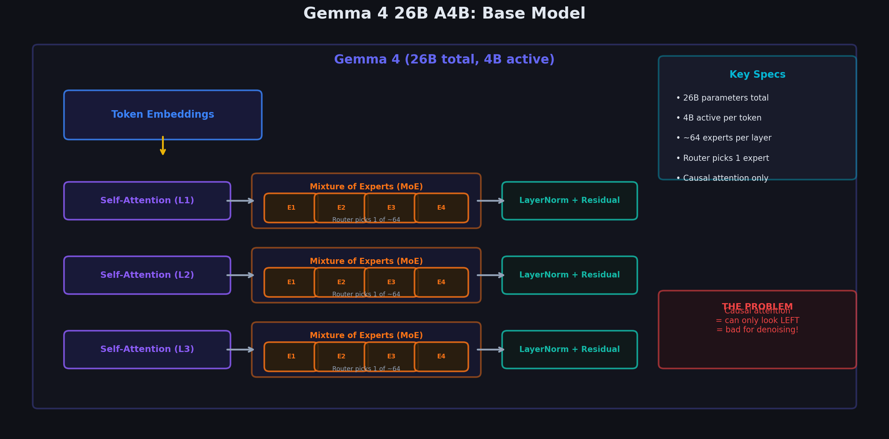

# Chapter 4.1: The Gemma 4 Base Model — What DiffusionGemma Inherits



---

## 4.1.1 Gemma 4 26B A4B: The Foundation

DiffusionGemma doesn't train a diffusion model from scratch. It starts from **Gemma 4 26B A4B**, a pre-trained Mixture of Experts (MoE) decoder-only transformer.

### Key Specifications

```
┌─────────────────────────────────────────────────────────┐
│              GEMMA 4 26B A4B SPECS                       │
├──────────────────────────┬──────────────────────────────┤
│ Total Parameters         │ 26 Billion                   │
│ Active Parameters        │ ~4 Billion (A4B)             │
│ Architecture             │ Decoder-only Transformer     │
│ Expert Type              │ Mixture of Experts (MoE)     │
│ Attention                │ Causal (unidirectional)      │
│ Vocabulary Size (K)      │ 256,000 tokens               │
│ Training                 │ Autoregressive (next-token)  │
│ Pre-training Data        │ Trillions of tokens          │
└──────────────────────────┴──────────────────────────────┘
```

### Mixture of Experts (MoE) — Quick Recap

In an MoE model, each transformer layer has **multiple feed-forward networks** (experts), but only a few are activated per token:

```
                    Input token embedding
                           │
                           ▼
                    ┌──────────────┐
                    │   Attention  │  (shared across all tokens)
                    │    Layer     │
                    └──────┬───────┘
                           │
                           ▼
                    ┌──────────────┐
                    │    Router    │  (learned gating network)
                    │  g(x) → w   │
                    └──┬───┬───┬──┘
                       │   │   │
                  w₁=0.6 w₂=0 w₃=0.4  (only top-2 experts activated)
                       │       │
                       ▼       ▼
                   ┌──────┐ ┌──────┐
                   │ FFN₁ │ │ FFN₃ │  ← Only 2 of N experts run
                   └──┬───┘ └──┬───┘
                      │        │
                      ▼        ▼
                   0.6·out₁ + 0.4·out₃
                           │
                           ▼
                    Output embedding
```

**Why MoE matters for DiffusionGemma**: 26B total parameters but only ~4B active per token. This means:
- **Rich representations** from 26B parameters of learned knowledge
- **Fast inference** with only 4B parameters computed per forward pass
- **Perfect for diffusion** — you process 256 tokens per step, each using 4B FLOPs

---


## 4.1.2 The Problem: Decoder-Only ≠ Diffusion Architecture

Standard diffusion needs two components:

| Component | Purpose | Traditional Architecture |
|-----------|---------|------------------------|
| **Encoder** | Process input query, provide context | Bidirectional transformer (like BERT) |
| **Denoiser** | Iteratively refine noisy canvas | UNet (images) or bidirectional transformer (text) |

But Gemma 4 is **decoder-only** with **causal attention**:

```
  WHAT GEMMA 4 HAS:                   WHAT DIFFUSION NEEDS:
  
  Causal Attention                     Encoder (bidirectional)
  ┌─ ─ ─ ─ ─ ─ ─ ─┐                  ┌─ ─ ─ ─ ─ ─ ─ ─┐
  │ ✓ ✗ ✗ ✗ ✗ ✗ ✗ │                  │ ✓ ✓ ✓ ✓ ✓ ✓ ✓ │
  │ ✓ ✓ ✗ ✗ ✗ ✗ ✗ │                  │ ✓ ✓ ✓ ✓ ✓ ✓ ✓ │
  │ ✓ ✓ ✓ ✗ ✗ ✗ ✗ │                  │ ✓ ✓ ✓ ✓ ✓ ✓ ✓ │
  │ ✓ ✓ ✓ ✓ ✗ ✗ ✗ │                  │ ✓ ✓ ✓ ✓ ✓ ✓ ✓ │
  │ ✓ ✓ ✓ ✓ ✓ ✗ ✗ │  + Denoiser (bidirectional)
  │ ✓ ✓ ✓ ✓ ✓ ✓ ✗ │                  │ ✓ ✓ ✓ ✓ ✓ ✓ ✓ │
  │ ✓ ✓ ✓ ✓ ✓ ✓ ✓ │                  │ ✓ ✓ ✓ ✓ ✓ ✓ ✓ │
  └─ ─ ─ ─ ─ ─ ─ ─┘                  └─ ─ ─ ─ ─ ─ ─ ─┘
  
  (each token sees only                (each token sees ALL
   previous tokens)                     other tokens)
```

The **Encoder-Denoiser Patch** solves this by making a single model play both roles. 

---

## 4.1.3 MoE Router Mathematics

Each transformer layer in Gemma 4 26B A4B replaces the dense FFN with a **Mixture of Experts** block. A learned router decides which experts process each token.

### Router Function

Given a hidden state $\mathbf{x} \in \mathbb{R}^d$ at a single token position, the router computes unnormalized scores over $E$ experts:

$$
\mathbf{g}(\mathbf{x}) = \text{softmax}\!\left(\mathbf{W}_g \cdot \mathbf{x}\right) \in \mathbb{R}^E
$$

where:
- $\mathbf{W}_g \in \mathbb{R}^{E \times d}$ is the learned router weight matrix
- $g_i(\mathbf{x})$ is the probability of routing to expert $i$
- Gemma 4 A4B uses $E \approx 64$ experts with **top-2** activation

### Top-$k$ Selection and Renormalization

Gemma 4 activates only the **top-2** experts per token. All other router weights are zeroed:

$$
\hat{g}_i(\mathbf{x}) = \begin{cases}
\dfrac{g_i(\mathbf{x})}{\sum_{j \in \text{Top}_k} g_j(\mathbf{x})} & \text{if } i \in \text{Top}_k \\
0 & \text{otherwise}
\end{cases}
$$

With $k = 2$, at most two experts run per token — this is why the model has **26B total parameters** but only **~4B active** per forward pass.

### MoE Output

The layer output is the weighted sum of the selected expert FFN outputs:

$$
\text{MoE}(\mathbf{x}) = \sum_{i \in \text{Top}_k} \hat{g}_i(\mathbf{x}) \cdot \text{FFN}_i(\mathbf{x})
$$

Each $\text{FFN}_i$ is a standard SwiGLU feed-forward network:

$$
\text{FFN}_i(\mathbf{x}) = \mathbf{W}_{2,i} \cdot \text{SwiGLU}(\mathbf{W}_{1,i} \cdot \mathbf{x})
$$

### Load Balancing Loss

Without regularization, routers **collapse** — sending 99% of tokens to expert 0 and starving the rest. Gemma uses an auxiliary load-balancing loss (Switch Transformer style):

$$
\mathcal{L}_{\text{balance}} = E \cdot \sum_{i=1}^{E} f_i \cdot P_i
$$

where:
- $f_i$ = fraction of tokens in the batch actually routed to expert $i$ (hard assignment)
- $P_i$ = mean softmax probability $\mathbb{E}_\text{batch}[g_i(\mathbf{x})]$ (soft assignment)
- $E$ = number of experts

**Goal**: Minimize $\mathcal{L}_{\text{balance}}$ so that $f_i \approx 1/E$ for all experts — uniform load.

**Intuition**: If expert 3 is overloaded ($f_3 = 0.4$) but the router also strongly prefers it ($P_3 = 0.35$), the product $f_3 \cdot P_3 = 0.14$ is large and penalized. The router learns to spread tokens evenly.

### Numerical Trace: Router on a 4D Hidden State

**Setup**: Toy layer with $d = 4$, $E = 4$ experts, top-$k = 2$.

$$
\mathbf{h} = [0.5,\ -0.3,\ 0.8,\ 0.1]
$$

**Router weight matrix** $\mathbf{W}_g \in \mathbb{R}^{4 \times 4}$:

$$
\mathbf{W}_g = \begin{bmatrix}
 0.2 &  0.1 & -0.3 &  0.4 \\
 0.5 & -0.2 &  0.1 &  0.3 \\
-0.1 &  0.4 &  0.2 & -0.5 \\
 0.3 &  0.6 & -0.4 &  0.1
\end{bmatrix}
$$

**Step 1 — Raw scores** $\mathbf{z} = \mathbf{W}_g \cdot \mathbf{h}$:

| Expert $i$ | Dot product calculation | $z_i$ |
|------------|------------------------|-------|
| 0 | $0.2(0.5) + 0.1(-0.3) + (-0.3)(0.8) + 0.4(0.1)$ | $-0.13$ |
| 1 | $0.5(0.5) + (-0.2)(-0.3) + 0.1(0.8) + 0.3(0.1)$ | $0.42$ |
| 2 | $(-0.1)(0.5) + 0.4(-0.3) + 0.2(0.8) + (-0.5)(0.1)$ | $-0.06$ |
| 3 | $0.3(0.5) + 0.6(-0.3) + (-0.4)(0.8) + 0.1(0.1)$ | $-0.34$ |

$$
\mathbf{z} = [-0.13,\ 0.42,\ -0.06,\ -0.34]
$$

**Step 2 — Softmax**:

$$
g_i = \frac{e^{z_i}}{\sum_j e^{z_j}}
$$

| Expert | $e^{z_i}$ | $g_i$ |
|--------|-----------|-------|
| 0 | 0.878 | 0.217 |
| 1 | 1.522 | **0.375** |
| 2 | 0.942 | **0.232** |
| 3 | 0.712 | 0.176 |

$$
\sum_j e^{z_j} = 4.054 \quad \Rightarrow \quad \mathbf{g} = [0.217,\ 0.375,\ 0.232,\ 0.176]
$$

**Step 3 — Top-2 selection**: Experts **1** ($g_1 = 0.375$) and **2** ($g_2 = 0.232$). Experts 0 and 3 are zeroed out.

**Step 4 — Renormalize** over $\{1, 2\}$:

$$
\hat{g}_1 = \frac{0.375}{0.375 + 0.232} = \frac{0.375}{0.607} = \mathbf{0.618}
$$

$$
\hat{g}_2 = \frac{0.232}{0.607} = \mathbf{0.382}
$$

**Step 5 — MoE output** (suppose $\text{FFN}_1(\mathbf{h}) = [1.0, 0.5, -0.2, 0.3]$ and $\text{FFN}_2(\mathbf{h}) = [0.2, 0.8, 0.4, -0.1]$):

$$
\text{MoE}(\mathbf{h}) = 0.618 \cdot [1.0, 0.5, -0.2, 0.3] + 0.382 \cdot [0.2, 0.8, 0.4, -0.1]
$$

$$
= [0.618 + 0.076,\ 0.309 + 0.306,\ -0.124 + 0.153,\ 0.185 - 0.038]
$$

$$
= \mathbf{[0.694,\ 0.615,\ 0.029,\ 0.147]}
$$

Only 2 of 4 experts executed — saving $\sim$50% of FFN compute while retaining expressive capacity from 26B total expert parameters.

---

## 4.1.4 Transformer Layer Anatomy

Each of Gemma 4's $\sim$50 transformer layers follows the same block structure. Below we walk through every component, then trace a full layer computation.

### Layer Block Diagram

```
  Input h^(ℓ)
       │
       ├──────────────────────────────────┐
       │                                  │ (residual)
       ▼                                  │
  ┌──────────┐                            │
  │ RMSNorm  │                            │
  └────┬─────┘                            │
       ▼                                  │
  ┌──────────────┐                        │
  │ Multi-Head   │                        │
  │ Attn (GQA)   │                        │
  └────┬─────────┘                        │
       │                                  │
       ▼                                  │
     (+) ◄────────────────────────────────┘
       │
       ├──────────────────────────────────┐
       │                                  │ (residual)
       ▼                                  │
  ┌──────────┐                            │
  │ RMSNorm  │                            │
  └────┬─────┘                            │
       ▼                                  │
  ┌──────────┐                            │
  │ MoE FFN  │  (top-2 of ~64 experts)   │
  └────┬─────┘                            │
       │                                  │
       ▼                                  │
     (+) ◄────────────────────────────────┘
       │
       ▼
  Output h^(ℓ+1)
```

---

### Component 1: RMSNorm

Gemma uses **Root Mean Square Layer Normalization** (no mean centering, no bias):

$$
\text{RMSNorm}(\mathbf{x}) = \frac{\mathbf{x}}{\text{RMS}(\mathbf{x})} \odot \boldsymbol{\gamma}
$$

where:

$$
\text{RMS}(\mathbf{x}) = \sqrt{\frac{1}{d}\sum_{j=1}^{d} x_j^2 + \epsilon}
$$

$\boldsymbol{\gamma} \in \mathbb{R}^d$ is a learned scale vector; $\epsilon = 10^{-6}$ prevents division by zero.

**Numerical example**: $\mathbf{x} = [1.0,\ -2.0,\ 3.0,\ 0.0]$, $\boldsymbol{\gamma} = [1, 1, 1, 1]$

$$
\text{mean}(\mathbf{x}^2) = \frac{1 + 4 + 9 + 0}{4} = 3.5 \quad \Rightarrow \quad \text{RMS} = \sqrt{3.5} = 1.871
$$

$$
\text{RMSNorm}(\mathbf{x}) = \frac{[1.0,\ -2.0,\ 3.0,\ 0.0]}{1.871} = [0.534,\ -1.069,\ 1.603,\ 0.000]
$$

RMSNorm is cheaper than LayerNorm (no mean subtraction) and performs comparably in large transformers.

---

### Component 2: Multi-Head Attention with GQA

**Grouped Query Attention (GQA)** is a middle ground between Multi-Head Attention (MHA) and Multi-Query Attention (MQA):

| Variant | Query heads $H_q$ | Key/Value heads $H_{kv}$ | KV cache size |
|---------|-------------------|--------------------------|---------------|
| MHA | 16 | 16 | Full |
| **GQA** (Gemma 4) | 16 | **2** | $H_{kv}/H_q = 1/8$ |
| MQA | 16 | 1 | Minimal |

Gemma 4 uses **16 query heads** but only **2 KV heads**. Each KV head is **shared** by a group of $16/2 = 8$ query heads.

**Attention formula** (per head $h$):

$$
\text{Attention}_h(\mathbf{Q}_h, \mathbf{K}_g, \mathbf{V}_g) = \text{softmax}\!\left(\frac{\mathbf{Q}_h \mathbf{K}_g^\top}{\sqrt{d_k}}\right) \mathbf{V}_g
$$

where head $h$ maps to KV group $g = \lfloor h / 8 \rfloor$.

**Why GQA matters for DiffusionGemma**: The denoiser processes $L = 256$ canvas tokens per step. KV cache for the encoder is small ($n \approx 100$ tokens), but canvas self-attention computes $L \times L$ interactions. GQA reduces KV memory and bandwidth by 8× compared to MHA, making bidirectional 256-token passes tractable.

**Projection dimensions** (Gemma 4 scale):

| Matrix | Shape | Purpose |
|--------|-------|---------|
| $\mathbf{W}_Q$ | $\mathbb{R}^{d \times d}$ | Project to 16 query heads × $d_k$ |
| $\mathbf{W}_K$ | $\mathbb{R}^{d \times 2 d_k}$ | Project to 2 KV heads × $d_k$ |
| $\mathbf{W}_V$ | $\mathbb{R}^{d \times 2 d_k}$ | Project to 2 KV heads × $d_k$ |
| $\mathbf{W}_O$ | $\mathbb{R}^{d \times d}$ | Output projection |

With $d = 5376$ and $d_k = 128$: $H_q = 16$, $H_{kv} = 2$.

---

### Component 3: Second RMSNorm

Identical to Component 1, applied before the MoE block. Decouples attention output scale from FFN input scale.

---

### Component 4: MoE FFN

As detailed in §4.1.3: router selects top-2 experts, weighted sum of SwiGLU FFN outputs. This replaces the single dense FFN used in smaller transformers.

---

### Component 5: Residual Connections

Two residual connections per layer preserve gradient flow through 50 layers:

$$
\mathbf{h}' = \mathbf{h} + \text{Attention}(\text{RMSNorm}(\mathbf{h}))
$$

$$
\mathbf{h}'' = \mathbf{h}' + \text{MoE}(\text{RMSNorm}(\mathbf{h}'))
$$

---

### Full Layer Computation Trace

**Input**: $\mathbf{h}^{(\ell)} = [0.5,\ -0.3,\ 0.8,\ 0.1]$ (toy 4D; real model uses $d = 5376$).

**Step 1 — Pre-attention RMSNorm**:

$$
\bar{\mathbf{h}} = \text{RMSNorm}(\mathbf{h}^{(\ell)}) = [0.534,\ -0.320,\ 0.854,\ 0.107]
$$

**Step 2 — Multi-Head Attention** (causal during pre-training):

$$
\mathbf{a} = \text{GQA}(\bar{\mathbf{h}}) = [0.12,\ 0.45,\ -0.08,\ 0.22]
$$

**Step 3 — Residual after attention**:

$$
\mathbf{h}' = \mathbf{h}^{(\ell)} + \mathbf{a} = [0.62,\ 0.15,\ 0.72,\ 0.32]
$$

**Step 4 — Pre-FFN RMSNorm**:

$$
\bar{\mathbf{h}}' = \text{RMSNorm}(\mathbf{h}') = [0.612,\ 0.148,\ 0.711,\ 0.316]
$$

**Step 5 — MoE FFN** (from §4.1.3 trace):

$$
\mathbf{f} = \text{MoE}(\bar{\mathbf{h}}') = [0.694,\ 0.615,\ 0.029,\ 0.147]
$$

**Step 6 — Residual after MoE**:

$$
\mathbf{h}^{(\ell+1)} = \mathbf{h}' + \mathbf{f} = [1.314,\ 0.765,\ 0.749,\ 0.467]
$$

```
  LAYER ℓ DATAFLOW SUMMARY:

  h^(ℓ)     = [0.50, -0.30,  0.80,  0.10]   ← input
  RMSNorm   = [0.53, -0.32,  0.85,  0.11]
  Attention = [0.12,  0.45, -0.08,  0.22]
  h'        = [0.62,  0.15,  0.72,  0.32]   ← after residual 1
  RMSNorm   = [0.61,  0.15,  0.71,  0.32]
  MoE FFN   = [0.69,  0.62,  0.03,  0.15]   ← top-2 experts
  h^(ℓ+1)  = [1.31,  0.77,  0.75,  0.47]   ← output to layer ℓ+1
```

This same block repeats 50 times, transforming token embeddings into rich contextual representations.

---

## 4.1.5 What DiffusionGemma Inherits vs. Changes

DiffusionGemma's central insight: **26 billion parameters of language knowledge are already learned**. Fine-tuning adapts the attention patterns and adds small conditioning modules — it does not rebuild the model from scratch.

### Component-by-Component Analysis

```
  ┌─────────────────────────────────────────────────────────────────────────┐
  │                    GEMMA 4 26B A4B → DIFFUSIONGEMMA                      │
  │                                                                          │
  │  INHERITED (frozen / shared)          MODIFIED (fine-tuned)              │
  │  ─────────────────────────           ──────────────────────              │
  │  Token embeddings (256K × d)         W_Q, W_K, W_V, W_O (attention)     │
  │  LM head (d × 256K)                  MoE expert weights (all ~64)        │
  │  RoPE frequency table                Router weights W_g                 │
  │  Layer architecture (50 layers)      RMSNorm scale vectors γ            │
  │  MoE topology (64 experts, top-2)   Attention mask logic              │
  │                                                                          │
  │  ADDED (trained from scratch)                                            │
  │  ────────────────────────────                                            │
  │  Timestep embedding MLP (sinusoidal → d)                                 │
  │  Self-conditioning FFNN (d → d)                                          │
  │  Adaptive layer norm modulation γ(t), β(t)  [optional]                   │
  └─────────────────────────────────────────────────────────────────────────┘
```

### Detailed Status Table

| Component | Parameters (approx.) | Status | Rationale |
|-----------|---------------------|--------|-----------|
| Token embeddings | $\sim$1.4B | **Frozen** | 256K vocabulary already mapped to meaningful vectors |
| LM head | $\sim$1.4B | **Frozen** | Same vocabulary projection; logits at all positions reuse it |
| Attention $\mathbf{W}_Q, \mathbf{W}_K, \mathbf{W}_V, \mathbf{W}_O$ | $\sim$4.3B | **Fine-tuned** | Must learn bidirectional patterns (was causal) |
| MoE expert weights | $\sim$18B | **Fine-tuned** | Adapt FFN to noisy canvas input distribution |
| Router $\mathbf{W}_g$ | $\sim$0.3B | **Fine-tuned** | May route differently for corrupted vs. clean tokens |
| RMSNorm $\boldsymbol{\gamma}$ | $\sim$0.3M | **Fine-tuned** | Scale adjustment for new activation distributions |
| RoPE tables | 0 (computed) | **Inherited** | Position encoding unchanged; mask logic changes |
| Timestep embedding MLP | $\sim$30M | **New** | Encodes noise level $t$ into hidden states |
| Self-conditioning FFNN | $\sim$30M | **New** | Passes previous step's predictions to next step |

### Parameter Count Summary

| Category | Parameters | Fraction of 26B |
|----------|-----------|-----------------|
| **Frozen** (embeddings + LM head) | $\sim$2.8B | 10.8% |
| **Fine-tuned** (layers, attention, MoE, router, norms) | $\sim$23.2B | 89.1% |
| **New** (timestep + self-conditioning) | $\sim$60M | 0.2% |
| **Total** | $\sim$26.06B | 100% |

**Key insight**: Although 89% of parameters are technically fine-tuned, the model **starts from a strong checkpoint**. The fine-tuning objective is narrower than pre-training — it only teaches:
1. Bidirectional attention (flip the mask)
2. All-position prediction (not just last token)
3. Noisy input handling (random tokens instead of clean text)
4. Timestep conditioning (how much noise is present)

This requires **orders of magnitude less data and compute** than pre-training 26B parameters from scratch on trillions of tokens.

### What the Mask Change Means

The **only architectural logic change** to existing components is the attention mask:

| Mode | Mask | Attention pattern |
|------|------|-------------------|
| Encoder (inherited) | Causal | Position $i$ sees $1, \ldots, i$ |
| Denoiser (modified) | Bidirectional | Position $i$ sees $1, \ldots, L$ |

The weights $\mathbf{W}_Q, \mathbf{W}_K, \mathbf{W}_V, \mathbf{W}_O$ are the **same tensors** — only the mask applied to $\mathbf{Q}\mathbf{K}^\top$ changes. Fine-tuning teaches these weights to produce useful representations when future positions are visible.

### Training Efficiency Comparison

| Approach | Data needed | Compute | Starting loss |
|----------|-------------|---------|---------------|
| Train 26B diffusion from scratch | Trillions of tokens | Thousands of TPU-hours | High (random init) |
| Fine-tune Gemma 4 → DiffusionGemma | Millions of instruction pairs | Tens of TPU-hours | Low (pre-trained) |

$$
\frac{\text{Compute}_{\text{fine-tune}}}{\text{Compute}_{\text{scratch}}} \approx \frac{1}{100} \text{ or less}
$$

By inheriting embeddings, LM head, MoE topology, and 50 layers of linguistic structure, DiffusionGemma buys **fluency for free** and spends training budget only on the **diffusion-specific skills**.

---

## 4.1.6 Rotary Position Embeddings (RoPE)

Gemma 4 encodes token position using **Rotary Position Embeddings (RoPE)** instead of additive sinusoidal position vectors. RoPE rotates query and key vectors in 2D subspaces by an angle proportional to position.

### How RoPE Works

For a hidden dimension pair $(2i, 2i+1)$ at position $m$, RoPE applies a 2D rotation:

$$
f(\mathbf{x}, m) = \begin{pmatrix} \cos(m\theta_i) & -\sin(m\theta_i) \\ \sin(m\theta_i) & \cos(m\theta_i) \end{pmatrix} \begin{pmatrix} x_{2i} \\ x_{2i+1} \end{pmatrix}
$$

where the base frequency for dimension pair $i$ is:

$$
\theta_i = \frac{1}{10000^{2i/d}}
$$

Equivalently, using complex notation:

$$
f(x, m) = x \cdot e^{im\theta_i}
$$

RoPE is applied to **queries** and **keys** (not values) before the attention dot product:

$$
\tilde{\mathbf{Q}}_m = \mathbf{R}(\theta, m) \cdot \mathbf{Q}_m, \qquad \tilde{\mathbf{K}}_n = \mathbf{R}(\theta, n) \cdot \mathbf{K}_n
$$

### Why the Dot Product Encodes Relative Position

The attention score between query at position $m$ and key at position $n$:

$$
\tilde{\mathbf{Q}}_m^\top \tilde{\mathbf{K}}_n = \mathbf{Q}_m^\top \mathbf{R}(\theta, n - m) \mathbf{K}_n
$$

The rotation depends only on **relative distance** $(n - m)$, not absolute positions. This gives the model translation-equivariant attention — "cat sat" has the same relative structure whether it starts at position 2 or position 50.

### 2D Numerical Example

**Setup**: Single dimension pair ($d = 2$), position $m = 1$, $\theta = \pi/4$.

$$
\mathbf{x} = \begin{pmatrix} 1.0 \\ 0.0 \end{pmatrix}, \quad m = 1, \quad \theta = \frac{\pi}{4}
$$

**Rotation angle**: $m\theta = \pi/4 = 45°$.

**Rotation matrix**:

$$
\mathbf{R}\!\left(\tfrac{\pi}{4}\right) = \begin{pmatrix} \cos(\pi/4) & -\sin(\pi/4) \\ \sin(\pi/4) & \cos(\pi/4) \end{pmatrix} = \begin{pmatrix} 0.707 & -0.707 \\ 0.707 & 0.707 \end{pmatrix}
$$

**Apply RoPE**:

$$
f(\mathbf{x}, 1) = \begin{pmatrix} 0.707 & -0.707 \\ 0.707 & 0.707 \end{pmatrix} \begin{pmatrix} 1.0 \\ 0.0 \end{pmatrix} = \begin{pmatrix} 0.707 \\ 0.707 \end{pmatrix}
$$

The vector $[1, 0]$ at position 1 is rotated to $[0.707, 0.707]$ — pointing at 45° in the plane.

**At position $m = 2$** (angle $= 2 \times \pi/4 = \pi/2$):

$$
f(\mathbf{x}, 2) = \begin{pmatrix} 0 & -1 \\ 1 & 0 \end{pmatrix} \begin{pmatrix} 1.0 \\ 0.0 \end{pmatrix} = \begin{pmatrix} 0.0 \\ 1.0 \end{pmatrix}
$$

Same token content, different positions → different rotations → attention can distinguish them.

### Why RoPE Matters for DiffusionGemma

DiffusionGemma uses the **same RoPE tables** as Gemma 4, but in two attention modes:

| Mode | Positions | RoPE role |
|------|-----------|-----------|
| **Encoder** (causal) | $1, \ldots, n$ | Position $m$'s key only attends to past — RoPE encodes "how far back" |
| **Denoiser** (bidirectional) | $1, \ldots, L$ | Position $m$'s key attends to **all** positions — RoPE encodes "where on the canvas" |

**The challenge**: During pre-training, position 5's key vector was only useful for positions $\geq 5$ (causal). In denoiser mode, position 5's key is attended to by positions $1, 2, 3, 4$ as well — positions that never "looked ahead" during pre-training.

**RoPE provides the position label; the bidirectional mask unlocks the information flow.** Fine-tuning teaches the model that "position 5 on the canvas" now carries useful future-context information, even though pre-training taught it that position 5 was always a "future" position to be ignored by earlier tokens.

### RoPE Under Self-Attention on the Noisy Canvas

During denoising step $s$, the canvas might be:

```
  Position:  1     2     3     4     5     6
  Token:   [the] [dog] [sat] [qq]  [the] [bar]
  RoPE m:    1     2     3     4     5     6
```

RoPE tells the model "this is position 4" regardless of whether the token is correct (`on`) or noise (`qq`). Combined with bidirectional attention, position 4's query can attend to position 3's key (rotated by $3\theta$) and position 5's key (rotated by $5\theta$), giving the model both **positional structure** and **content context** to decide whether `qq` should become `on`.

### RoPE vs. Alternative Position Encodings

| Method | Relative position? | Works with bidirectional? | Used by |
|--------|-------------------|--------------------------|---------|
| Sinusoidal (absolute) | Approximate | Yes | Original Transformer |
| Learned absolute | No | Yes | BERT |
| ALiBi (linear bias) | Yes | Yes | Some LLMs |
| **RoPE** | **Exact** | **Yes** | **Gemma 4, DiffusionGemma** |

RoPE's exact relative-position property and compatibility with both causal and bidirectional masks make it the natural choice for a model that must serve dual roles (encoder + denoiser) without changing the position encoding machinery.

---

**Next**: [02_encoder_denoiser_patch.md](../../02_encoder_denoiser_patch/02_encoder_denoiser_patch/) — The key architectural innovation.
