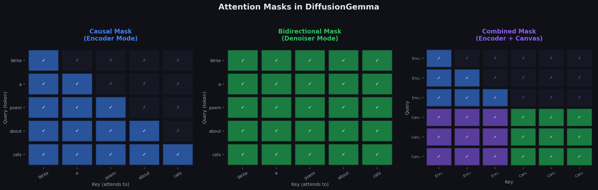

# Chapter 4.3: Inside a Single Transformer Layer — Causal vs. Bidirectional

> *"Let's zoom into one layer and watch the numbers flow."*



---

## 4.3.1 Setup: A Tiny Example

To really see what changes, let's trace through **one attention layer** with just 3 tokens and a dimension of $d = 4$.

**Tokens**: ["cat", "sat", "mat"]  
**Dimension**: $d = 4$  
**Head dimension**: $d_k = 4$

### Token Embeddings (Input to the Layer)

```
  h₁ ("cat") = [1.0,  0.5,  0.2, -0.3]
  h₂ ("sat") = [0.3,  0.8, -0.1,  0.6]
  h₃ ("mat") = [0.7, -0.2,  0.9,  0.1]
```

### Weight Matrices (Same for Both Modes!)

```
  W_Q = [[0.5, 0.1, 0.0, 0.2],      W_K = [[0.3, 0.0, 0.4, 0.1],
         [0.0, 0.5, 0.1, 0.0],             [0.1, 0.6, 0.0, 0.2],
         [0.2, 0.0, 0.5, 0.1],             [0.0, 0.1, 0.3, 0.5],
         [0.1, 0.2, 0.0, 0.5]]             [0.4, 0.0, 0.1, 0.3]]
```

---

## 4.3.2 Causal Attention (Encoder Mode)

### Step 1: Compute Q, K, V for all tokens

```
  Q₁ = W_Q · h₁ = [0.5·1.0 + 0.1·0.5 + 0.0·0.2 + 0.2·(-0.3), ...] 
  Q₂ = W_Q · h₂ = [...]
  Q₃ = W_Q · h₃ = [...]
  
  K₁ = W_K · h₁ = [...]
  K₂ = W_K · h₂ = [...]
  K₃ = W_K · h₃ = [...]
  
  (V computed similarly with W_V)
```

### Step 2: Compute Attention Scores

Raw scores $S_{ij} = Q_i \cdot K_j / \sqrt{d_k}$:

```
  Score matrix (before masking):
  
              K₁("cat")  K₂("sat")  K₃("mat")
  Q₁("cat")  [  2.1        1.3        0.8    ]
  Q₂("sat")  [  1.5        2.4        1.1    ]
  Q₃("mat")  [  0.9        1.7        2.6    ]
```

### Step 3: Apply CAUSAL Mask

```
  CAUSAL MASK:        AFTER MASKING:
  [  ✓   ·   ·  ]    [  2.1   -∞    -∞   ]
  [  ✓   ✓   ·  ]    [  1.5   2.4   -∞   ]
  [  ✓   ✓   ✓  ]    [  0.9   1.7   2.6  ]
  
  Set masked positions to -∞ so softmax gives them probability 0.
```

### Step 4: Apply Softmax (Row-wise)

```
  Row 1 (token "cat"):
  softmax([2.1, -∞, -∞]) = [1.0, 0.0, 0.0]
  → "cat" can ONLY attend to itself
  
  Row 2 (token "sat"):
  softmax([1.5, 2.4, -∞]) = [0.29, 0.71, 0.0]
  → "sat" attends mostly to itself (0.71) and "cat" (0.29)
  
  Row 3 (token "mat"):
  softmax([0.9, 1.7, 2.6]) = [0.10, 0.23, 0.67]
  → "mat" attends most to itself (0.67), then "sat" (0.23), then "cat" (0.10)
```

```
  ATTENTION WEIGHTS (CAUSAL):
  
              V₁("cat")  V₂("sat")  V₃("mat")
  "cat" →    [ 1.00       0.00       0.00 ]    "cat" only sees itself
  "sat" →    [ 0.29       0.71       0.00 ]    "sat" sees cat + sat
  "mat" →    [ 0.10       0.23       0.67 ]    "mat" sees all three
  
  Visual:
  "cat":  ████████████████████████████████░░░░░░░░░░░░░░░░░░░░░░░░░░░░░░░░
          100% self
  
  "sat":  █████████░░░░░░░░░░░░░███████████████████████████░░░░░░░░░░░░░░░
          29% cat                71% self
  
  "mat":  ███░░░░░░░░░░░░░░░░░░░██████░░░░░░░░░░░██████████████████████████
          10% cat                23% sat           67% self
```

### Step 5: Compute Output

Output at each position = weighted sum of Value vectors:

```
  output₁ = 1.00 · V₁                           (only knows about "cat")
  output₂ = 0.29 · V₁ + 0.71 · V₂               (knows about "cat", "sat")
  output₃ = 0.10 · V₁ + 0.23 · V₂ + 0.67 · V₃  (knows about all three)
```

---

## 4.3.3 Bidirectional Attention (Denoiser Mode)

**Same tokens, same weights** — only the mask changes!

### Steps 1–2: Identical to Above

Q, K, V and raw scores are exactly the same:

```
  Score matrix (NO masking):
  
              K₁("cat")  K₂("sat")  K₃("mat")
  Q₁("cat")  [  2.1        1.3        0.8    ]
  Q₂("sat")  [  1.5        2.4        1.1    ]
  Q₃("mat")  [  0.9        1.7        2.6    ]
```

### Step 3: NO Mask Applied (Bidirectional)

```
  BIDIRECTIONAL MASK:    AFTER MASKING:
  [  ✓   ✓   ✓  ]      [  2.1   1.3   0.8  ]
  [  ✓   ✓   ✓  ]      [  1.5   2.4   1.1  ]
  [  ✓   ✓   ✓  ]      [  0.9   1.7   2.6  ]
  
  No positions masked out. Every token sees everything.
```

### Step 4: Apply Softmax (Row-wise)

```
  Row 1 (token "cat"):
  softmax([2.1, 1.3, 0.8]) = [0.54, 0.24, 0.15]
  → "cat" NOW attends to all three tokens!
  
  Row 2 (token "sat"):
  softmax([1.5, 2.4, 1.1]) = [0.22, 0.54, 0.15]
  → "sat" still focuses on itself but also sees "cat" and "mat"
  
  Row 3 (token "mat"):
  softmax([0.9, 1.7, 2.6]) = [0.10, 0.23, 0.56]
  → Similar to causal (already could see everything in causal)
```

```
  ATTENTION WEIGHTS (BIDIRECTIONAL):
  
              V₁("cat")  V₂("sat")  V₃("mat")
  "cat" →    [ 0.54       0.24       0.15 ]    "cat" NOW sees sat + mat!
  "sat" →    [ 0.22       0.54       0.15 ]    "sat" NOW sees mat!
  "mat" →    [ 0.10       0.23       0.56 ]    (roughly same as before)
```

### Step 5: Compute Output (DIFFERENT from Causal!)

```
  output₁ = 0.54·V₁ + 0.24·V₂ + 0.15·V₃    ← CHANGED! Now has future context
  output₂ = 0.22·V₁ + 0.54·V₂ + 0.15·V₃    ← CHANGED! Now has future context
  output₃ = 0.10·V₁ + 0.23·V₂ + 0.56·V₃    ← roughly same
```

---

## 4.3.3b Full Numerical Trace: Bidirectional with Values

Section 4.3.2–4.3.3 computed attention **weights** but left the Value vectors symbolic. Here we plug in concrete $\mathbf{V}$ vectors, compute the actual 4D outputs, and quantify how much the mask changes representations.

### Define the Value Vectors

Using the same $\mathbf{W}_V$ as in §4.3.1 (or treating these as post-projection values):

$$
\mathbf{V}_1 = [0.1,\; 0.9,\; 0.3,\; 0.5]^\top \quad \text{("cat")}
$$
$$
\mathbf{V}_2 = [0.7,\; 0.2,\; 0.8,\; 0.4]^\top \quad \text{("sat")}
$$
$$
\mathbf{V}_3 = [0.4,\; 0.6,\; 0.1,\; 0.7]^\top \quad \text{("mat")}
$$

### Causal Mode: Actual Output Vectors

Using the attention weights from §4.3.2:

$$
\mathbf{o}_1^{\text{causal}} = 1.00\,\mathbf{V}_1 = [0.10,\; 0.90,\; 0.30,\; 0.50]^\top
$$

$$
\mathbf{o}_2^{\text{causal}} = 0.29\,\mathbf{V}_1 + 0.71\,\mathbf{V}_2
= [0.029,\; 0.261,\; 0.087,\; 0.145]^\top + [0.497,\; 0.142,\; 0.568,\; 0.284]^\top
= [0.526,\; 0.403,\; 0.655,\; 0.429]^\top
$$

$$
\mathbf{o}_3^{\text{causal}} = 0.10\,\mathbf{V}_1 + 0.23\,\mathbf{V}_2 + 0.67\,\mathbf{V}_3
= [0.439,\; 0.538,\; 0.281,\; 0.611]^\top
$$

### Bidirectional Mode: Actual Output Vectors

Using the attention weights from §4.3.3:

$$
\mathbf{o}_1^{\text{bi}} = 0.54\,\mathbf{V}_1 + 0.24\,\mathbf{V}_2 + 0.15\,\mathbf{V}_3
= [0.054,\; 0.486,\; 0.162,\; 0.270]^\top + [0.168,\; 0.048,\; 0.192,\; 0.096]^\top + [0.060,\; 0.090,\; 0.015,\; 0.105]^\top
= [0.282,\; 0.624,\; 0.369,\; 0.471]^\top
$$

$$
\mathbf{o}_2^{\text{bi}} = 0.22\,\mathbf{V}_1 + 0.54\,\mathbf{V}_2 + 0.15\,\mathbf{V}_3
= [0.460,\; 0.396,\; 0.513,\; 0.431]^\top
$$

$$
\mathbf{o}_3^{\text{bi}} = 0.10\,\mathbf{V}_1 + 0.23\,\mathbf{V}_2 + 0.56\,\mathbf{V}_3
= [0.395,\; 0.472,\; 0.270,\; 0.534]^\top
$$

### Side-by-Side: Token "cat" (Position 1)

| Mode | Output vector $\mathbf{o}_1$ | Interpretation |
|------|----------------------------------|----------------|
| **Causal** | $[0.10,\; 0.90,\; 0.30,\; 0.50]$ | Pure self-attention — only "cat" information |
| **Bidirectional** | $[0.282,\; 0.624,\; 0.369,\; 0.471]$ | Blends 54% cat + 24% sat + 15% mat |

The bidirectional output is **not** a small perturbation — every dimension shifts because future tokens contribute:

```
  Dimension:     d₁      d₂      d₃      d₄
  Causal:       0.10    0.90    0.30    0.50
  Bidirectional: 0.282   0.624   0.369   0.471
  Δ:            +0.182  -0.276  +0.069  -0.029
```

### L2 Distance: Quantifying the Mask Effect

$$
\Delta \mathbf{o}_1 = \mathbf{o}_1^{\text{bi}} - \mathbf{o}_1^{\text{causal}} = [0.182,\; -0.276,\; 0.069,\; -0.029]^\top
$$

$$
\|\Delta \mathbf{o}_1\|_2 = \sqrt{0.182^2 + (-0.276)^2 + 0.069^2 + (-0.029)^2} = \sqrt{0.1149} \approx \mathbf{0.339}
$$

Relative to the causal output magnitude $\|\mathbf{o}_1^{\text{causal}}\|_2 = \sqrt{0.01 + 0.81 + 0.09 + 0.25} \approx 1.095$, the mask change alters the representation by roughly **31%** in L2 norm. Position 3 changes less ($\|\mathbf{o}_3^{\text{bi}} - \mathbf{o}_3^{\text{causal}}\|_2 \approx 0.10$) because causal attention already let "mat" see all prior tokens.

### Multi-Head Attention: The General Formula

Real transformers split attention across $h$ heads. The full formula is:

$$
\text{MultiHead}(\mathbf{Q}, \mathbf{K}, \mathbf{V}) = \text{Concat}(\text{head}_1, \ldots, \text{head}_h) \cdot \mathbf{W}_O
$$

$$
\text{head}_i = \text{Attention}(\mathbf{Q}\,\mathbf{W}_Q^i,\; \mathbf{K}\,\mathbf{W}_K^i,\; \mathbf{V}\,\mathbf{W}_V^i)
$$

where $\mathbf{W}_Q^i, \mathbf{W}_K^i, \mathbf{W}_V^i \in \mathbb{R}^{d \times d_k}$ and $\mathbf{W}_O \in \mathbb{R}^{h \cdot d_v \times d}$.

#### Two-Head Example ($h = 2$, $d_k = d_v = 2$ per head)

Split the 4D vectors across two heads of dimension 2:

```
  Head 1:  Q₁ʰ¹ = [q₁, q₂],  K₁ʰ¹ = [k₁, k₂],  V₁ʰ¹ = [0.1, 0.9]
  Head 2:  Q₁ʰ² = [q₃, q₄],  K₁ʰ² = [k₃, k₄],  V₁ʰ² = [0.3, 0.5]
```

Each head computes its own softmax attention independently:

$$
\text{head}_1 = 0.54 \cdot [0.1, 0.9] + 0.24 \cdot [0.7, 0.2] + 0.15 \cdot [0.4, 0.6] = [0.282, 0.624]
$$

$$
\text{head}_2 = 0.54 \cdot [0.3, 0.5] + 0.24 \cdot [0.8, 0.4] + 0.15 \cdot [0.1, 0.7] = [0.369, 0.471]
$$

Concatenate and project:

$$
\text{Concat}(\text{head}_1, \text{head}_2) = [0.282, 0.624, 0.369, 0.471] = \mathbf{o}_1^{\text{bi}}
$$

(same result as single-head above when $\mathbf{W}_O = \mathbf{I}$)

Different heads learn different attention **patterns** — one head might focus on syntactic neighbors, another on semantic associations — but the mask (causal vs. bidirectional) applies identically to all heads.

### RoPE: Position Embeddings Under Bidirectional Attention

Gemma applies **Rotary Position Embeddings (RoPE)** before the attention dot product:

$$
\tilde{\mathbf{Q}} = \mathbf{R}(\theta, \text{pos}) \cdot \mathbf{Q}, \qquad \tilde{\mathbf{K}} = \mathbf{R}(\theta, \text{pos}) \cdot \mathbf{K}
$$

where $\mathbf{R}(\theta, \text{pos})$ is a block-diagonal rotation matrix that encodes relative position through angle $\theta$.

In **bidirectional** denoiser mode, RoPE still rotates $\mathbf{Q}$ and $\mathbf{K}$ by their absolute canvas positions. The positional signal is unchanged — what changes is **which positions can attend to which**. During causal pre-training, position 5's key always came from a "past" token. In denoiser mode, position 5's key may come from a **future** canvas token that the model never attended to during pre-training.

The model must learn (via fine-tuning) that "position 5" can now carry useful information about what comes later in the sentence, even though pre-training taught it that position 5 was always a "future" position to be ignored. RoPE provides the position label; the bidirectional mask unlocks the information flow.

---

## 4.3.4 The Critical Difference: Token 1

Let's zoom into **position 1 ("cat")** to see the impact:

```
  CAUSAL:
  output₁ = 1.00 · V₁
           = V₁
           (knows ONLY about "cat")
  
  BIDIRECTIONAL:
  output₁ = 0.54·V₁ + 0.24·V₂ + 0.15·V₃
           (knows about "cat", "sat", AND "mat"!)
```

**This is why bidirectional attention is essential for the denoiser.** In a noisy canvas like:

```
  ["rand", "rand", "rand", "chicken", "rand", "road"]
    pos 1   pos 2   pos 3    pos 4     pos 5   pos 6
```

With causal attention, position 1 can ONLY see itself — a random token. It has no useful context.

With bidirectional attention, position 1 can see "chicken" at pos 4 and "road" at pos 6 — giving it the context to predict "Why" (as in "Why did the chicken cross the road").

```
  CAUSAL (pos 1 sees):
  ┌───────┐
  │"rand" │  → "I see garbage. I have no idea what to predict."
  └───────┘
  
  BIDIRECTIONAL (pos 1 sees):
  ┌───────┬───────┬───────┬──────────┬───────┬───────┐
  │"rand" │"rand" │"rand" │"chicken" │"rand" │"road" │
  └───────┴───────┴───────┴──────────┴───────┴───────┘
  → "I see 'chicken' and 'road'. This might be 'Why did the chicken 
     cross the road'. So position 1 should be 'Why'!"
```

---

## 4.3.5 The Fine-Tuning Challenge

Gemma 4 was trained for millions of steps with causal attention. Its weights have learned to:
- Produce Query vectors that only look backward
- Generate Key/Value vectors optimized for causal context
- Process hidden states that encode "what came before"

When we switch to bidirectional, the weights produce **wrong representations** at first. The model must be **fine-tuned** to learn:

```
  BEFORE FINE-TUNING:
  ┌──────────────────────────────────────────────────────────┐
  │  Bidirectional attention output is CONFUSED               │
  │                                                           │
  │  Position 1 with bidirectional:                           │
  │  "I used to only see 1 token. Now I see 6 tokens.        │
  │   I don't know what to do with all this extra info!"      │
  │                                                           │
  │  The attention weights are random and unhelpful            │
  │  because the model never saw bidirectional context         │
  │  during pre-training.                                      │
  └──────────────────────────────────────────────────────────┘
  
  AFTER FINE-TUNING:
  ┌──────────────────────────────────────────────────────────┐
  │  Bidirectional attention output is USEFUL                  │
  │                                                           │
  │  Position 1 with bidirectional:                           │
  │  "I see 'chicken' at pos 4 and 'road' at pos 6.          │
  │   Combined with the query (from encoder KV), this is     │
  │   probably a joke setup. I should predict 'Why'."          │
  │                                                           │
  │  The attention weights now meaningfully combine            │
  │  information from all directions.                          │
  └──────────────────────────────────────────────────────────┘
```

### What Gets Fine-Tuned

```
  ┌──────────────────────────────────┬───────────────────────┐
  │  Component                        │ Status                │
  ├──────────────────────────────────┼───────────────────────┤
  │  W_Q, W_K, W_V, W_O (attention) │ FINE-TUNED            │
  │  MoE expert weights              │ FINE-TUNED            │
  │  Router weights                   │ FINE-TUNED            │
  │  Layer norms                      │ FINE-TUNED            │
  │  Token embeddings                 │ SHARED (unchanged)    │
  │  LM head                          │ SHARED (unchanged)    │
  │  Self-conditioning FFNN           │ NEW (trained fresh)   │
  │  Timestep embedding               │ NEW (trained fresh)   │
  └──────────────────────────────────┴───────────────────────┘
```

---

## 4.3.6 Why Every Position Gets Logits (Visual)

In autoregressive mode, only the **last** position's logits predict the next token. The rest are "wasted":

```
  AUTOREGRESSIVE: Only last position matters
  
  Input:  [The] [cat] [sat] [on]
           │     │     │     │
           ▼     ▼     ▼     ▼
  Layer 1: [h]  [h]   [h]  [h]
           │     │     │     │
  Layer 2: [h]  [h]   [h]  [h]
           │     │     │     │
           ...  ...   ...   ...
           │     │     │     │
  LM Head: [──] [──]  [──] [logits] → softmax → P("the") = 0.8
           ↑     ↑     ↑     ↑
          WASTE WASTE WASTE  USED!
          
  We only use logits at position 4 to predict token 5.
```

```
  DENOISER MODE: ALL positions matter
  
  Input:  [rand] [rand] [rand] [rand]
           │      │      │      │
           ▼      ▼      ▼      ▼
  Layer 1: [h]   [h]    [h]   [h]
           │      │      │      │
  Layer 2: [h]   [h]    [h]   [h]
           │      │      │      │
           ...   ...    ...   ...
           │      │      │      │
  LM Head: [logits₁] [logits₂] [logits₃] [logits₄]
             │          │          │          │
             ▼          ▼          ▼          ▼
           P("The")  P("cat")  P("sat")  P("on")
           = 0.85    = 0.60    = 0.55    = 0.70
           
  ALL 4 positions predict what the clean token should be!
  Nothing is wasted!
```

### The Math

At every position $i$, the LM head produces:

$$
\text{logits}_i = \mathbf{W}_{\text{head}} \cdot h_i^{(\text{final layer})} \in \mathbb{R}^{K}
$$

$$
p_\theta(x_0^i = k \mid x_t) = \text{softmax}(\text{logits}_i)[k] = \frac{e^{\text{logits}_i[k]}}{\sum_{j=1}^{K} e^{\text{logits}_i[j]}}
$$

This gives a **complete probability distribution** over the entire vocabulary at **each** of the 256 canvas positions.

---

**Next**: [04_kv_cache_sharing.md](../../04_kv_cache_sharing/04_kv_cache_sharing/) — How the encoder's KV cache feeds into the denoiser.
