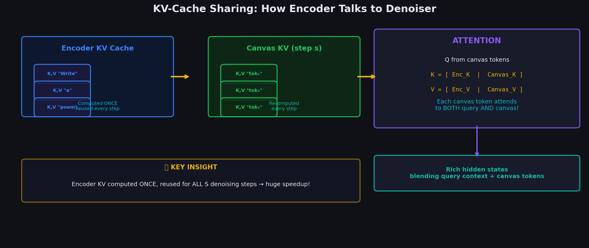

# Chapter 4.4: KV-Cache Sharing — How the Encoder Talks to the Denoiser

> *"The KV cache is the wire connecting the two brains."*



---

## 4.4.1 The Problem: Two Modes Need to Communicate

After the encoder processes "Tell me a joke", the denoiser needs to know what the user asked. Without this, the denoiser has no idea what to generate — it would just produce random coherent text, not a joke.

**Question**: How does the encoder's understanding reach the denoiser?

---

## 4.4.2 Tracing the KV Cache Through the Entire Pipeline

Let's follow the data flow through a concrete 2-layer transformer with 3 query tokens and 4 canvas tokens.

### Phase 1: Encoder Creates the KV Cache

```
  ENCODER INPUT: "Tell" "me" "joke"  (3 tokens)
  
  ═══ LAYER 1 ═══
  
  Step A: Compute Q, K, V for all 3 tokens
  
  Token embeddings: [e₁, e₂, e₃]
       │
       ├──→ K₁,₁ = W_K · e₁    V₁,₁ = W_V · e₁     (for "Tell")
       ├──→ K₁,₂ = W_K · e₂    V₁,₂ = W_V · e₂     (for "me")
       └──→ K₁,₃ = W_K · e₃    V₁,₃ = W_V · e₃     (for "joke")
  
  Step B: Self-attention (causal) produces hidden states h₁¹, h₂¹, h₃¹
  
  Step C: SAVE the K and V vectors
  
  ┌──────────────────────────────────────────┐
  │  KV CACHE — LAYER 1:                     │
  │                                           │
  │  Keys:   [K₁,₁, K₁,₂, K₁,₃]            │
  │  Values: [V₁,₁, V₁,₂, V₁,₃]            │
  │           ↑ Tell  ↑ me   ↑ joke           │
  └──────────────────────────────────────────┘
  
  ═══ LAYER 2 ═══
  
  Step D: Compute Q, K, V from layer 1 outputs [h₁¹, h₂¹, h₃¹]
  
       ├──→ K₂,₁ = W_K · h₁¹    V₂,₁ = W_V · h₁¹
       ├──→ K₂,₂ = W_K · h₂¹    V₂,₂ = W_V · h₂¹
       └──→ K₂,₃ = W_K · h₃¹    V₂,₃ = W_V · h₃¹
  
  Step E: Self-attention (causal) produces h₁², h₂², h₃²
  
  Step F: SAVE the K and V vectors
  
  ┌──────────────────────────────────────────┐
  │  KV CACHE — LAYER 2:                     │
  │                                           │
  │  Keys:   [K₂,₁, K₂,₂, K₂,₃]            │
  │  Values: [V₂,₁, V₂,₂, V₂,₃]            │
  └──────────────────────────────────────────┘
  
  ENCODER IS DONE. Total output: KV cache with 2 layers × 3 positions.
```

---

### Phase 2: Denoiser Uses the KV Cache

```
  DENOISER INPUT: "Why" "rand" "rand" "road"  (4 canvas tokens)
  
  ALSO RECEIVES: Encoder KV cache from Phase 1
  
  ═══ LAYER 1 ═══
  
  Step A: Compute Q, K, V for all 4 canvas tokens
  
  Canvas embeddings: [c₁, c₂, c₃, c₄]
       │
       ├──→ Q₁,₁ = W_Q · c₁    K₁,₁' = W_K · c₁    V₁,₁' = W_V · c₁
       ├──→ Q₁,₂ = W_Q · c₂    K₁,₂' = W_K · c₂    V₁,₂' = W_V · c₂
       ├──→ Q₁,₃ = W_Q · c₃    K₁,₃' = W_K · c₃    V₁,₃' = W_V · c₃
       └──→ Q₁,₄ = W_Q · c₄    K₁,₄' = W_K · c₄    V₁,₄' = W_V · c₄
  
  Step B: CONCATENATE encoder KV with canvas KV
  
  ┌─────────────────────────────────────────────────────────────┐
  │  FULL KEYS AT LAYER 1:                                      │
  │                                                              │
  │  [K₁,₁, K₁,₂, K₁,₃,  |  K₁,₁', K₁,₂', K₁,₃', K₁,₄']  │
  │   ↑Tell  ↑me   ↑joke   |   ↑Why   ↑rand  ↑rand   ↑road    │
  │   ╰── from encoder ──╯  ╰─── from canvas ─────────────╯    │
  │                                                              │
  │  FULL VALUES AT LAYER 1:                                    │
  │  [V₁,₁, V₁,₂, V₁,₃,  |  V₁,₁', V₁,₂', V₁,₃', V₁,₄']  │
  └─────────────────────────────────────────────────────────────┘
  
  Total: 3 (encoder) + 4 (canvas) = 7 key-value pairs
```

```
  Step C: ATTENTION — each canvas Query attends to ALL 7 Keys
  
  For canvas token "Why" at position 1:
  
  Q₁,₁ attends to: [K₁,₁  K₁,₂  K₁,₃  K₁,₁' K₁,₂' K₁,₃' K₁,₄']
                     Tell   me    joke   Why   rand  rand   road
  
  Scores = Q₁,₁ · [K₁,₁, K₁,₂, K₁,₃, K₁,₁', K₁,₂', K₁,₃', K₁,₄']ᵀ / √d_k
         = [  1.8,   1.2,   2.5,   1.0,   0.3,   0.1,   1.4 ]
  
  After softmax:
         = [ 0.22,  0.12,  0.44,  0.10,  0.05,  0.04,  0.15 ]
              ↑       ↑      ↑
         Most attention goes to "joke" (0.44) from the encoder!
         The model understands: "the user wants a joke"
         AND it also attends to "road" (0.15) from the canvas.
  
  Output₁ = 0.22·V(Tell) + 0.12·V(me) + 0.44·V(joke)  ← encoder context
           + 0.10·V(Why) + 0.05·V(rand) + 0.04·V(rand) + 0.15·V(road)
                                                          ← canvas context
```

```
  THIS IS THE KEY INSIGHT:
  
  ┌──────────────────────────────────────────────────────────────┐
  │                                                               │
  │  The attention mechanism AUTOMATICALLY blends:                │
  │                                                               │
  │  ENCODER UNDERSTANDING     +    CANVAS CONTEXT                │
  │  "The user wants a joke"        "I see 'chicken' and 'road'" │
  │                                                               │
  │  Into a SINGLE hidden state that captures BOTH.              │
  │                                                               │
  │  No special cross-attention needed!                           │
  │  No adapter layers!                                           │
  │  Just concatenate the KV caches and let                      │
  │  standard attention do the work.                              │
  │                                                               │
  └──────────────────────────────────────────────────────────────┘
```

---

## 4.4.3 Why the Encoder KV Cache Stays Fixed

The encoder ran ONCE and produced KVs for "Tell", "me", "joke". These don't change during denoising because:

1. The query doesn't change — the user still asked "Tell me a joke"
2. The encoder used causal attention — each token's KV only depends on tokens before it
3. No new tokens are added to the encoder sequence during denoising

```
  DENOISING STEP 1:
  
  Encoder KV:  [K(Tell), K(me), K(joke)]  ← FROZEN
  Canvas KV:   [K(Why), K(rand), K(rand), K(road)]  ← computed fresh
  
  DENOISING STEP 2:
  
  Encoder KV:  [K(Tell), K(me), K(joke)]  ← SAME! Not recomputed!
  Canvas KV:   [K(Why), K(did), K(the), K(road)]  ← NEW (canvas changed)
  
  DENOISING STEP 3:
  
  Encoder KV:  [K(Tell), K(me), K(joke)]  ← SAME! Still frozen!
  Canvas KV:   [K(Why), K(did), K(the), K(chicken)]  ← NEW again
  
  ... (S steps total)
  
  The encoder forward pass costs are paid ONCE.
  Only canvas KV is recomputed at each step.
```

---

## 4.4.3b Mathematical Analysis of KV Cache Sharing

This section quantifies the **memory footprint**, **compute savings**, and **attention complexity** of sharing the encoder KV cache across $S$ denoising steps.

### Memory Cost of the Encoder KV Cache

At each layer $\ell$, the encoder stores two matrices:

$$
\mathbf{K}_{\text{enc}}^{(\ell)} \in \mathbb{R}^{d_k \times n}, \qquad \mathbf{V}_{\text{enc}}^{(\ell)} \in \mathbb{R}^{d_v \times n}
$$

Assuming $d_k = d_v$ (standard in Gemma), total cache memory is:

$$
\text{Memory}_{\text{KV}} = 2 \times L_{\text{layers}} \times n \times d_k \times \texttt{sizeof}(\text{float16})
$$

#### Gemma 4 Worked Example

| Parameter | Value |
|-----------|-------|
| $L_{\text{layers}}$ | 50 (approx.) |
| $d_k$ | 128 |
| $n$ | 100 (query tokens) |
| dtype | float16 (2 bytes) |

$$
\text{Memory}_{\text{KV}} = 2 \times 50 \times 100 \times 128 \times 2 \text{ bytes} = 2{,}560{,}000 \text{ bytes} = \mathbf{2.56 \text{ MB}}
$$

This is **tiny** relative to the ~26B-parameter model weights (~52 GB in float16). The KV cache is negligible memory overhead — the savings are in **compute**, not RAM.

### Compute Savings Formula

Define:
- $C_{\text{enc}}$ = cost of one full encoder forward pass over $n$ tokens (all layers)
- $C_{\text{den}}$ = cost of one full denoiser forward pass over $L$ canvas tokens (all layers, including attending to cached encoder KV)
- $S$ = number of denoising steps

| Strategy | Total cost |
|----------|------------|
| **Without sharing** (re-encode every step) | $S \times (C_{\text{enc}} + C_{\text{den}})$ |
| **With sharing** (encode once) | $C_{\text{enc}} + S \times C_{\text{den}}$ |

$$
\boxed{\text{Savings} = S \cdot C_{\text{enc}} + S \cdot C_{\text{den}} - \big(C_{\text{enc}} + S \cdot C_{\text{den}}\big) = (S - 1) \times C_{\text{enc}}}
$$

The denoiser cost is **identical** in both strategies; all savings come from avoiding $(S - 1)$ redundant encoder passes.

For $S = 16$: savings $= 15 \times C_{\text{enc}}$ — the encoder cost is paid **once** instead of 16 times.

### Attention Complexity at Each Denoiser Layer

The dominant operation is the query–key dot product $\mathbf{Q} \mathbf{K}_{\text{full}}^\top$, where $\mathbf{K}_{\text{full}}$ has $n + L$ columns:

$$
\text{Cost}_{QK^\top} = O\!\left(L \times (n + L) \times d_k\right) \quad \text{per layer}
$$

Decompose into two terms:

| Component | Keys attended | Complexity |
|-----------|---------------|------------|
| **Encoder cross-attention** | $n$ encoder keys | $O(L \times n \times d_k)$ |
| **Canvas self-attention** | $L$ canvas keys | $O(L \times L \times d_k)$ |
| **Total** | $n + L$ | $O(L \times (n + L) \times d_k)$ |

When $n \ll L$ (typical: $n = 100$, $L = 256$), the encoder overhead is a small fraction:

$$
\frac{L \cdot n \cdot d_k}{L \cdot (n + L) \cdot d_k} = \frac{n}{n + L} = \frac{100}{356} \approx 28\%
$$

The remaining 72% of attention FLOPs are canvas self-attention. The encoder KV adds modest overhead but provides the **query understanding** that makes generation task-conditional.

The value projection $\mathbf{A} \mathbf{V}_{\text{full}}$ has the same complexity: $O(L \times (n + L) \times d_v)$.

### Full Numerical Example: Gemma 4 at Inference

**Parameters**: $L = 256$, $n = 100$, $d_k = 128$, $L_{\text{layers}} = 50$, $S = 16$

#### Per-Layer Attention FLOPs (Q·Kᵀ multiply-adds)

$$
\underbrace{L \times n \times d_k}_{\text{encoder}} = 256 \times 100 \times 128 = 32{,}768{,}000
$$

$$
\underbrace{L \times L \times d_k}_{\text{canvas}} = 256 \times 256 \times 128 = 83{,}886{,}080
$$

$$
\text{Per layer total} = 116{,}654{,}080 \approx 1.17 \times 10^8 \text{ FLOPs}
$$

#### Full Denoiser Pass (all layers, one step)

$$
\text{FLOPs}_{\text{den, 1 step}} = 50 \times 116{,}654{,}080 \approx 5.83 \times 10^9 \text{ FLOPs}
$$

#### Encoder Pass (one-time, all layers)

Encoder self-attention is causal over $n$ tokens: $O(n^2 \cdot d_k)$ per layer.

$$
\text{FLOPs}_{\text{enc}} = 50 \times 100 \times 100 \times 128 = 64{,}000{,}000 = 6.4 \times 10^7
$$

#### Total Inference Cost Comparison

| | Without sharing | With sharing |
|--|-----------------|--------------|
| Encoder | $16 \times 6.4 \times 10^7 = 1.02 \times 10^9$ | $6.4 \times 10^7$ |
| Denoiser | $16 \times 5.83 \times 10^9 = 9.33 \times 10^9$ | $16 \times 5.83 \times 10^9 = 9.33 \times 10^9$ |
| **Total** | **$1.03 \times 10^{10}$ FLOPs** | **$9.39 \times 10^9$ FLOPs** |
| **Savings** | — | **$9.6 \times 10^8$ FLOPs (~9.3%)** |

The percentage savings on total FLOPs is modest here because the denoiser dominates (canvas is 2.5× longer than the query). But the savings formula $(S-1) \times C_{\text{enc}}$ shows the encoder work is eliminated entirely:

$$
\frac{\text{Savings}}{\text{Encoder cost without sharing}} = \frac{15 \times 6.4 \times 10^7}{16 \times 6.4 \times 10^7} = \frac{15}{16} = 93.75\%
$$

of encoder compute is saved. For longer queries ($n = 1000$), $C_{\text{enc}}$ grows as $O(n^2)$ while the denoiser's encoder-attention term grows only as $O(n)$, so total savings approach **~72%** as noted in §4.4.4.

#### What Gets Recomputed Each Denoising Step

| Tensor | Step 1 | Step 2 | ... | Step $S$ |
|--------|--------|--------|-----|--------------|
| $\mathbf{K}_{\text{enc}}^{(\ell)}, \mathbf{V}_{\text{enc}}^{(\ell)}$ | computed | **reused** | **reused** | **reused** |
| $\mathbf{K}_{\text{canvas}}^{(\ell)}, \mathbf{V}_{\text{canvas}}^{(\ell)}$ | computed | recomputed | recomputed | recomputed |
| $\mathbf{Q}^{(\ell)}$ (canvas) | computed | recomputed | recomputed | recomputed |

Only canvas-side tensors change as the noisy canvas is updated; the encoder's understanding of "Tell me a joke" remains frozen in the cache.

---

## 4.4.4 Compute Cost Breakdown

For $S = 16$ denoising steps, query length $n = 100$, canvas size $L = 256$:

```
  WITHOUT KV cache sharing (re-run encoder every step):
  ┌──────────────────────────────────────────────┐
  │  Encoder: 16 × cost(100 tokens) = 16x        │
  │  Denoiser: 16 × cost(256 tokens) = 16x       │
  │  Total: 16 × (100 + 256) = 5,696 token-passes│
  └──────────────────────────────────────────────┘
  
  WITH KV cache sharing (encoder runs once):
  ┌──────────────────────────────────────────────┐
  │  Encoder: 1 × cost(100 tokens) = 1x          │
  │  Denoiser: 16 × cost(256 tokens) = 16x       │
  │  Total: 100 + 16 × 256 = 4,196 token-passes  │
  └──────────────────────────────────────────────┘
  
  Savings: 1,500 token-passes (~26% fewer total computations)
  For longer queries (n=1000): savings grow to ~72%!
```

---

## 4.4.5 Complete Data Flow: End-to-End at One Layer

Here's everything connected for one attention layer:

```
  ┌─────────────────────────────────────────────────────────────────────┐
  │                         ONE COMPLETE LAYER                          │
  │                                                                      │
  │  ENCODER (ran once, results cached):                                │
  │  ┌─────────────────────────────────────────────┐                   │
  │  │  "Tell"  "me"  "joke"                        │                   │
  │  │    │       │      │                           │                   │
  │  │    ▼       ▼      ▼                           │                   │
  │  │  [K₁,V₁] [K₂,V₂] [K₃,V₃]                   │ ← Stored in      │
  │  │                                               │   KV cache       │
  │  └───────────────────┬─────────────────────────┘                   │
  │                       │                                              │
  │                       │ K₁,K₂,K₃ and V₁,V₂,V₃                     │
  │                       │ are PREPENDED to denoiser's K,V             │
  │                       ▼                                              │
  │  DENOISER (runs S times):                                           │
  │  ┌─────────────────────────────────────────────────────────────┐   │
  │  │  "Why"   "rand"  "rand"  "road"                              │   │
  │  │    │       │        │       │                                  │   │
  │  │    ▼       ▼        ▼       ▼                                  │   │
  │  │  [Q₁']  [Q₂']   [Q₃']   [Q₄']     ← Queries from canvas     │   │
  │  │  [K₁']  [K₂']   [K₃']   [K₄']     ← Keys from canvas        │   │
  │  │  [V₁']  [V₂']   [V₃']   [V₄']     ← Values from canvas      │   │
  │  │    │       │        │       │                                  │   │
  │  │    │  CONCATENATE: Full Keys = [K₁,K₂,K₃ | K₁',K₂',K₃',K₄']│   │
  │  │    │               Full Vals = [V₁,V₂,V₃ | V₁',V₂',V₃',V₄']│   │
  │  │    │                                                           │   │
  │  │    ▼                                                           │   │
  │  │  ATTENTION: Q' × Full_K^T / √d → softmax → × Full_V          │   │
  │  │    │                                                           │   │
  │  │    ▼                                                           │   │
  │  │  [out₁]  [out₂]  [out₃]  [out₄]   ← Rich hidden states      │   │
  │  │  Each output blends encoder understanding + canvas context    │   │
  │  └─────────────────────────────────────────────────────────────┘   │
  │                                                                      │
  └─────────────────────────────────────────────────────────────────────┘
```

---

**Now you can see the full picture:**
1. Encoder runs once → stores K,V at every layer
2. Denoiser runs S times → at each layer, prepends encoder K,V to its own
3. Standard attention does the rest — no special architecture needed

**Next**: [../05_Inference/00_connecting_the_components.md](../../05_Inference/00_connecting_the_components/) — How all the inference components fit together.
