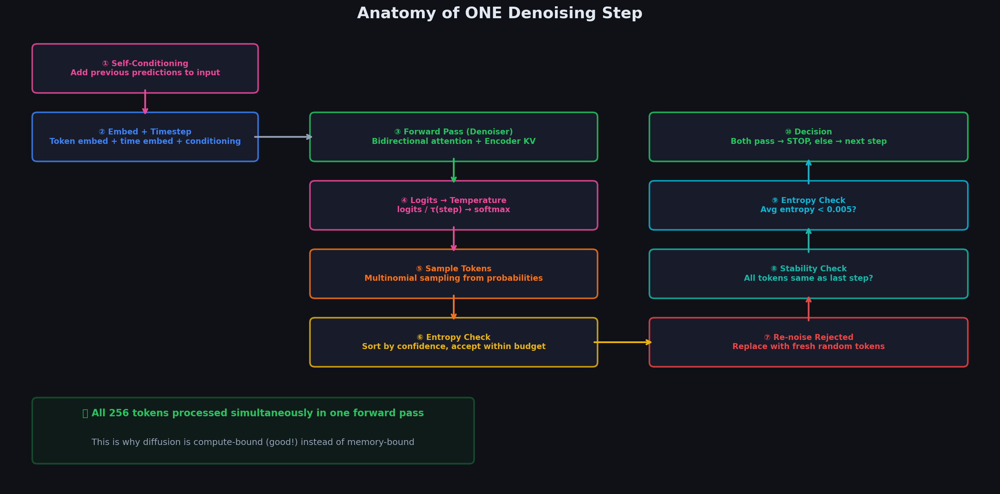

# Chapter 5.0: Connecting the Dots — How ALL Inference Components Work Together

> *"Before we zoom into each part, let's see the whole machine."*





---

## 5.0.1 The Problem: Too Many Moving Parts

If you read about self-conditioning, the scheduler, and the sampler separately, it's hard to see how they connect. Here's the truth: **they all run inside a single denoising step, in a specific order.**

---

## 5.0.2 The Complete Flow of ONE Denoising Step

Let's trace through **step 3** (out of 16) for a canvas of 8 tokens. The canvas currently looks like this after steps 1–2:

```
  Canvas entering step 3:
  ┌──────┬──────┬──────┬──────┬──────┬──────┬──────┬──────┐
  │"Waves"│"rand"│"upon"│"the" │"rand"│"rand"│"rand"│"rand"│
  │ pos 1 │ pos 2│ pos 3│ pos 4│ pos 5│ pos 6│ pos 7│ pos 8│
  └──────┴──────┴──────┴──────┴──────┴──────┴──────┴──────┘
     ✓       ✗      ✓      ✓      ✗      ✗      ✗      ✗
   (kept)  (noise) (kept) (kept)
```

Also available:
- **Encoder KV cache** (from the query "Write a haiku about the ocean")
- **Self-conditioning vectors** $c_1, c_2, \ldots, c_8$ (from step 2)

---

### STAGE 1: Prepare Input (Self-Conditioning + Embedding)

```
  ┌─────────────────────────────────────────────────────────────┐
  │  STAGE 1: PREPARE INPUT                                      │
  │                                                               │
  │  For each position i:                                        │
  │                                                               │
  │  a) Look up token embedding:                                  │
  │     e₁ = Embed("Waves")  = [0.71, -0.3, ...]                │
  │     e₂ = Embed("rand")   = [0.12,  0.8, ...]  (some random) │
  │     ...                                                       │
  │                                                               │
  │  b) ADD self-conditioning from step 2:                        │
  │     ê₁ = e₁ + c₁  (c₁ encodes: "last step I predicted      │
  │                      'Waves' with 85% confidence")            │
  │     ê₂ = e₂ + c₂  (c₂ encodes: "last step I predicted      │
  │                      'crash' with 40% confidence")            │
  │     ...                                                       │
  │                                                               │
  │  c) ADD timestep embedding:                                   │
  │     ê₁' = ê₁ + emb(t=3)  (tells model: "step 3 of 16,      │
  │                             canvas is still quite noisy")     │
  │                                                               │
  │  OUTPUT: Modified embeddings [ê₁', ê₂', ..., ê₈']           │
  └─────────────────────────────────────────────────────────────┘
                              │
                              ▼
```

### STAGE 2: Forward Pass Through the Model

```
  ┌─────────────────────────────────────────────────────────────┐
  │  STAGE 2: FORWARD PASS (Gemma 4 in Denoiser Mode)           │
  │                                                               │
  │  Input: [ê₁', ê₂', ..., ê₈'] + Encoder KV cache            │
  │                                                               │
  │  At each layer:                                               │
  │    - Compute Q from canvas embeddings                         │
  │    - Concatenate encoder KV + canvas KV                       │
  │    - Bidirectional attention (each pos sees all others)        │
  │    - Feed through MoE experts                                 │
  │    - Residual connections + layer norms                        │
  │                                                               │
  │  After ALL layers:                                            │
  │    - LM Head maps each position to vocabulary logits          │
  │                                                               │
  │  OUTPUT: logits₁, logits₂, ..., logits₈                     │
  │          Each logits_i ∈ ℝ^{256000}                          │
  └─────────────────────────────────────────────────────────────┘
                              │
                              ▼
```

### STAGE 3: Scheduler — Temperature Scaling

```
  ┌─────────────────────────────────────────────────────────────┐
  │  STAGE 3: TEMPERATURE SCALING (Scheduler)                    │
  │                                                               │
  │  Step 3 of 16: τ₃ = 1.5 + (0.3 - 1.5) × (16-3)/16         │
  │                τ₃ = 1.5 - 1.2 × 0.8125 = 0.525              │
  │                                                               │
  │  Apply to each position:                                      │
  │  scaled_logits_i = logits_i / 0.525                          │
  │                                                               │
  │  Convert to probabilities:                                    │
  │  p_i = softmax(scaled_logits_i)                              │
  │                                                               │
  │  Position 1: p₁ = [P("Waves")=0.90, P("Wave")=0.03, ...]   │
  │  Position 2: p₂ = [P("crash")=0.55, P("hit")=0.15, ...]    │
  │  Position 3: p₃ = [P("upon")=0.82, P("on")=0.08, ...]      │
  │  Position 4: p₄ = [P("the")=0.93, P("a")=0.02, ...]        │
  │  Position 5: p₅ = [P("sandy")=0.35, P("rocky")=0.20, ...]  │
  │  Position 6: p₆ = [P("shore")=0.40, P("beach")=0.25, ...]  │
  │  Position 7: p₇ = [P("with")=0.10, P("and")=0.08, ...]     │
  │  Position 8: p₈ = [P("wind")=0.12, P("rain")=0.11, ...]    │
  │                                                               │
  └─────────────────────────────────────────────────────────────┘
                              │
                              ▼
```

### STAGE 4: Multinomial Sampling

```
  ┌─────────────────────────────────────────────────────────────┐
  │  STAGE 4: SAMPLE CANDIDATE TOKENS                            │
  │                                                               │
  │  Draw one token from each probability distribution:           │
  │                                                               │
  │  Pos 1: sample from p₁ → "Waves"  (drew the 90% option)    │
  │  Pos 2: sample from p₂ → "crash"  (drew the 55% option)    │
  │  Pos 3: sample from p₃ → "upon"   (drew the 82% option)    │
  │  Pos 4: sample from p₄ → "the"    (drew the 93% option)    │
  │  Pos 5: sample from p₅ → "sandy"  (drew the 35% option)    │
  │  Pos 6: sample from p₆ → "beach"  (drew the 25% option!)   │
  │  Pos 7: sample from p₇ → "and"    (drew the 8% option!)    │
  │  Pos 8: sample from p₈ → "rain"   (drew the 11% option)    │
  │                                                               │
  │  Note: Sampling is STOCHASTIC. Even a 55% token might        │
  │  not be selected — a 15% token could be chosen instead!      │
  │  This is intentional: it enables diversity.                   │
  │                                                               │
  └─────────────────────────────────────────────────────────────┘
                              │
                              ▼
```

### STAGE 5: Entropy-Bounded Sampler (Accept/Reject)

```
  ┌─────────────────────────────────────────────────────────────┐
  │  STAGE 5: ACCEPT OR REJECT (Sampler)                         │
  │                                                               │
  │  a) Compute entropy at each position:                         │
  │                                                               │
  │  Pos 1: H₁ = 0.52 bits   "Waves" (very confident)           │
  │  Pos 2: H₂ = 1.80 bits   "crash" (moderately confident)     │
  │  Pos 3: H₃ = 0.85 bits   "upon"  (confident)                │
  │  Pos 4: H₄ = 0.35 bits   "the"   (very confident)           │
  │  Pos 5: H₅ = 3.20 bits   "sandy" (uncertain)                │
  │  Pos 6: H₆ = 2.90 bits   "beach" (uncertain)                │
  │  Pos 7: H₇ = 5.50 bits   "and"   (very uncertain)           │
  │  Pos 8: H₈ = 5.10 bits   "rain"  (very uncertain)           │
  │                                                               │
  │  b) Sort by entropy (most confident first):                   │
  │     Pos 4 (0.35) → Pos 1 (0.52) → Pos 3 (0.85)             │
  │     → Pos 2 (1.80) → Pos 6 (2.90) → Pos 5 (3.20)           │
  │     → Pos 8 (5.10) → Pos 7 (5.50)                           │
  │                                                               │
  │  c) Cumulative entropy budget check (B = -50):               │
  │                                                               │
  │     Pos 4: 0.35 - 17.97 = -17.62   (sum: -17.62 ≤ -50? ✓)  │
  │     Pos 1: 0.52 - 17.97 = -17.45   (sum: -35.07 ≤ -50? ✓)  │
  │     Pos 3: 0.85 - 17.97 = -17.12   (sum: -52.19 ≤ -50? ✓)  │
  │     Pos 2: 1.80 - 17.97 = -16.17   (sum: -68.36 ≤ -50? ✓)  │
  │     Pos 6: 2.90 - 17.97 = -15.07   (sum: -83.43 ≤ -50? ✓)  │
  │     Pos 5: 3.20 - 17.97 = -14.77   (sum: -98.20 ≤ -50? ✓)  │
  │     Pos 8: 5.10 - 17.97 = -12.87   (sum: -111.1 ≤ -50? ✓)  │
  │     Pos 7: 5.50 - 17.97 = -12.47   (sum: -123.5 ≤ -50? ✓)  │
  │                                                               │
  │  With budget B = -50, all are accepted this round!           │
  │  (Stricter budget B = -35 would reject pos 5,6,7,8)          │
  │                                                               │
  │  RESULT:                                                      │
  │  ACCEPTED:  pos 1,2,3,4,5,6  (confident enough)              │
  │  REJECTED:  pos 7,8           (if using stricter budget)      │
  └─────────────────────────────────────────────────────────────┘
                              │
                              ▼
```

### STAGE 6: Re-noise Rejected Positions

```
  ┌─────────────────────────────────────────────────────────────┐
  │  STAGE 6: RE-NOISE (replace rejected tokens with random)     │
  │                                                               │
  │  BEFORE:                                                      │
  │  ["Waves"]["crash"]["upon"]["the"]["sandy"]["beach"]["and"]["rain"]│
  │     ✓        ✓       ✓      ✓      ✓       ✓      ✗      ✗  │
  │                                                               │
  │  AFTER:                                                       │
  │  ["Waves"]["crash"]["upon"]["the"]["sandy"]["beach"]["##"]["xyz"]│
  │     ✓        ✓       ✓      ✓      ✓       ✓      ↑      ↑  │
  │                                                   new     new │
  │                                                  random  random│
  └─────────────────────────────────────────────────────────────┘
                              │
                              ▼
```

### STAGE 7: Self-Conditioning (Save for Next Step)

```
  ┌─────────────────────────────────────────────────────────────┐
  │  STAGE 7: COMPUTE SELF-CONDITIONING FOR STEP 4              │
  │                                                               │
  │  For each position i, using the probabilities from Stage 3:   │
  │                                                               │
  │  a) Soft embedding = probability × embedding matrix           │
  │     ẽ₁ = 0.90·E["Waves"] + 0.03·E["Wave"] + ...             │
  │        ≈ E["Waves"]  (dominated by 90% probability)          │
  │                                                               │
  │     ẽ₇ = 0.10·E["with"] + 0.08·E["and"] + 0.07·E["the"]... │
  │        ≈ blurry average  (no dominant token)                  │
  │                                                               │
  │  b) Pass through FFNN:                                        │
  │     c₁ = FFNN(ẽ₁)   → strong signal for "Waves"             │
  │     c₇ = FFNN(ẽ₇)   → weak signal (uncertain)               │
  │                                                               │
  │  c) SAVE c₁...c₈ for step 4                                  │
  │                                                               │
  │  At step 4, these will be ADDED to the token embeddings:     │
  │  - Pos 7 gets re-noised to "##", but c₇ tells the model:    │
  │    "Last step I thought this might be 'with' or 'and'"        │
  │  - This memory helps the model make better predictions!       │
  └─────────────────────────────────────────────────────────────┘
                              │
                              ▼
```

### STAGE 8: Adaptive Stopping Check

```
  ┌─────────────────────────────────────────────────────────────┐
  │  STAGE 8: CHECK IF WE SHOULD STOP EARLY                     │
  │                                                               │
  │  a) Stability: Are predictions same as step 2?               │
  │     Step 2 predicted: [Waves, crash, upon, the, ?, ?, ?, ?] │
  │     Step 3 predicted: [Waves, crash, upon, the, sandy,       │
  │                         beach, and, rain]                     │
  │     New tokens at pos 5-8 → Stability = 4/8 = 0.50          │
  │     NOT stable (need 1.0)                                     │
  │                                                               │
  │  b) Confidence: Average entropy across all positions          │
  │     avg(H) = (0.52+1.80+0.85+0.35+3.20+2.90+5.50+5.10)/8   │
  │            = 2.53 bits                                        │
  │     NOT confident (need < 0.005)                              │
  │                                                               │
  │  DECISION: CONTINUE to step 4                                │
  │                                                               │
  └─────────────────────────────────────────────────────────────┘
                              │
                              ▼
                      Go to STEP 4
                  (back to Stage 1 with updated canvas)
```

---

## 5.0.3 The Full Loop Visualized

```
  ┌──────────────────────────────────────────────────────────────────┐
  │                                                                   │
  │            THE DENOISING LOOP (repeats S times)                   │
  │                                                                   │
  │    Canvas ──→ [1. Add self-conditioning]                          │
  │      ↑         │                                                  │
  │      │         ▼                                                  │
  │      │        [2. Forward pass (Gemma 4 bidirectional)]           │
  │      │         │                                                  │
  │      │         ▼                                                  │
  │      │        [3. Temperature scale logits]                       │
  │      │         │                                                  │
  │      │         ▼                                                  │
  │      │        [4. Sample candidate tokens]                        │
  │      │         │                                                  │
  │      │         ▼                                                  │
  │      │        [5. Accept/Reject (entropy bound)]                  │
  │      │         │                                                  │
  │      │         ▼                                                  │
  │      │        [6. Re-noise rejected positions]                    │
  │      │         │                                                  │
  │      │         ▼                                                  │
  │      │        [7. Compute self-cond for next step]                │
  │      │         │                                                  │
  │      │         ▼                                                  │
  │      │        [8. Check: Stop early?] ──YES──→ OUTPUT CANVAS      │
  │      │         │                                                  │
  │      │        NO                                                  │
  │      │         │                                                  │
  │      └─────── ▼                                                   │
  │         Updated canvas                                            │
  │                                                                   │
  └──────────────────────────────────────────────────────────────────┘
```

---

## 5.0.4 How the Components Relate to Each Other

```
  ┌────────────────────────────────────────────────────────────────┐
  │                 COMPONENT RELATIONSHIPS                        │
  │                                                                 │
  │  SELF-CONDITIONING feeds → FORWARD PASS                        │
  │  "Memory from last step    "Runs the model to get logits"     │
  │   improves input quality"                                      │
  │                                                                 │
  │  FORWARD PASS feeds → SCHEDULER (temperature)                  │
  │  "Raw logits are too        "Sharpen/soften the logits         │
  │   uncertain for noisy        based on which step we're on"     │
  │   canvas"                                                      │
  │                                                                 │
  │  SCHEDULER feeds → MULTINOMIAL SAMPLING                        │
  │  "Temperature-scaled         "Random draw from the             │
  │   probabilities"              adjusted distribution"           │
  │                                                                 │
  │  MULTINOMIAL SAMPLING feeds → SAMPLER (entropy bound)          │
  │  "Candidate tokens with      "Keep only confident ones,        │
  │   their probabilities"        reject the rest"                 │
  │                                                                 │
  │  SAMPLER feeds → RE-NOISING                                    │
  │  "Accept/reject decisions"    "Rejected → new random token"   │
  │                                                                 │
  │  RE-NOISING feeds → UPDATED CANVAS → NEXT STEP                │
  │  "New canvas = accepted       "Goes back to Stage 1"           │
  │   tokens + new random"                                         │
  │                                                                 │
  │  PROBABILITIES also feed → SELF-CONDITIONING                   │
  │  "Save soft embeddings         "Will be used at next step"     │
  │   from this step's probs"                                      │
  │                                                                 │
  │  SCHEDULER also feeds → ADAPTIVE STOPPING                      │
  │  "Track stability and          "End the loop early if          │
  │   entropy over steps"           canvas has converged"          │
  │                                                                 │
  └────────────────────────────────────────────────────────────────┘
```

---

**Now** you know how all the pieces fit together. The following sections zoom into each component with deeper math:

- [01_self_conditioning.md](../../01_self_conditioning/01_self_conditioning/) — Self-conditioning math and the FFNN
- [02_multi_canvas_sampling.md](../../02_multi_canvas_sampling/02_multi_canvas_sampling/) — Block diffusion for long sequences
- [03_scheduler.md](../../03_scheduler/03_scheduler/) — Temperature schedule and adaptive stopping
- [04_entropy_bounded_sampler.md](../../04_entropy_bounded_sampler/04_entropy_bounded_sampler/) — The accept/reject math

---

## Deep Dive: One Step Traced Numerically

To make the eight stages concrete, we trace **one full denoising step** on a miniature 4-token canvas. The target phrase is `"The cat sat on"`, but the canvas entering this step still has noise:

```
  Canvas entering step 5 (of 16):
  ┌────────┬────────┬─────┬────────┐
  │ rand₁  │ rand₂  │ sat │ rand₃  │
  │ pos 1  │ pos 2  │pos 3│ pos 4  │
  └────────┴────────┴─────┴────────┘
```

We use a **toy vocabulary** of 5 tokens $\{\texttt{The}, \texttt{cat}, \texttt{sat}, \texttt{on}, \texttt{rand}\}$ with $d = 4$ dimensional embeddings, and carry probabilities forward from **step 4** (the previous denoising step).

### Setup: Embedding Matrix and Previous Probabilities

```
  E[The]  = [1.0,  0.0,  0.0,  0.0]
  E[cat]  = [0.0,  1.0,  0.0,  0.0]
  E[sat]  = [0.0,  0.0,  1.0,  0.0]
  E[on]   = [0.0,  0.0,  0.0,  1.0]
  E[rand] = [0.25, 0.25, 0.25, 0.25]   ← diffuse "noise" direction
```

Previous-step probabilities (step 4 output, top-4 mass shown; remainder on `rand`):

| Position | Canvas token | $p_i$ over $\{\texttt{The}, \texttt{cat}, \texttt{sat}, \texttt{on}\}$ |
|----------|-------------|--------------------------------------------------------------------------|
| 1 | `rand₁` | $[0.3,\; 0.2,\; 0.1,\; 0.05]$ + 0.35 on `rand` |
| 2 | `rand₂` | $[0.5,\; 0.1,\; 0.1,\; 0.05]$ + 0.25 on `rand` |
| 3 | `sat` | $[0.05,\; 0.05,\; 0.9,\; 0.0]$ + 0.0 on `rand` |
| 4 | `rand₃` | $[0.1,\; 0.1,\; 0.1,\; 0.1]$ + 0.6 on `rand` |

---

### Step 1: Self-Conditioning (Soft Embedding → FFNN)

For each position $i$, compute the **soft embedding** from the previous step's distribution:

$$
\tilde{\mathbf{e}}_i = \sum_{k=1}^{K} p_i[k] \cdot \mathbf{E}[k]
$$

**Position 1** (moderate confidence toward `The`):

```
  ẽ₁ = 0.30·[1,0,0,0] + 0.20·[0,1,0,0] + 0.10·[0,0,1,0] + 0.05·[0,0,0,1] + 0.35·[0.25,0.25,0.25,0.25]

     = [0.30, 0.20, 0.10, 0.05] + [0.0875, 0.0875, 0.0875, 0.0875]

     = [0.3875, 0.2875, 0.1875, 0.1375]    ← pulled toward E[The], but blurred by noise mass
```

**Position 3** (high confidence — canvas already has `sat`):

```
  ẽ₃ = 0.05·[1,0,0,0] + 0.05·[0,1,0,0] + 0.90·[0,0,1,0] + 0.0·[0,0,0,1]

     = [0.05, 0.05, 0.90, 0.0]    ≈ E[sat] = [0,0,1,0]   (dominant 90% mass)
```

**Position 4** (very low confidence — nearly uniform):

```
  ẽ₄ = 0.10·[1,0,0,0] + 0.10·[0,1,0,0] + 0.10·[0,0,1,0] + 0.10·[0,0,0,1] + 0.60·[0.25,0.25,0.25,0.25]

     = [0.10, 0.10, 0.10, 0.10] + [0.15, 0.15, 0.15, 0.15]

     = [0.25, 0.25, 0.25, 0.25]    = E[rand]   (no dominant direction)
```

**FFNN** (simple linear + ReLU example, shared weights):

$$
\mathbf{c}_i = \mathbf{W}_2 \cdot \text{ReLU}(\mathbf{W}_1 \cdot \tilde{\mathbf{e}}_i + \mathbf{b}_1) + \mathbf{b}_2
$$

With $\mathbf{W}_1 = \mathbf{I}_4$, $\mathbf{b}_1 = \mathbf{0}$, $\mathbf{W}_2 = 0.5\,\mathbf{I}_4$, $\mathbf{b}_2 = \mathbf{0}$:

```
  Position 1:  h₁ = ReLU([0.3875, 0.2875, 0.1875, 0.1375]) = [0.3875, 0.2875, 0.1875, 0.1375]
               c₁ = 0.5 · h₁ = [0.194, 0.144, 0.094, 0.069]

  Position 3:  h₃ = ReLU([0.05, 0.05, 0.90, 0.0]) = [0.05, 0.05, 0.90, 0.0]
               c₃ = [0.025, 0.025, 0.450, 0.0]    ← strong "sat" signal

  Position 4:  h₄ = ReLU([0.25, 0.25, 0.25, 0.25]) = [0.25, 0.25, 0.25, 0.25]
               c₄ = [0.125, 0.125, 0.125, 0.125]  ← weak, symmetric (uncertain)
```

---

### Step 2: Token Embedding + Timestep + Conditioning

For step $s = 5$ of $S = 16$, add three vectors at each position:

$$
\hat{\mathbf{e}}_i^{\,s} = \text{Embed}(x_t^i) + \text{emb}(t{=}5) + \mathbf{c}_i
$$

```
  emb(t=5) = [0.10, 0.05, -0.05, 0.00]    ← "mid-denoising" timestep signal

  Position 1 (canvas = rand₁):
    e₁ = Embed(rand₁) = [0.25, 0.25, 0.25, 0.25]
    ê₁ = [0.25, 0.25, 0.25, 0.25] + [0.10, 0.05, -0.05, 0.00] + [0.194, 0.144, 0.094, 0.069]
       = [0.544, 0.444, 0.294, 0.319]

  Position 2 (canvas = rand₂):
    e₂ = [0.25, 0.25, 0.25, 0.25]
    c₂ = [0.250, 0.050, 0.050, 0.025]    (from ẽ₂ = [0.50, 0.10, 0.10, 0.05] + noise)
    ê₂ = [0.25, 0.25, 0.25, 0.25] + [0.10, 0.05, -0.05, 0.00] + [0.250, 0.050, 0.050, 0.025]
       = [0.600, 0.350, 0.250, 0.275]    ← memory says "probably cat" (50%)

  Position 3 (canvas = sat):
    e₃ = Embed(sat) = [0.0, 0.0, 1.0, 0.0]
    ê₃ = [0.0, 0.0, 1.0, 0.0] + [0.10, 0.05, -0.05, 0.00] + [0.025, 0.025, 0.450, 0.0]
       = [0.125, 0.075, 1.395, 0.0]      ← strong sat embedding reinforced by c₃

  Position 4 (canvas = rand₃):
    e₄ = [0.25, 0.25, 0.25, 0.25]
    ê₄ = [0.25, 0.25, 0.25, 0.25] + [0.10, 0.05, -0.05, 0.00] + [0.125, 0.125, 0.125, 0.125]
       = [0.475, 0.425, 0.325, 0.375]    ← no strong directional bias
```

These $\hat{\mathbf{e}}_i^{\,s}$ vectors are the actual inputs to the denoiser's first layer (plus encoder KV cross-attention).

---

### Step 3: Forward Pass → Logits → Softmax → Probabilities

The model runs bidirectional attention over all 4 positions, then the LM head outputs logits $\mathbf{z}_i \in \mathbb{R}^5$ per position. Example raw logits:

| Position | $z_i$ over $\{\texttt{The}, \texttt{cat}, \texttt{sat}, \texttt{on}, \texttt{rand}\}$ |
|----------|----------------------------------------------------------------------------------------|
| 1 | $[2.8,\; 0.6,\; -0.4,\; 0.2,\; -1.0]$ |
| 2 | $[0.3,\; 2.5,\; 0.1,\; -0.2,\; -0.8]$ |
| 3 | $[-0.5,\; -0.3,\; 3.2,\; 0.1,\; -1.5]$ |
| 4 | $[0.5,\; 0.4,\; 0.3,\; 1.8,\; 0.2]$ |

**Softmax** at $\tau = 1.0$ (before temperature scaling) for position 1:

```
  exp(z₁) = [16.44, 1.82, 0.67, 1.22, 0.37],   sum = 20.52

  p₁ = [16.44/20.52, 1.82/20.52, 0.67/20.52, 1.22/20.52, 0.37/20.52]
     = [0.801, 0.089, 0.033, 0.059, 0.018]
```

Similarly:

```
  p₂ = softmax([0.3, 2.5, 0.1, -0.2, -0.8]) = [0.089, 0.746, 0.055, 0.041, 0.069]
  p₃ = softmax([-0.5, -0.3, 3.2, 0.1, -1.5]) = [0.023, 0.028, 0.924, 0.038, 0.007]
  p₄ = softmax([0.5, 0.4, 0.3, 1.8, 0.2])   = [0.116, 0.105, 0.095, 0.601, 0.083]
```

---

### Step 4: Temperature Scaling ($\tau = 1.5$)

At step 5 of 16: $\tau_5 = 1.5 + (0.2 - 1.5) \times (16-5)/16 = 1.5 - 1.3 \times 0.6875 = 0.606$.

For clarity in this trace, we use $\tau = 1.5$ to show a visible softening effect:

$$
p_i = \text{softmax}\!\left(\frac{\mathbf{z}_i}{\tau}\right)
$$

**Position 1** with $\tau = 1.5$:

```
  z₁/τ = [2.8/1.5, 0.6/1.5, -0.4/1.5, 0.2/1.5, -1.0/1.5]
       = [1.867, 0.400, -0.267, 0.133, -0.667]

  exp(·) = [6.468, 1.492, 0.766, 1.142, 0.513],   sum = 10.381

  p₁(τ=1.5) = [0.623, 0.144, 0.074, 0.110, 0.049]    ← softer than [0.801, ...] at τ=1.0
```

**Position 4** (uncertain `on` vs others) — temperature has the largest effect on flat distributions:

```
  z₄/τ = [0.333, 0.267, 0.200, 1.200, 0.133]
  p₄(τ=1.5) = [0.143, 0.134, 0.126, 0.498, 0.099]    ← "on" drops from 60.1% to 49.8%
```

Higher $\tau$ → more uniform; lower $\tau$ → sharper. Early steps use high $\tau$ to explore; late steps use low $\tau$ to commit.

---

### Step 5: Multinomial Sampling

Draw one token per position from the temperature-scaled distribution:

$$
\hat{x}_0^i \sim \text{Categorical}(p_i)
$$

```
  Position 1:  p₁ = [0.623, 0.144, 0.074, 0.110, 0.049]
               u₁ = 0.41  →  cumulative: 0.623 ≥ 0.41  →  sample "The"  ✓

  Position 2:  p₂ = [0.089, 0.746, 0.055, 0.041, 0.069]  (after τ=1.5 scaling)
               u₂ = 0.82  →  cumulative: 0.089+0.746 = 0.835 ≥ 0.82  →  sample "cat"  ✓

  Position 3:  p₃ = [0.023, 0.028, 0.924, 0.038, 0.007]
               u₃ = 0.15  →  0.023+0.028+0.924 = 0.975 ≥ 0.15  →  sample "sat"  ✓

  Position 4:  p₄ = [0.143, 0.134, 0.126, 0.498, 0.099]
               u₄ = 0.72  →  0.143+0.134+0.126+0.498 = 0.901 ≥ 0.72  →  sample "on"  ✓

  Candidate canvas: ["The", "cat", "sat", "on"]   ← lucky draw; all match target!
```

Note: position 4 had only 49.8% chance of `on` — a draw of `cat` (13.4%) or `The` (14.3%) would be equally valid stochastic outcomes.

---

### Step 6: Entropy at Each Position

$$
H_i = -\sum_{k} p_i[k] \log_2 p_i[k]
$$

Using the $\tau = 1.5$ probabilities:

**Position 1** ($p_1 = [0.623, 0.144, 0.074, 0.110, 0.049]$):

```
  H₁ = -(0.623·log₂(0.623) + 0.144·log₂(0.144) + 0.074·log₂(0.074)
         + 0.110·log₂(0.110) + 0.049·log₂(0.049))

     = -(0.623·(-0.682) + 0.144·(-2.796) + 0.074·(-3.755)
         + 0.110·(-3.184) + 0.049·(-4.351))

     = -(-0.425 - 0.403 - 0.278 - 0.350 - 0.213)

     = 1.67 bits     (moderately confident)
```

**Position 3** ($p_3 = [0.023, 0.028, 0.924, 0.038, 0.007]$):

```
  H₃ = -(0.924·log₂(0.924) + 0.028·log₂(0.028) + 0.023·log₂(0.023) + ...)

     ≈ 0.42 bits     (very confident — peaked on "sat")
```

**Position 4** ($p_4 = [0.143, 0.134, 0.126, 0.498, 0.099]$):

```
  H₄ ≈ 2.05 bits     (least confident — "on" leads but barely)
```

Summary:

| Position | Sampled token | $H_i$ (bits) | Confidence |
|----------|--------------|----------------|------------|
| 1 | `The` | 1.67 | moderate |
| 2 | `cat` | 1.12 | moderate-high |
| 3 | `sat` | 0.42 | very high |
| 4 | `on` | 2.05 | moderate-low |

---

### Step 7: Accept/Reject with Entropy Budget

Sort by entropy (ascending = most confident first):

$$
\pi = [3,\; 2,\; 1,\; 4] \quad\text{(positions ordered by } H_i \text{)}
$$

With $K = 5$ toy vocab: $H_{\max} = \log_2 5 \approx 2.32$ bits.  
With full vocab $K = 256{,}000$: $H_{\max} \approx 17.97$ bits. We use the real budget scale:

$$
\text{Accept } \pi_j \text{ while } \sum_{m=1}^{j} \bigl(\mathcal{H}_{\pi_m} - \mathcal{H}_{\max}\bigr) \geq B
$$

where $B = -50$ (accept while cumulative sum has not dropped below the budget floor).

Using $H_{\max} = 17.97$:

| Rank $j$ | Position $\pi_j$ | $H_{\pi_j}$ | $H_{\pi_j} - H_{\max}$ | Cumulative | $\geq -50$? | Decision |
|------------|-------------------|---------------|--------------------------|------------|--------------|----------|
| 1 | pos 3 (`sat`) | 0.42 | $-17.55$ | $-17.55$ | ✓ | **Accept** |
| 2 | pos 2 (`cat`) | 1.12 | $-16.85$ | $-34.40$ | ✓ | **Accept** |
| 3 | pos 1 (`The`) | 1.67 | $-16.30$ | $-50.70$ | ✗ | **Reject** |
| 4 | pos 4 (`on`) | 2.05 | $-15.92$ | — | ✗ | **Reject** |

Positions 3 and 2 are accepted; positions 1 and 4 are rejected despite sampling good tokens — the budget ran out after two high-confidence accepts.

---

### Step 8: Re-noise Rejected Tokens

Rejected positions are replaced with **fresh uniform random** tokens:

$$
x_{s+1}^i = \begin{cases}
\hat{x}_0^i & \text{if accepted} \\
\text{Uniform}\{1, \ldots, K\} & \text{if rejected}
\end{cases}
$$

```
  BEFORE:
  ["The"]  ["cat"]  ["sat"]  ["on"]
    ✗        ✓        ✓       ✗

  Re-noise pos 1 and pos 4:
    pos 1 ← Uniform(K)  →  draws token ID 847291  →  "xq7"
    pos 4 ← Uniform(K)  →  draws token ID 12045   →  "k9@"

  AFTER:
  ["xq7"]  ["cat"]  ["sat"]  ["k9@"]
     ↑       ✓        ✓        ↑
   new noise          kept    new noise
```

The canvas is **not** `"The cat sat on"` yet — but positions 2 and 3 are locked in. At step 6, self-conditioning vectors $\mathbf{c}_1, \ldots, \mathbf{c}_4$ computed from *this* step's probabilities will tell the model: "I was fairly sure about `cat` and `sat`, less sure about `The` and `on`" — guiding the next iteration.

---

**Next**: [01_self_conditioning.md](../../01_self_conditioning/01_self_conditioning/) — Deep dive into the self-conditioning mechanism.
