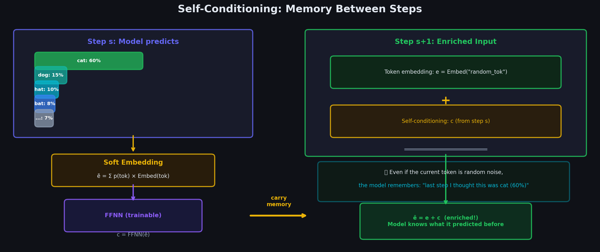

# Chapter 5.1: Self-Conditioning — Memory Across Denoising Steps

> *"Tell me what you tried last step, so I can do better this step."*



---

## 5.1.1 The Problem: Each Step Starts Fresh

Each denoising step is a **fresh** forward pass. Without self-conditioning, the model at step $s+1$ has **no memory** of step $s$:

```
  WITHOUT SELF-CONDITIONING:
  
  Step 1:                              Step 2:
  ┌──────────────────────┐            ┌──────────────────────┐
  │ Canvas: [rand ...]    │            │ Canvas: [The rand ...]│
  │         ↓             │            │         ↓             │
  │ Model predicts:       │            │ Model predicts:       │
  │  pos 1: "The" (85%)   │            │  pos 1: "The" (80%)   │
  │  pos 2: "cat" (55%)   │  ────────→ │  pos 2: ??? ← NO IDEA│
  │  pos 3: "sat" (60%)   │            │  what it predicted    │
  │  ...                   │            │  at pos 2 before!     │
  └──────────────────────┘            └──────────────────────┘
  
  The model at Step 2 can see the CANVAS (which has "The" at pos 1)
  but it has NO idea what the model PREDICTED at the other positions
  or how CONFIDENT those predictions were.
```

**Why this matters**: If position 2 was predicted as "cat" with 55% confidence in step 1, the model should know this in step 2 so it can:
- Build on that prediction
- Improve it with better context
- Not waste effort re-discovering the same thing

---

## 5.1.2 The Solution: Feed Back the Predictions

Self-conditioning passes the model's **previous probability distributions** to the next step. Here's the exact pipeline:

### Numerical Trace: Position 2 at Step 1

**Step 1a: Model produces probabilities at position 2:**

```
  p₂ = softmax(logits₂) = 
  
  Token:       "cat"   "dog"   "the"   "sat"   "bird"   ... (256,000 tokens)
  Probability:  0.55    0.15    0.10    0.08    0.03    ...
                 ↑
            Most likely
```

**Step 1b: Multiply probabilities with embedding matrix:**

The embedding matrix $\mathbf{E}$ maps each token to a vector. For simplicity, let's use $d = 4$:

```
  Embedding matrix E (K × d):
  
  "cat"  → E["cat"]  = [ 0.8,   0.2,   0.1,  -0.3]
  "dog"  → E["dog"]  = [ 0.7,   0.3,   0.0,  -0.2]
  "the"  → E["the"]  = [ 0.1,  -0.3,   0.5,   0.4]
  "sat"  → E["sat"]  = [ 0.0,  -0.1,   0.9,   0.6]
  "bird" → E["bird"] = [ 0.6,   0.4,   0.2,  -0.1]
  ...
```

**Soft embedding = weighted average:**

```
  ẽ₂ = 0.55 × E["cat"]  + 0.15 × E["dog"]  + 0.10 × E["the"]
     + 0.08 × E["sat"]  + 0.03 × E["bird"] + ...

  ẽ₂ = 0.55 × [0.8, 0.2, 0.1, -0.3]
     + 0.15 × [0.7, 0.3, 0.0, -0.2]
     + 0.10 × [0.1, -0.3, 0.5, 0.4]
     + 0.08 × [0.0, -0.1, 0.9, 0.6]
     + 0.03 × [0.6, 0.4, 0.2, -0.1]
     + ...

  ẽ₂ ≈ [0.44+0.11+0.01+0.00+0.02,   ← dimension 1
         0.11+0.05-0.03-0.01+0.01,   ← dimension 2
         0.06+0.00+0.05+0.07+0.01,   ← dimension 3
        -0.17-0.03+0.04+0.05-0.00]   ← dimension 4
  
  ẽ₂ ≈ [0.58, 0.13, 0.19, -0.11]
```

**Notice**: The soft embedding is **close to E["cat"]** = [0.8, 0.2, 0.1, -0.3] because "cat" dominates with 55% probability, but it's "pulled" toward other tokens too.

```
  Visualizing in embedding space (2D projection):
  
       dim 2
         ↑
    0.4  │              ○ E["bird"]
    0.3  │        ○ E["dog"]
    0.2  │   ○ E["cat"]
    0.1  │        ★ ẽ₂ (soft embedding)
    0.0  │──────────────────────→ dim 1
   -0.1  │    ○ E["sat"]
   -0.3  │         ○ E["the"]
  
  ★ sits near "cat" but is shifted toward "dog" and "bird"
  because they also had some probability mass.
```

**Step 1c: Pass through FFNN:**

```
  c₂ = FFNN(ẽ₂) = W₂ · GELU(W₁ · ẽ₂ + b₁) + b₂

  With W₁ ∈ ℝ^{8×4}, W₂ ∈ ℝ^{4×8}:
  
  hidden = GELU(W₁ · [0.58, 0.13, 0.19, -0.11] + b₁)
         = GELU([1.2, -0.3, 0.8, 0.5, -0.1, 0.7, 0.2, -0.4])
         = [1.17, 0.0, 0.76, 0.46, 0.0, 0.66, 0.18, 0.0]  (GELU ≈ x if x>0, ≈0 if x<0)
  
  c₂ = W₂ · hidden + b₂
     = [0.35, -0.12, 0.28, 0.09]   ← the conditioning vector
```

---

### Step 2: Use the Conditioning at Position 2

```
  At Step 2, position 2 has a new canvas token (maybe "rand" or "cat"):
  
  Normal token embedding:  e₂ = Embed("rand") = [0.12, 0.80, -0.15, 0.33]
  
  Self-conditioning adds:  c₂ = [0.35, -0.12, 0.28, 0.09]
  
  Final input embedding:   ê₂ = e₂ + c₂
                              = [0.12+0.35, 0.80-0.12, -0.15+0.28, 0.33+0.09]
                              = [0.47, 0.68, 0.13, 0.42]
```

```
  WHAT THE MODEL "SEES" AT POSITION 2 IN STEP 2:
  
  ┌───────────────────────────────────────────────────────────┐
  │                                                            │
  │  Token embedding e₂:  "The current canvas token is rand"  │
  │                        (some random token)                 │
  │                                                            │
  │  + Self-conditioning c₂: "But last step, I was pretty     │
  │                           sure this should be 'cat'        │
  │                           (55% confident)"                 │
  │                                                            │
  │  = Combined ê₂:  "The canvas says 'rand', but my memory  │
  │                    says 'cat' — let me factor both in"     │
  │                                                            │
  └───────────────────────────────────────────────────────────┘
```

---

## 5.1.3 High Confidence vs. Low Confidence: What the Model Learns

```
  HIGH CONFIDENCE (position 1 predicted "The" at 90%):
  
  p₁ = [0.90, 0.03, 0.02, ...]
  ẽ₁ = 0.90 × E["The"] + 0.03 × E["A"] + ...
     ≈ E["The"]   (almost exactly "The"'s embedding)
  c₁ = FFNN(ẽ₁) → strong, clear signal
  
  The FFNN learns to produce a STRONG conditioning vector:
  "I was very sure. Pay attention to this!"
```

```
  LOW CONFIDENCE (position 7 predicted "with" at 10%):
  
  p₇ = [0.10, 0.08, 0.07, 0.07, 0.06, ...]
  ẽ₇ = 0.10 × E["with"] + 0.08 × E["and"] + 0.07 × E["the"] + ...
     ≈ average of many embeddings  (blurry, no dominant direction)
  c₇ = FFNN(ẽ₇) → weak, noisy signal
  
  The FFNN learns to produce a WEAK conditioning vector:
  "I wasn't sure. Don't rely too heavily on this."
```

---

## 5.1.4 The First Step: No Memory Yet

At step $s = 0$, there are no previous predictions:

```
  Step 0: c_i = 0 for all positions
  (no self-conditioning — use plain token embeddings)
  
  Step 1: c_i = FFNN(ẽ_i)  from step 0's predictions
  (first real self-conditioning)
  
  Step 2: c_i = FFNN(ẽ_i)  from step 1's predictions
  (even better conditioning)
  ...
```

During training, self-conditioning is **randomly dropped** (set to zero) 50% of the time. This makes the model work both with and without conditioning, which is critical for step 0.

---

## 5.1.5 Why the FFNN Matters

Without the FFNN, we'd add the raw soft embedding directly to the token embedding. The problem:

```
  WITHOUT FFNN:
  ê₂ = e₂ + ẽ₂ = Embed("rand") + soft_embed(predictions)
  
  Both live in the SAME embedding space.
  The model can't distinguish:
  "This came from the current token" vs "This came from last step's prediction"
  
  WITH FFNN:
  ê₂ = e₂ + FFNN(ẽ₂) = Embed("rand") + learned_transform(soft_embed)
  
  The FFNN maps to a DIFFERENT subspace.
  The model can learn to treat the two signals differently.
```

---

## 5.1.6 Self-Conditioning Across Multiple Steps

```
  Step 0: Canvas = [rand, rand, rand, rand, rand]
          Self-cond = [0, 0, 0, 0, 0]
          → Model predicts with NO memory
          
  Step 1: Canvas = [The, rand, rand, on, rand]
          Self-cond = [c₁⁰, c₂⁰, c₃⁰, c₄⁰, c₅⁰]  (from step 0)
          → Model has memory of step 0 predictions
          → Better predictions because it knows what it tried before
          
  Step 2: Canvas = [The, cat, rand, on, rand]
          Self-cond = [c₁¹, c₂¹, c₃¹, c₄¹, c₅¹]  (from step 1)
          → Model has memory of step 1 predictions
          → Even better! c₂¹ encodes "step 1 predicted 'cat' at 65%"
          
  Step 3: Canvas = [The, cat, sat, on, the]
          Self-cond = [c₁², c₂², c₃², c₄², c₅²]  (from step 2)
          → Very strong memory. Most positions are confident.
          → c₅² encodes "step 2 predicted 'the' at 70%"
  
  Each step builds on the last, creating an increasingly
  clear picture of what the final output should be.
```

---

## 5.1.7 Complete Numerical Trace

This section walks through self-conditioning for **all three positions** of a miniature canvas, using a vocabulary of $K = 5$ tokens $\{a, b, c, d, e\}$ and embedding dimension $d = 4$.

### Mathematical Formulation

At denoising step $s$, after the model produces probability vectors $\mathbf{p}_i^{(s)} \in \mathbb{R}^K$ at each position $i$, self-conditioning for step $s+1$ is:

$$
\boxed{
\tilde{\mathbf{e}}_i = {\mathbf{p}_i^{(s)}}^{\!\top} \mathbf{E}, \qquad
\mathbf{c}_i = \mathbf{W}_2 \cdot \text{ReLU}(\mathbf{W}_1 \cdot \tilde{\mathbf{e}}_i + \mathbf{b}_1) + \mathbf{b}_2, \qquad
\hat{\mathbf{e}}_i^{\,s+1} = \text{Embed}(x_t^i) + \mathbf{c}_i
}
$$

where $\mathbf{E} \in \mathbb{R}^{K \times d}$ is the token embedding matrix and $\mathbf{c}_i \in \mathbb{R}^d$ is the conditioning vector saved for the next step.

### Setup

**Embedding matrix** $\mathbf{E}$ ($5 \times 4$):

```
  E[a] = [1,   0,   0,   0]
  E[b] = [0,   1,   0,   0]
  E[c] = [0,   0,   1,   0]
  E[d] = [0,   0,   0,   1]
  E[e] = [0.5, 0.5, 0.5, 0.5]    ← diffuse fallback token
```

**Step $s$ output probabilities:**

```
  p₁ = [0.10, 0.05, 0.70, 0.10, 0.05]    ← high confidence on c
  p₂ = [0.30, 0.30, 0.10, 0.20, 0.10]    ← low confidence (split a/b)
  p₃ = [0.02, 0.02, 0.02, 0.02, 0.92]    ← very high confidence on e
```

**FFNN weights** (shared across positions):

```
  W₁ (4×4) = | 1.0   0    0    0  |       b₁ = [ 0,  0,  0, -0.1]
             | 0    1.0   0    0  |
             | 0     0   1.0   0  |
             | 0.5  0.5  0.5  0.5 |

  W₂ (4×4) = 0.8 · I₄                    b₂ = [0.1, 0.05, 0.2, 0.0]
```

---

### Position 1: High Confidence ($P(c) = 0.7$)

**Soft embedding:**

```
  ẽ₁ = 0.10·E[a] + 0.05·E[b] + 0.70·E[c] + 0.10·E[d] + 0.05·E[e]

     = 0.10·[1,0,0,0] + 0.05·[0,1,0,0] + 0.70·[0,0,1,0] + 0.10·[0,0,0,1] + 0.05·[0.5,0.5,0.5,0.5]

     = [0.10, 0.05, 0.70, 0.10] + [0.025, 0.025, 0.025, 0.025]

     = [0.125, 0.075, 0.725, 0.125]
```

Compare to $\mathbf{E}[c] = [0, 0, 1, 0]$: the soft embedding is **close to $\mathbf{E}[c]$** because $P(c) = 0.7$ was dominant. The third component (0.725) carries most of the mass.

**FFNN forward pass:**

```
  W₁·ẽ₁ + b₁:
    row 1: 1.0·0.125 + 0 = 0.125
    row 2: 1.0·0.075 + 0 = 0.075
    row 3: 1.0·0.725 + 0 = 0.725
    row 4: 0.5·(0.125+0.075+0.725+0.125) - 0.1 = 0.5·1.05 - 0.1 = 0.425

  h₁ = ReLU([0.125, 0.075, 0.725, 0.425]) = [0.125, 0.075, 0.725, 0.425]

  c₁ = W₂·h₁ + b₂
     = [0.8·0.125+0.1,  0.8·0.075+0.05,  0.8·0.725+0.2,  0.8·0.425+0.0]
     = [0.200,  0.110,  0.780,  0.340]
```

**Use at step $s+1$** (canvas token at pos 1 is `a`):

```
  Embed(a) = [1, 0, 0, 0]

  ê₁^{s+1} = Embed(a) + c₁
           = [1, 0, 0, 0] + [0.200, 0.110, 0.780, 0.340]
           = [1.200, 0.110, 0.780, 0.340]
```

The model sees: "canvas says `a`, but my memory strongly suggests `c`" — the large third component (0.780) in $\mathbf{c}_1$ pulls the representation toward the `c` direction.

---

### Position 2: Low Confidence (Split Between $a$ and $b$)

**Soft embedding:**

```
  ẽ₂ = 0.30·E[a] + 0.30·E[b] + 0.10·E[c] + 0.20·E[d] + 0.10·E[e]

     = 0.30·[1,0,0,0] + 0.30·[0,1,0,0] + 0.10·[0,0,1,0] + 0.20·[0,0,0,1] + 0.10·[0.5,0.5,0.5,0.5]

     = [0.30, 0.30, 0.10, 0.20] + [0.05, 0.05, 0.05, 0.05]

     = [0.35, 0.35, 0.15, 0.25]
```

This is **not close to any single embedding** — it sits midway between $\mathbf{E}[a] = [1,0,0,0]$ and $\mathbf{E}[b] = [0,1,0,0]$. The first two components are equal (0.35), encoding genuine ambiguity.

**FFNN forward pass:**

```
  W₁·ẽ₂ + b₁ = [0.35, 0.35, 0.15, 0.5·(0.35+0.35+0.15+0.25)-0.1]
             = [0.35, 0.35, 0.15, 0.5·1.10 - 0.1]
             = [0.35, 0.35, 0.15, 0.45]

  h₂ = ReLU([0.35, 0.35, 0.15, 0.45]) = [0.35, 0.35, 0.15, 0.45]

  c₂ = [0.8·0.35+0.1,  0.8·0.35+0.05,  0.8·0.15+0.2,  0.8·0.45+0.0]
     = [0.380,  0.330,  0.320,  0.360]
```

Notice $\mathbf{c}_2$ has **similar magnitude in all four dimensions** (~0.32–0.38) — a weak, non-directional signal. The FFNN has learned to produce diffuse conditioning when the soft embedding is blurry.

**Use at step $s+1$** (canvas token at pos 2 is `e`):

```
  Embed(e) = [0.5, 0.5, 0.5, 0.5]

  ê₂^{s+1} = [0.5, 0.5, 0.5, 0.5] + [0.380, 0.330, 0.320, 0.360]
           = [0.880, 0.830, 0.820, 0.860]
```

The combined embedding is nearly uniform — correctly reflecting that the model has little to say about position 2.

---

### Position 3: Very High Confidence ($P(e) = 0.92$)

**Soft embedding:**

```
  ẽ₃ = 0.02·E[a] + 0.02·E[b] + 0.02·E[c] + 0.02·E[d] + 0.92·E[e]

     = [0.02, 0.02, 0.02, 0.02] + [0.46, 0.46, 0.46, 0.46]

     = [0.48, 0.48, 0.48, 0.48]
```

This is **almost exactly $\mathbf{E}[e] = [0.5, 0.5, 0.5, 0.5]$** — the 92% mass on `e` dominates completely. Compare to position 2's blurry $[0.35, 0.35, 0.15, 0.25]$: high confidence produces a soft embedding that nearly coincides with a single token's row in $\mathbf{E}$.

**FFNN forward pass:**

```
  W₁·ẽ₃ + b₁ = [0.48, 0.48, 0.48, 0.5·1.92 - 0.1]
             = [0.48, 0.48, 0.48, 0.86]

  h₃ = ReLU([0.48, 0.48, 0.48, 0.86]) = [0.48, 0.48, 0.48, 0.86]

  c₃ = [0.8·0.48+0.1,  0.8·0.48+0.05,  0.8·0.48+0.2,  0.8·0.86+0.0]
     = [0.484,  0.434,  0.584,  0.688]
```

The conditioning vector is **strong and symmetric** — all components are large, signaling "I was very sure about `e`; trust this."

**Use at step $s+1$** (canvas token at pos 3 is `c`):

```
  Embed(c) = [0, 0, 1, 0]

  ê₃^{s+1} = [0, 0, 1, 0] + [0.484, 0.434, 0.584, 0.688]
           = [0.484, 0.434, 1.584, 0.688]
```

---

### Side-by-Side Comparison

| Position | Dominant token | $\tilde{\mathbf{e}}_i$ | $\|\tilde{\mathbf{e}}_i\|$ | $\mathbf{c}_i$ | Signal strength |
|----------|---------------|--------------------------|-------------------------------|-----------------|-----------------|
| 1 | `c` (70%) | $[0.125, 0.075, 0.725, 0.125]$ | 0.74 | $[0.20, 0.11, 0.78, 0.34]$ | Strong, directional |
| 2 | `a`/`b` (30%/30%) | $[0.35, 0.35, 0.15, 0.25]$ | 0.56 | $[0.38, 0.33, 0.32, 0.36]$ | Weak, diffuse |
| 3 | `e` (92%) | $[0.48, 0.48, 0.48, 0.48]$ | 0.83 | $[0.48, 0.43, 0.58, 0.69]$ | Strong, symmetric |

The FFNN transforms each soft embedding into a conditioning vector whose **magnitude and directionality** encode confidence:

- **High confidence** → $\tilde{\mathbf{e}}_i \approx \mathbf{E}[k]$ for some $k$ → $\mathbf{c}_i$ has large, structured components
- **Low confidence** → $\tilde{\mathbf{e}}_i$ is a blurry average → $\mathbf{c}_i$ has small, uniform components

At step $s+1$, each $\mathbf{c}_i$ is added to the token embedding before the forward pass, giving the denoiser a differentiable memory of what it predicted and how sure it was.

---

**Next**: [02_multi_canvas_sampling.md](../../02_multi_canvas_sampling/02_multi_canvas_sampling/) — Generating sequences longer than 256 tokens.
