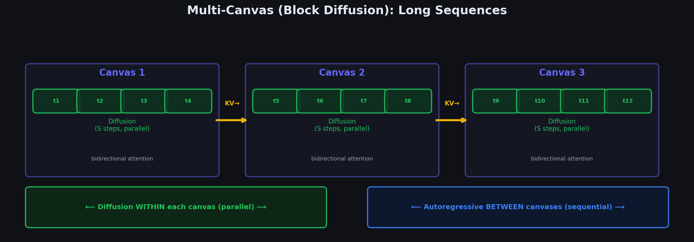

# Chapter 5.2: Multi-Canvas Sampling (Block Diffusion)

> *"Diffusion within, autoregression between — the best of both worlds."*



---

## 5.2.1 The Canvas Size Limit

DiffusionGemma's canvas is $L = 256$ tokens. Most responses are longer. How do you generate 1000+ tokens?

**Answer**: Generate multiple canvases **sequentially**, stitching them together like autoregressive blocks.

---

## 5.2.2 The Block Diffusion Algorithm

```
  ┌─────────────────────────────────────────────────────────────────────┐
  │                      MULTI-CANVAS GENERATION                        │
  │                                                                      │
  │  BLOCK 1 (Canvas 1):                                                │
  │  ┌──────────────────────────────────────────┐                       │
  │  │  Encoder: process query                   │                       │
  │  │  KV cache = encode("Write about cats")   │                       │
  │  │                                            │                       │
  │  │  Denoiser: S steps                         │                       │
  │  │  [rand...rand] → ... → [Roses are red,    │                       │
  │  │   violets are blue, cats are wonderful,]  │                       │
  │  └──────────────────────────────────────────┘                       │
  │                    │                                                  │
  │                    ▼ Append 256 tokens to context                    │
  │                                                                      │
  │  BLOCK 2 (Canvas 2):                                                │
  │  ┌──────────────────────────────────────────┐                       │
  │  │  Encoder: EXTEND KV cache                 │                       │
  │  │  KV cache += encode(block_1_tokens)       │                       │
  │  │                                            │                       │
  │  │  Denoiser: S steps                         │                       │
  │  │  [rand...rand] → ... → [and so are you.   │                       │
  │  │   They purr and play all day long,]        │                       │
  │  └──────────────────────────────────────────┘                       │
  │                    │                                                  │
  │                    ▼ Append 256 more tokens                          │
  │                                                                      │
  │  BLOCK 3 (Canvas 3):                                                │
  │  ┌──────────────────────────────────────────┐                       │
  │  │  Encoder: EXTEND KV cache again           │                       │
  │  │  KV cache += encode(block_2_tokens)       │                       │
  │  │                                            │                       │
  │  │  Denoiser: S steps                         │                       │
  │  │  [rand...rand] → ... → [chasing mice      │                       │
  │  │   with glee. <EOS>]                        │                       │
  │  └──────────────────────────────────────────┘                       │
  │                                                                      │
  │  STOP: <EOS> token detected                                         │
  └─────────────────────────────────────────────────────────────────────┘
```

---

## 5.2.3 KV-Cache Extension (The Key Efficiency)

When generating block $b+1$, we don't re-encode everything from scratch. We **extend** the existing KV cache.

### Mathematical View

Let $n$ be the original query length, and $L = 256$ the canvas size.

After block 1:

$$
\mathbf{K}_{\text{enc}}^{(\ell)} \in \mathbb{R}^{d_k \times n} \quad \longrightarrow \quad \mathbf{K}_{\text{enc}}^{(\ell)} \in \mathbb{R}^{d_k \times (n + L)}
$$

After block 2:

$$
\mathbf{K}_{\text{enc}}^{(\ell)} \in \mathbb{R}^{d_k \times (n + 2L)}
$$

After block $b$:

$$
\mathbf{K}_{\text{enc}}^{(\ell)} \in \mathbb{R}^{d_k \times (n + bL)}
$$

### Why Extension Works

The encoder uses **causal attention**. When we add new tokens (the completed block), the KV cache for existing tokens **doesn't change** — their keys and values only depend on tokens before them (which haven't changed).

```
  Original KV cache:     New KV cache entries:
  ┌──────────────────┐  ┌──────────────────┐
  │ K,V for "Write"  │  │ K,V for "Roses"  │  ← Only these need
  │ K,V for "a"      │  │ K,V for "are"    │     computing!
  │ K,V for "poem"   │  │ K,V for "red,"   │
  │ K,V for "about"  │  │ ...              │
  │ K,V for "cats"   │  │ K,V for "ful,"   │
  └──────────────────┘  └──────────────────┘
  ↑                      ↑
  Unchanged!             Only 256 new entries
  Don't recompute!       (one encoder pass)
```

---

## 5.2.3b KV Cache Extension: Mathematical Details

### Cache Concatenation Notation

Let $\ell$ denote a transformer layer, $b$ the block index (0-indexed), $n$ the original query length, and $L = 256$ the canvas size. The encoder KV cache at layer $\ell$ grows by **column concatenation** as each completed block is encoded:

$$
\mathbf{K}^{(\ell)}_{\text{enc},\,b} = \bigl[\,\mathbf{K}^{(\ell)}_{\text{enc},\,b-1} \;\|\; \mathbf{K}^{(\ell)}_{\text{block}_b}\,\bigr]
$$

where $\|$ denotes concatenation along the sequence (column) dimension. Similarly for values:

$$
\mathbf{V}^{(\ell)}_{\text{enc},\,b} = \bigl[\,\mathbf{V}^{(\ell)}_{\text{enc},\,b-1} \;\|\; \mathbf{V}^{(\ell)}_{\text{block}_b}\,\bigr]
$$

After block $b$ completes, the encoder cache has length $n + b \cdot L$:

| Block | Cache length | New entries computed |
|-------|-------------|---------------------|
| 0 (query only) | $n$ | $n$ |
| 1 | $n + L$ | $L$ |
| 2 | $n + 2L$ | $L$ |
| $b$ | $n + bL$ | $L$ |

Only the **new block's tokens** require a forward pass through the encoder; prior cache entries are reused unchanged (causal attention guarantees this).

### Denoiser Attention with Extended Cache

During denoising of block $b$, each canvas position attends to both the extended encoder cache and the canvas's own KV. At denoiser layer $\ell$:

$$
\mathbf{A}^{(\ell)} = \text{softmax}\!\left(\frac{\mathbf{Q}^{(\ell)} \cdot \bigl[\mathbf{K}^{(\ell)}_{\text{enc},\,b} \;\|\; \mathbf{K}^{(\ell)}_{\text{canvas}}\bigr]^{\!\top}}{\sqrt{d_k}}\right) \cdot \bigl[\mathbf{V}^{(\ell)}_{\text{enc},\,b} \;\|\; \mathbf{V}^{(\ell)}_{\text{canvas}}\bigr]
$$

### Dimension Analysis

| Tensor | Shape | Description |
|--------|-------|-------------|
| $\mathbf{Q}^{(\ell)}$ | $\mathbb{R}^{L \times d_k}$ | Queries from canvas positions |
| $\mathbf{K}^{(\ell)}_{\text{enc},\,b}$ | $\mathbb{R}^{(n + bL) \times d_k}$ | Keys from encoder (query + prior blocks) |
| $\mathbf{K}^{(\ell)}_{\text{canvas}}$ | $\mathbb{R}^{L \times d_k}$ | Keys from current canvas (bidirectional) |
| $\mathbf{V}^{(\ell)}_{\text{enc},\,b}$ | $\mathbb{R}^{(n + bL) \times d_k}$ | Values from encoder |
| $\mathbf{V}^{(\ell)}_{\text{canvas}}$ | $\mathbb{R}^{L \times d_k}$ | Values from current canvas |
| Attention weights | $\mathbb{R}^{L \times (n + bL + L)}$ | One row per canvas position |
| Output $\mathbf{A}^{(\ell)}$ | $\mathbb{R}^{L \times d_k}$ | Weighted value sum per position |

Each of the $L$ canvas positions attends over $n + bL + L$ total keys: the full encoder context plus all canvas positions.

### Complexity Analysis

**Per denoising step** at block $b$, layer $\ell$:

$$
\text{Cost}^{(\ell)}_b = O\!\left(L \cdot (n + bL + L) \cdot d_k\right)
$$

The query-key dot product is $L \times (n + bL + L)$, each costing $d_k$ multiply-adds. The value aggregation has the same order.

**Total attention cost** across $B$ blocks and $S$ denoising steps per block:

$$
\sum_{b=0}^{B-1} S \cdot L \cdot (n + bL + L) \cdot d_k = O\!\left(S \cdot B \cdot L \cdot n \cdot d_k + S \cdot B^2 \cdot L^2 \cdot d_k\right)
$$

The $B^2 L^2$ term arises because later blocks attend over longer encoder caches ($n + bL$ grows with $b$).

### Comparison: Block Diffusion vs. Autoregressive

| Approach | Forward passes | Attention per pass | Total attention |
|----------|---------------|-------------------|-----------------|
| **Autoregressive** | $N$ (one per token) | $O(N \cdot d_k)$ per pass, growing context | $O(N^2 \cdot d_k)$ |
| **Block diffusion** | $B \times S + B$ (denoise + encode) | $O(L \cdot (n + bL + L) \cdot d_k)$ per pass | $O(S \cdot B \cdot L \cdot n \cdot d_k + S \cdot B^2 \cdot L^2 \cdot d_k)$ |

Autoregressive generation requires $N$ sequential forward passes, each attending over an increasingly long prefix. Block diffusion batches $L$ tokens per pass and refines them jointly over $S$ steps, trading $N$ sequential passes for $B \times S$ parallel-ish passes.

### Numerical Example

Generate $N = 1024$ tokens with $L = 256$, $S = 16$ denoising steps, query length $n = 100$:

```
  Number of blocks:  B = ⌈1024 / 256⌉ = 4

  AUTOREGRESSIVE:
    Forward passes = N = 1024
    (one pass per token, each attending over growing context)

  BLOCK DIFFUSION:
    Denoiser passes = B × S = 4 × 16 = 64
    Encoder extension passes = B = 4   (one per completed block)
    Total forward passes = 64 + 4 = 68

  Speedup: 1024 / 68 ≈ 15× fewer forward passes
```

Per-block attention cost at denoising step (single layer):

| Block $b$ | Encoder cache length | Total keys $n + bL + L$ | Attention matrix size |
|------------|---------------------|--------------------------|----------------------|
| 0 | $100$ | $100 + 0 + 256 = 356$ | $256 \times 356$ |
| 1 | $356$ | $100 + 256 + 256 = 612$ | $256 \times 612$ |
| 2 | $612$ | $100 + 512 + 256 = 868$ | $256 \times 868$ |
| 3 | $868$ | $100 + 768 + 256 = 1124$ | $256 \times 1124$ |

Later blocks pay more per step (longer encoder context), but still process 256 tokens per pass rather than one — the net effect is a large win for long sequences.

---

## 5.2.4 The Hybrid Nature: Diffusion + Autoregression

```
  TIME →

  ┌─────────────────┐ ┌─────────────────┐ ┌─────────────────┐
  │    Canvas 1      │ │    Canvas 2      │ │    Canvas 3      │
  │                  │ │                  │ │                  │
  │  ┌──┐           │ │  ┌──┐           │ │  ┌──┐           │
  │  │S1│ all 256   │ │  │S1│ all 256   │ │  │S1│ all 256   │
  │  ├──┤ tokens    │ │  ├──┤ tokens    │ │  ├──┤ tokens    │
  │  │S2│ refined   │ │  │S2│ refined   │ │  │S2│ refined   │
  │  ├──┤ together  │ │  ├──┤ together  │ │  ├──┤ together  │
  │  │..│           │ │  │..│           │ │  │..│           │
  │  ├──┤           │ │  ├──┤           │ │  ├──┤           │
  │  │Sn│           │ │  │Sn│           │ │  │Sn│           │
  │  └──┘           │ │  └──┘           │ │  └──┘           │
  │ ← DIFFUSION →  │ │ ← DIFFUSION →  │ │ ← DIFFUSION →  │
  └────────┬────────┘ └────────┬────────┘ └────────┬────────┘
           │                   │                    │
           ▼                   ▼                    ▼
  Block 1 done ──────→ Block 2 done ──────→ Block 3 done
           ← AUTOREGRESSIVE (sequential between blocks) →
```

**Within each block**: Pure diffusion (all 256 tokens refined simultaneously)  
**Between blocks**: Autoregressive (each block depends on all previous blocks)

---

## 5.2.5 Complexity Analysis

For generating $N$ total tokens with canvas size $L$ and $S$ denoising steps:

| Approach | Forward Passes | Tokens per Pass |
|----------|---------------|----------------|
| Pure autoregressive | $N$ | 1 |
| Pure diffusion (if possible) | $S$ | $N$ |
| Block diffusion | $\lceil N/L \rceil \times S + \lceil N/L \rceil$ | $L$ |

For $N = 1024$, $L = 256$, $S = 16$:

| Approach | Forward Passes |
|----------|---------------|
| Autoregressive | **1024** |
| Block diffusion | $4 \times 16 + 4 =$ **68** |

**Speedup**: $1024 / 68 \approx 15\times$ fewer forward passes!

---

## 5.2.6 Stopping Criterion

Generation stops when the denoiser produces an **end-of-sequence** (EOS) token within a canvas. Tokens after the EOS are discarded:

```
  Canvas 3: [chasing mice with glee . <EOS> rand rand rand ... rand]
                                        ↑
                                   Generation stops here
                                   Everything after is discarded
```

---

**Next**: [03_scheduler.md](../../03_scheduler/03_scheduler/) — How DiffusionGemma controls the denoising process.
