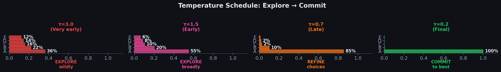
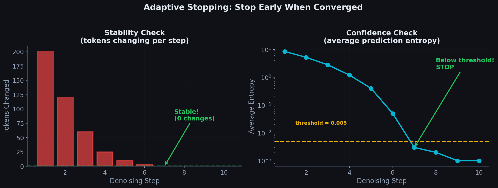

# Chapter 5.3: The Scheduler — Controlling the Denoising Process

> *"Not just how many steps, but how to step."*





---

## 5.3.1 Overview

The scheduler in DiffusionGemma is a collection of three mechanisms that control the denoising process:

```
┌──────────────────────────────────────────────────────────────┐
│                     THE SCHEDULER                             │
│                                                               │
│  ┌─────────────────┐                                         │
│  │  1. STEP COUNT   │  How many maximum denoising steps?     │
│  │     S_max        │  (e.g., 16, 32, 64)                    │
│  └─────────────────┘                                         │
│                                                               │
│  ┌─────────────────┐                                         │
│  │  2. LOGITS       │  How to sharpen/smooth predictions     │
│  │     SCHEDULER    │  at each step? (temperature control)   │
│  └─────────────────┘                                         │
│                                                               │
│  ┌─────────────────┐                                         │
│  │  3. ADAPTIVE     │  Can the model stop early if           │
│  │     STOPPING     │  it converges? (stability + confidence)│
│  └─────────────────┘                                         │
│                                                               │
└──────────────────────────────────────────────────────────────┘
```

---

## 5.3.2 Step Count

The step count $S$ defines the **maximum** number of denoising iterations. The tradeoff:

$$
\text{Quality} \propto S, \qquad \text{Speed} \propto \frac{1}{S}
$$

```
  S = 4  (fast, lower quality):
  [rand] → [rough] → [better] → [ok] → [done]
  
  S = 16 (balanced):
  [rand] → [.] → [.] → ... → [.] → [good] → [done]
  
  S = 64 (slow, high quality):
  [rand] → [.] → [.] → [.] → ... → [.] → [excellent] → [done]
```

---

## 5.3.3 The Logits Scheduler (Temperature Schedule)

### The Problem: Uncertain Logits

At each denoising step, the canvas contains noisy tokens. These noisy neighbors make the model's predictions **less confident** than they would be with a clean context:

```
  Clean context:    "The cat sat on the ___"
  Model prediction:  P("mat") = 0.85, P("floor") = 0.10, ...
  
  Noisy context:    "The xyz sat qr the ___"
  Model prediction:  P("mat") = 0.35, P("floor") = 0.20, P("dog") = 0.15, ...
                     Much less confident! Logits are "flat"
```

### Temperature Scaling

The logits scheduler divides the raw logits by a **temperature** $\tau_s$ at step $s$:

$$
\boxed{p_i^{(s)} = \text{softmax}\left(\frac{\text{logits}_i^{(s)}}{\tau_s}\right)}
$$

where:

$$
\tau_s = \tau_{\min} + (\tau_{\max} - \tau_{\min}) \cdot \frac{S - s}{S}
$$

The temperature **decreases** over steps (counts down):

```
  Step:           1      2      3      ...    S-1     S
  Temperature:   τ_max  ···    ···     ···    ···    τ_min
                 (high)                              (low)
                 
  τ (temperature)
  τ_max ─┤ ●
         │   ●
         │     ●
         │       ●
         │         ●●
         │           ●●
         │              ●●
         │                ●●●
  τ_min ─┤                   ●●●●●
         └──┬──┬──┬──┬──┬──┬──┬──┬──→ step s
            1  2  3  4  5  6  7  8
```

### Effect of Temperature on Distributions

$$
\text{softmax}\left(\frac{[3.0,\; 1.5,\; 0.5]}{\tau}\right) \text{ for different } \tau:
$$

| $\tau$ | P(token 1) | P(token 2) | P(token 3) | Effect |
|-----------|------------|------------|------------|--------|
| 2.0 | 0.47 | 0.29 | 0.24 | Flat (exploratory) |
| 1.0 | 0.67 | 0.24 | 0.09 | Balanced |
| 0.5 | 0.88 | 0.11 | 0.01 | Sharp (decisive) |
| 0.1 | ~1.0 | ~0.0 | ~0.0 | Near-argmax |

```
  HIGH TEMPERATURE (early steps):       LOW TEMPERATURE (late steps):
  
  P  │                                  P  │
  0.5┤  █                               1.0┤  █
     │  █  █                                │  █
  0.3┤  █  █  █                          0.5┤  █
     │  █  █  █  █                          │  █
  0.1┤  █  █  █  █  █                    0.0┤  █  ·  ·  ·  ·
     └──┴──┴──┴──┴──┴──                    └──┴──┴──┴──┴──┴──
       a  b  c  d  e                         a  b  c  d  e
  
  "I'm not sure, explore"              "I'm confident, commit"
```

### Why This Schedule Makes Sense

```
  Early Steps:                           Late Steps:
  ┌──────────────────────────┐          ┌──────────────────────────┐
  │ Canvas: mostly random     │         │ Canvas: mostly clean      │
  │ Context: unreliable       │         │ Context: reliable         │
  │ Model: uncertain          │         │ Model: confident          │
  │                            │         │                            │
  │ → High τ: EXPLORE         │         │ → Low τ: EXPLOIT          │
  │   Don't commit too early  │         │   Commit to best tokens   │
  │   Consider many options   │         │   Sharp predictions       │
  └──────────────────────────┘          └──────────────────────────┘
```

This is analogous to **exploration vs. exploitation** in reinforcement learning, or **simulated annealing** in optimization.

---

## 5.3.3b Temperature: Full Mathematical Derivation

### The Temperature-Scaled Softmax

Given raw logits $\mathbf{z} = [z_1, z_2, \ldots, z_K] \in \mathbb{R}^K$ at a single canvas position, the temperature-scaled softmax is:

$$
\boxed{p_i = \frac{\exp(z_i / \tau)}{\displaystyle\sum_{j=1}^{K} \exp(z_j / \tau)}}
$$

The temperature $\tau > 0$ acts as a **scaling factor on the inverse sharpness** of the distribution:

- $\tau$ large → logits compressed toward zero → distribution flattens (more exploration)
- $\tau$ small → logits amplified → distribution sharpens (more exploitation)

### Proof: Limiting Behavior

**Case 1: $\tau \to 0$ (approaches argmax / one-hot)**

Let $k^* = \arg\max_j z_j$. For any $i \neq k^*$, since $z_{k^*} > z_i$:

$$
\frac{z_i}{\tau} - \frac{z_{k^*}}{\tau} = \frac{z_i - z_{k^*}}{\tau} \xrightarrow{\tau \to 0} -\infty
$$

Therefore:

$$
\frac{\exp(z_i / \tau)}{\exp(z_{k^*} / \tau)} = \exp\!\left(\frac{z_i - z_{k^*}}{\tau}\right) \xrightarrow{\tau \to 0} 0 \quad \text{for } i \neq k^*
$$

So $p_i \to 0$ for $i \neq k^*$ and $p_{k^*} \to 1$. The distribution becomes a **one-hot vector** — deterministic argmax selection.

**Case 2: $\tau \to \infty$ (approaches uniform)**

As $\tau \to \infty$, $z_i / \tau \to 0$ for all $i$, so:

$$
\exp(z_i / \tau) \to \exp(0) = 1 \quad \text{for all } i
$$

Therefore:

$$
p_i \to \frac{1}{\sum_{j=1}^{K} 1} = \frac{1}{K}
$$

The distribution becomes **uniform** — every token is equally likely regardless of logits.

### Full Numerical Trace

Consider logits $\mathbf{z} = [3.0,\; 1.5,\; 0.5,\; -0.3,\; -1.0]$ over 5 tokens.

#### $\tau = 2.0$ (high — exploratory)

```
  z/τ = [1.50, 0.75, 0.25, -0.15, -0.50]

  exp(z/τ) = [4.482, 2.117, 1.284, 0.861, 0.607]

  sum = 4.482 + 2.117 + 1.284 + 0.861 + 0.607 = 9.351

  p = [4.482/9.351, 2.117/9.351, 1.284/9.351, 0.861/9.351, 0.607/9.351]
    = [0.479, 0.226, 0.137, 0.092, 0.065]
```

#### $\tau = 1.0$ (baseline — no scaling)

```
  z/τ = [3.0, 1.5, 0.5, -0.3, -1.0]

  exp(z) = [20.086, 4.482, 1.649, 0.741, 0.368]

  sum = 27.326

  p = [0.735, 0.164, 0.060, 0.027, 0.013]
```

#### $\tau = 0.5$ (low — decisive)

```
  z/τ = [6.0, 3.0, 1.0, -0.6, -2.0]

  exp(z/τ) = [403.43, 20.086, 2.718, 0.549, 0.135]

  sum = 426.92

  p = [0.945, 0.047, 0.006, 0.001, 0.0003]
```

#### $\tau = 0.1$ (very low — near-argmax)

```
  z/τ = [30.0, 15.0, 5.0, -3.0, -10.0]

  exp(z/τ) = [1.07×10¹³, 3.27×10⁶, 148.4, 0.050, 0.000045]

  sum ≈ 1.07×10¹³

  p ≈ [1.000, 0.000, 0.000, 0.000, 0.000]    ← effectively one-hot on token 1
```

### Summary Table

| $\tau$ | $p_1$ | $p_2$ | $p_3$ | $p_4$ | $p_5$ | Character |
|---------|---------|---------|---------|---------|---------|-----------|
| 2.0 | 0.479 | 0.226 | 0.137 | 0.092 | 0.065 | Flat, exploratory |
| 1.0 | 0.735 | 0.164 | 0.060 | 0.027 | 0.013 | Balanced |
| 0.5 | 0.945 | 0.047 | 0.006 | 0.001 | 0.0003 | Sharp |
| 0.1 | ~1.0 | ~0.0 | ~0.0 | ~0.0 | ~0.0 | Argmax |

### Entropy vs. Temperature

Shannon entropy $H(\mathbf{p}) = -\sum_i p_i \log_2 p_i$ measures distributional uncertainty:

```
  H(τ=2.0) = -(0.479·log₂0.479 + 0.226·log₂0.226 + 0.137·log₂0.137
              + 0.092·log₂0.092 + 0.065·log₂0.065)
           = -(0.479·(-1.062) + 0.226·(-2.146) + 0.137·(-2.867)
              + 0.092·(-3.443) + 0.065·(-3.944))
           = 2.10 bits

  H(τ=1.0) = 0.96 bits
  H(τ=0.5) = 0.34 bits
  H(τ=0.1) ≈ 0.00 bits
```

**Entropy decreases monotonically as $\tau$ decreases.** This is why the schedule starts hot (high $H$, explore many tokens) and ends cold (low $H$, commit to the best token).

| $\tau$ | $H(\mathbf{p})$ (bits) | Max possible ($\log_2 5$) |
|---------|--------------------------|-------------------------------|
| 2.0 | 2.10 | 2.32 |
| 1.0 | 0.96 | 2.32 |
| 0.5 | 0.34 | 2.32 |
| 0.1 | ≈ 0.00 | 2.32 |

### DiffusionGemma Temperature Schedule

The schedule linearly interpolates from hot to cold:

$$
\tau_s = \tau_{\min} + (\tau_{\max} - \tau_{\min}) \cdot \frac{S - s}{S}
$$

With $\tau_{\max} = 1.5$, $\tau_{\min} = 0.2$, $S = 16$:

| Step $s$ | $(S - s) / S$ | $\tau_s = 0.2 + 1.3 \times (S-s)/S$ | Phase |
|-----------|-----------------|---------------------------------------|-------|
| 1 | $15/16 = 0.9375$ | $0.2 + 1.3 \times 0.9375 =$ **1.419** | Hot — explore |
| 4 | $12/16 = 0.7500$ | $0.2 + 1.3 \times 0.7500 =$ **1.175** | Cooling |
| 8 | $8/16 = 0.5000$ | $0.2 + 1.3 \times 0.5000 =$ **0.850** | Mid-range |
| 12 | $4/16 = 0.2500$ | $0.2 + 1.3 \times 0.2500 =$ **0.525** | Sharpening |
| 16 | $0/16 = 0.0000$ | $0.2 + 1.3 \times 0.0000 =$ **0.200** | Cold — commit |

```
  τ
  1.5 ┤ ●
      │   ●
      │     ●
      │       ●
      │         ●
      │           ●
      │             ●
      │               ●
  0.2 ┤                 ●
      └──┬──┬──┬──┬──┬──┬──→ step s
         1  4  8  12 16
```

At step 1, $\tau = 1.419$ keeps distributions relatively flat — the model samples diverse candidates from a noisy canvas. At step 16, $\tau = 0.2$ amplifies the best logit by $5\times$, producing near-deterministic predictions for final commitment.

---

## 5.3.4 Multinomial Sampling

After temperature scaling, tokens are **not** selected by argmax. Instead, they are sampled from the resulting multinomial distribution:

$$
\hat{x}_0^i \sim \text{Categorical}\left(\text{softmax}\left(\frac{\text{logits}_i^{(s)}}{\tau_s}\right)\right)
$$

This introduces beneficial **stochasticity**:
- Prevents the model from always picking the same token
- Allows exploration of multiple valid completions
- Combined with temperature, provides fine-grained control over diversity

---

## 5.3.5 Adaptive Stopping

Even with a maximum of $S$ steps, the model may converge early. **Adaptive stopping** checks two conditions at each step:

### Condition 1: Stability

Are the predicted tokens **the same** as in the previous step?

$$
\text{stability}^{(s)} = \frac{1}{L}\sum_{i=1}^{L} \mathbb{1}\left[\hat{x}_0^{i,(s)} = \hat{x}_0^{i,(s-1)}\right]
$$

If stability = 1.0 for $N_{\text{stable}}$ consecutive steps, the canvas has converged.

In DiffusionGemma: $N_{\text{stable}} = 1$ (stop after just 1 step where all tokens are the same).

### Condition 2: Confidence (Low Entropy)

Is the model **confident** about its predictions? Measured by entropy:

$$
\mathcal{H}_i^{(s)} = -\sum_{k=1}^{K} p_i^{(s)}[k] \log p_i^{(s)}[k]
$$

Average entropy across all canvas positions:

$$
\bar{\mathcal{H}}^{(s)} = \frac{1}{L} \sum_{i=1}^{L} \mathcal{H}_i^{(s)}
$$

**Stop when**: $\bar{\mathcal{H}}^{(s)} < \epsilon_{\text{conf}}$

In DiffusionGemma: $\epsilon_{\text{conf}} = 0.005$

### Combined Stopping Criterion

$$
\boxed{\text{STOP if } \left(\text{stability}^{(s)} = 1.0 \text{ for } N_{\text{stable}} \text{ steps}\right) \;\textbf{AND}\; \left(\bar{\mathcal{H}}^{(s)} < \epsilon_{\text{conf}}\right)}
$$

```
  Step   Stability   Avg Entropy    Action
  ────   ─────────   ───────────    ──────
    1      0.10        4.200        Continue
    2      0.35        3.100        Continue
    3      0.62        1.800        Continue
    4      0.78        0.900        Continue
    5      0.91        0.200        Continue
    6      0.97        0.050        Continue
    7      1.00        0.003        STOP! ← Both conditions met
    8      (skipped)
    ...
   16      (skipped)
   
   Saved 9 steps! (58% fewer steps)
```

---

## 5.3.6 Summary: Scheduler Components

```
  ┌──────────────────────────────────────────────────────────────┐
  │                    SCHEDULER PIPELINE                         │
  │                                                               │
  │  For each denoising step s = 1, ..., S_max:                  │
  │                                                               │
  │  1. Compute raw logits from the model                        │
  │                                                               │
  │  2. Apply temperature:                                        │
  │     logits ← logits / τ_s                                    │
  │     where τ_s decreases from τ_max to τ_min                  │
  │                                                               │
  │  3. Sample tokens via multinomial:                            │
  │     x̂₀ⁱ ~ Cat(softmax(logits_i / τ_s))                     │
  │                                                               │
  │  4. Check adaptive stopping:                                  │
  │     IF (tokens unchanged for N_stable steps)                  │
  │        AND (avg entropy < ε_conf):                            │
  │        → STOP early                                           │
  │     ELSE:                                                     │
  │        → continue to next step                                │
  │                                                               │
  └──────────────────────────────────────────────────────────────┘
```

---

**Next**: [04_entropy_bounded_sampler.md](../../04_entropy_bounded_sampler/04_entropy_bounded_sampler/) — The accept/reject mechanism for tokens.
