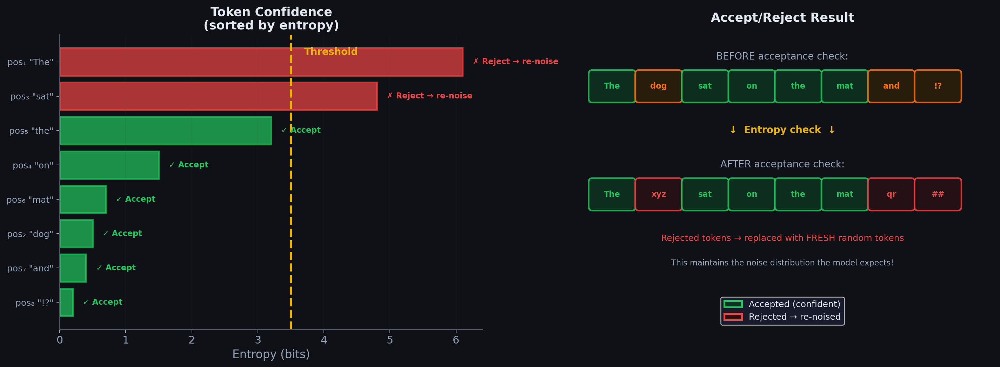

# Chapter 7: End-to-End Walkthrough — Every Step, Every Component, Connected

> *"Let's trace through the COMPLETE pipeline with a small example, showing exactly where each component fits."*





---

## 7.1 Setup

```
  QUERY:      "Tell me a joke"
  CANVAS:     8 tokens (small for clarity; real model uses 256)
  MAX STEPS:  S = 5
  VOCAB SIZE: K = 10 (tiny for illustration; real model uses 256,000)
  
  Our vocabulary: {0:"the", 1:"why", 2:"did", 3:"chicken",
                    4:"cross", 5:"road", 6:"a", 7:"to", 8:"get", 9:"other"}
```

---

## 7.2 Phase 1: Encoder Mode

### What Happens

The encoder processes "Tell me a joke" using Gemma 4 with **causal attention**.

```
  INPUT: "Tell" "me" "a" "joke"
  
  ┌────────────────────────────────────────────────────────┐
  │  ENCODER: Gemma 4 (Causal Attention)                    │
  │                                                          │
  │  Token:   "Tell"   "me"    "a"     "joke"               │
  │  Sees:    [Tell]  [Tell,  [Tell,  [Tell, me,            │
  │                    me]     me, a]  a, joke]              │
  │                                                          │
  │  Layer 1: Process with causal attention                  │
  │           Store K₁,V₁ for each of the 4 tokens          │
  │                                                          │
  │  Layer 2: Process with causal attention                  │
  │           Store K₂,V₂ for each of the 4 tokens          │
  │                                                          │
  │  ...                                                     │
  │                                                          │
  │  Layer L: Process with causal attention                  │
  │           Store K_L,V_L for each of the 4 tokens         │
  │                                                          │
  └────────────────────────────┬───────────────────────────┘
                               │
                               ▼
                    ┌─────────────────────┐
                    │   KV CACHE          │
                    │   4 positions ×     │
                    │   L layers ×        │
                    │   (K + V) vectors   │
                    │                     │
                    │   Ready to share    │
                    │   with denoiser!    │
                    └─────────────────────┘
```

**The encoder runs ONCE and never runs again** (for this canvas block).

---

## 7.3 Phase 2: Canvas Initialization

```
  Draw 8 tokens uniformly at random from vocabulary:
  
  Position:  1    2    3    4    5    6    7    8
  Token ID:  6    3    0    9    2    5    1    4
  Token:    "a" "chicken" "the" "other" "did" "road" "why" "cross"
  
  Canvas₀ = ["a", "chicken", "the", "other", "did", "road", "why", "cross"]
  
  (These are random! By coincidence some look meaningful,
   but they're just noise at this point.)
```

---

## 7.4 Phase 3: Denoising Loop

### STEP 1 of 5

```
══════════════════════════════════════════════════════════════════
  DENOISING STEP 1                    Temperature τ₁ = 1.4 (high)
══════════════════════════════════════════════════════════════════
```

**Stage 1: Prepare Input**

```
  Token embeddings:  e₁=Embed("a"), e₂=Embed("chicken"), ...
  Self-conditioning: c_i = 0 for all i  (first step — no memory)
  Timestep embedding: emb(t=1) added to all
  
  Input: [ê₁, ê₂, ê₃, ê₄, ê₅, ê₆, ê₇, ê₈]
```

**Stage 2: Forward Pass**

```
  Gemma 4 (bidirectional) processes all 8 canvas tokens
  PLUS attends to the encoder KV cache (4 positions)
  
  At each layer:
  - Canvas tokens compute Q (8 queries)
  - Keys = [encoder_K (4) | canvas_K (8)] = 12 total
  - Values = [encoder_V (4) | canvas_V (8)] = 12 total
  - Each canvas token attends to all 12 positions
  
  Output: logits at each of 8 positions (logits ∈ ℝ^10 each)
```

**Stage 3: Temperature Scaling**

```
  τ₁ = 1.4 (high — exploratory, don't commit yet)
  
  Raw logits at position 1:     [0.5, 2.1, 1.3, 0.8, 0.2, 0.4, 0.6, 0.1, 0.3, 0.7]
  Scaled logits (÷ 1.4):        [0.36, 1.50, 0.93, 0.57, 0.14, 0.29, 0.43, 0.07, 0.21, 0.50]
  After softmax:                 [0.07, 0.21, 0.12, 0.08, 0.05, 0.06, 0.07, 0.05, 0.06, 0.08]
                                       ↑                              
                                  "why" has 21% — highest but not dominant (high τ → flat)
```

```
  Probabilities after temperature scaling for ALL positions:
  
  Pos 1: p₁ = [..., P("why")=0.21, ...]        H₁ = 3.1 bits
  Pos 2: p₂ = [..., P("did")=0.18, ...]        H₂ = 3.3 bits
  Pos 3: p₃ = [..., P("the")=0.25, ...]        H₃ = 2.8 bits
  Pos 4: p₄ = [..., P("chicken")=0.30, ...]    H₄ = 2.5 bits
  Pos 5: p₅ = [..., P("cross")=0.15, ...]      H₅ = 3.4 bits
  Pos 6: p₆ = [..., P("the")=0.20, ...]        H₆ = 3.2 bits
  Pos 7: p₇ = [..., P("road")=0.12, ...]       H₇ = 3.5 bits  ← very uncertain
  Pos 8: p₈ = [..., P("other")=0.10, ...]      H₈ = 3.5 bits  ← very uncertain
```

**Stage 4: Sample Candidates**

```
  Pos 1: sample → "why"     (drew the 21% option)
  Pos 2: sample → "did"     (drew the 18% option)
  Pos 3: sample → "the"     (drew the 25% option)
  Pos 4: sample → "chicken" (drew the 30% option)
  Pos 5: sample → "cross"   (drew the 15% option)
  Pos 6: sample → "a"       (drew a 12% option — NOT the most likely!)
  Pos 7: sample → "road"    (drew the 12% option)
  Pos 8: sample → "get"     (drew a 10% option)
```

**Stage 5: Accept/Reject**

```
  Sort by entropy (most confident first):
  Pos 4 (H=2.5) → Pos 3 (H=2.8) → Pos 1 (H=3.1) → Pos 6 (H=3.2) → ...
  
  With our budget, only the first 4 pass:
  
  ACCEPTED: pos 4 ("chicken"), pos 3 ("the"), pos 1 ("why"), pos 6 ("a")
  REJECTED: pos 2, pos 5, pos 7, pos 8
```

**Stage 6: Re-noise + Stage 7: Self-conditioning**

```
  Canvas after step 1:
  ┌──────┬──────┬──────┬─────────┬──────┬──────┬──────┬──────┐
  │"why" │ rand │"the" │"chicken"│ rand │ "a"  │ rand │ rand │
  │  ✓   │  ✗   │  ✓   │   ✓     │  ✗   │  ✓   │  ✗   │  ✗   │
  └──────┴──────┴──────┴─────────┴──────┴──────┴──────┴──────┘
  
  Self-conditioning saved: c₁...c₈ (from this step's probabilities)
  c₁ encodes: "I think pos 1 is 'why' (21%)"
  c₄ encodes: "I think pos 4 is 'chicken' (30%)"
  c₇ encodes: "I think pos 7 is 'road' (12%) — not sure though"
```

**Stage 8: Adaptive Stopping** → NO (too early, too uncertain)

---

### STEP 2 of 5

```
══════════════════════════════════════════════════════════════════
  DENOISING STEP 2                    Temperature τ₂ = 1.12 (lower)
══════════════════════════════════════════════════════════════════
```

**Stage 1: Prepare Input**

```
  Canvas:         ["why", rand, "the", "chicken", rand, "a", rand, rand]
  
  Now WITH self-conditioning from step 1:
  ê_i = Embed(canvas_token_i) + c_i^(step 1)
  
  Position 2 (a random token):
  - Token embedding = Embed(rand) → some arbitrary vector
  - Self-cond c₂ = "step 1 thought this was 'did' (18%)"
  - Combined input carries BOTH pieces of information
  
  Position 7 (a random token):
  - Token embedding = Embed(rand) → some arbitrary vector
  - Self-cond c₇ = "step 1 thought this was 'road' (12%)"
  - Weak signal but still informative
```

**Stage 2: Forward Pass**

```
  Now the model has MUCH better context:
  
  Canvas: ["why", rand, "the", "chicken", rand, "a", rand, rand]
  
  Position 2 ("rand") with bidirectional attention sees:
  - Encoder KV: "Tell me a joke" ← context: user wants a joke
  - Canvas pos 1: "why" ← the joke might start with "why"
  - Canvas pos 3: "the" 
  - Canvas pos 4: "chicken" ← "why ... the chicken" → joke pattern!
  - Self-cond: "last step I predicted 'did' here"
  
  → Much more confident: "why [???] the chicken" → "did"!
```

**Stages 3–7: Temperature, Sample, Accept/Reject**

```
  τ₂ = 1.12 (lower temperature → sharper probabilities)
  
  Probabilities (MUCH more confident now):
  Pos 1: P("why")=0.70       H₁ = 1.2    ← very confident
  Pos 2: P("did")=0.55       H₂ = 1.8    ← moderately confident  
  Pos 3: P("the")=0.75       H₃ = 1.0    ← very confident
  Pos 4: P("chicken")=0.80   H₄ = 0.8    ← very confident
  Pos 5: P("cross")=0.40     H₅ = 2.2    ← moderate
  Pos 6: P("the")=0.50       H₆ = 1.9    ← moderate (changed from "a"!)
  Pos 7: P("road")=0.30      H₇ = 2.8    ← still uncertain
  Pos 8: P("other")=0.15     H₈ = 3.1    ← uncertain
  
  ACCEPTED: pos 1,2,3,4,5,6  (first 6 in sorted order)
  REJECTED: pos 7, pos 8
  
  Canvas after step 2:
  ┌──────┬──────┬──────┬─────────┬───────┬──────┬──────┬──────┐
  │"why" │"did" │"the" │"chicken"│"cross"│"the" │ rand │ rand │
  │  ✓   │  ✓   │  ✓   │   ✓     │  ✓    │  ✓   │  ✗   │  ✗   │
  └──────┴──────┴──────┴─────────┴───────┴──────┴──────┴──────┘
  
  Note: pos 6 changed from "a" to "the"! ← SELF-CORRECTION in action
  The model realized "cross the road" is better than "cross a road"
```

---

### STEP 3 of 5

```
══════════════════════════════════════════════════════════════════
  DENOISING STEP 3                    Temperature τ₃ = 0.84
══════════════════════════════════════════════════════════════════

  Canvas: ["why", "did", "the", "chicken", "cross", "the", rand, rand]
  
  Now the model sees: "why did the chicken cross the ??? ???"
  
  With self-conditioning: c₇ remembers "step 2 thought 'road' (30%)"
  
  Probabilities (very confident for most positions):
  Pos 1: P("why")=0.92       H₁ = 0.4
  Pos 2: P("did")=0.88       H₂ = 0.5
  Pos 3: P("the")=0.95       H₃ = 0.3
  Pos 4: P("chicken")=0.93   H₄ = 0.3
  Pos 5: P("cross")=0.85     H₅ = 0.6
  Pos 6: P("the")=0.90       H₆ = 0.5
  Pos 7: P("road")=0.75      H₇ = 1.0    ← NOW confident! Context helps
  Pos 8: P("?")=0.20         H₈ = 3.0    ← still uncertain
  
  ACCEPTED: pos 1,2,3,4,5,6,7  (all confident enough)
  REJECTED: pos 8
  
  Canvas after step 3:
  ┌──────┬──────┬──────┬─────────┬───────┬──────┬──────┬──────┐
  │"why" │"did" │"the" │"chicken"│"cross"│"the" │"road"│ rand │
  │  ✓   │  ✓   │  ✓   │   ✓     │  ✓    │  ✓   │  ✓   │  ✗   │
  └──────┴──────┴──────┴─────────┴───────┴──────┴──────┴──────┘
```

---

### STEP 4 of 5

```
══════════════════════════════════════════════════════════════════
  DENOISING STEP 4                    Temperature τ₄ = 0.56
══════════════════════════════════════════════════════════════════

  Canvas: ["why", "did", "the", "chicken", "cross", "the", "road", rand]
  
  Almost done! Model sees: "why did the chicken cross the road ???"
  
  Probabilities:
  Pos 1-7: All > 0.90 with H < 0.5  ← locked in
  Pos 8: P("?")=0.50, P("!")=0.30   H₈ = 1.5  ← now much more confident
  
  Sample pos 8 → "?" (drew the 50% option)
  
  ALL ACCEPTED!
  
  Canvas after step 4:
  ┌──────┬──────┬──────┬─────────┬───────┬──────┬──────┬──────┐
  │"why" │"did" │"the" │"chicken"│"cross"│"the" │"road"│ "?"  │
  │  ✓   │  ✓   │  ✓   │   ✓     │  ✓    │  ✓   │  ✓   │  ✓   │
  └──────┴──────┴──────┴─────────┴───────┴──────┴──────┴──────┘
```

---

### STEP 5 of 5 → ADAPTIVE STOPPING!

```
══════════════════════════════════════════════════════════════════
  DENOISING STEP 5                    Temperature τ₅ = 0.30
══════════════════════════════════════════════════════════════════

  Canvas: ["why", "did", "the", "chicken", "cross", "the", "road", "?"]
  
  Model produces predictions...
  ALL positions predict the SAME token as step 4.
  ALL positions have entropy < 0.005.
  
  STABILITY CHECK: 8/8 positions unchanged → stability = 1.0 ✓
  CONFIDENCE CHECK: avg(H) = 0.003 < 0.005 ✓
  
  ╔═══════════════════════════════════════╗
  ║  ADAPTIVE STOPPING TRIGGERED!         ║
  ║  Canvas has converged after 5 steps.  ║
  ╚═══════════════════════════════════════╝
```

---

## 7.5 Phase 4: Output Assembly

```
  Final canvas: ["why", "did", "the", "chicken", "cross", "the", "road", "?"]
  
  Detokenize: "Why did the chicken cross the road?"
  
  ┌─────────────────────────────────────────┐
  │  STATISTICS:                             │
  │                                          │
  │  Encoder forward passes:  1              │
  │  Denoiser forward passes: 5              │
  │  Total forward passes:    6              │
  │                                          │
  │  Autoregressive would need: 8 passes     │
  │  Savings: 25% fewer passes               │
  │  (With L=256: savings are 80-95%!)       │
  └─────────────────────────────────────────┘
```

---

## 7.6 Tracing How Each Component Contributed

```
  ┌──────────────────────────────────────────────────────────────────┐
  │                  COMPONENT CONTRIBUTION MAP                       │
  │                                                                   │
  │  ENCODER (Ch 4.2):                                               │
  │  └─ Processed "Tell me a joke" → KV cache                       │
  │     └─ The denoiser knew to generate a JOKE, not random text    │
  │                                                                   │
  │  BIDIRECTIONAL ATTENTION (Ch 4.3):                               │
  │  └─ At step 1, pos 2 could see "chicken" at pos 4               │
  │     └─ This helped predict "did" (joke setup pattern)            │
  │     └─ With causal attention, pos 2 couldn't see pos 4!         │
  │                                                                   │
  │  KV CACHE SHARING (Ch 4.4):                                     │
  │  └─ Encoder KV computed ONCE, reused in all 5 denoiser steps    │
  │     └─ Saved 4 encoder forward passes                            │
  │                                                                   │
  │  SELF-CONDITIONING (Ch 5.1):                                     │
  │  └─ Step 2: c₂ told model "step 1 predicted 'did' (18%)"       │
  │     └─ Model boosted confidence: "did" went from 18% → 55%     │
  │  └─ Step 3: c₇ told model "step 2 predicted 'road' (30%)"      │
  │     └─ Combined with "cross the" context → "road" at 75%       │
  │                                                                   │
  │  TEMPERATURE SCHEDULE (Ch 5.3):                                  │
  │  └─ Step 1 (τ=1.4): Flat distributions → explored options       │
  │     └─ Didn't commit to wrong tokens prematurely                 │
  │  └─ Step 4 (τ=0.56): Sharp distributions → committed to best   │
  │     └─ Final tokens chosen decisively                            │
  │                                                                   │
  │  ENTROPY-BOUNDED SAMPLER (Ch 5.4):                               │
  │  └─ Step 1: Only accepted 4 of 8 (rejected uncertain ones)      │
  │     └─ Prevented bad tokens from polluting the canvas            │
  │  └─ Step 3: Accepted 7 of 8 (most positions now confident)      │
  │     └─ Let the canvas converge                                   │
  │                                                                   │
  │  RE-NOISING (Ch 5.4):                                           │
  │  └─ Rejected tokens replaced with fresh random tokens            │
  │     └─ Kept canvas distribution close to training distribution   │
  │                                                                   │
  │  SELF-CORRECTION (Ch 3.3):                                       │
  │  └─ Step 2: pos 6 changed from "a" → "the"                     │
  │     └─ "cross the road" better than "cross a road"               │
  │     └─ This is IMPOSSIBLE in autoregressive or masked diffusion  │
  │                                                                   │
  │  ADAPTIVE STOPPING (Ch 5.3):                                    │
  │  └─ Stopped at step 5 (could have gone to max S)                │
  │     └─ Saved unnecessary computation                             │
  │                                                                   │
  └──────────────────────────────────────────────────────────────────┘
```

---

## 7.7 Multi-Canvas: If the Output Were Longer

If the response needed more than 8 tokens (256 in real model):

```
  BLOCK 1: Canvas of 8 tokens
  ┌─────────────────────────────────────────────────────┐
  │ Encoder: KV cache from "Tell me a joke" (4 pos)     │
  │ Denoiser: 5 steps → "Why did the chicken cross..."  │
  └─────────────────────────────┬───────────────────────┘
                                │
                                ▼ These 8 tokens get added to encoder KV
  
  BLOCK 2: New canvas of 8 tokens
  ┌─────────────────────────────────────────────────────┐
  │ Encoder: EXTEND KV cache by running encoder on the  │
  │          8 tokens from block 1 (total: 4+8=12 pos)  │
  │ Denoiser: 6 steps → "the road? To get to the..."   │
  └─────────────────────────────┬───────────────────────┘
                                │
                                ▼
  BLOCK 3: New canvas of 8 tokens
  ┌─────────────────────────────────────────────────────┐
  │ Encoder: EXTEND KV cache (total: 4+8+8=20 pos)     │
  │ Denoiser: 4 steps → "other side! <EOS> ..."        │
  │                                        ↑             │
  │                               Stop here!             │
  └─────────────────────────────────────────────────────┘
  
  Final output: "Why did the chicken cross the road? 
                 To get to the other side!"
  
  Total forward passes: 1 + 5 + 1 + 6 + 1 + 4 = 18
  Autoregressive: 24 tokens → 24 forward passes
```

---

## 7.8 Key Equations Summary

```
┌────────────────────────────────────────────────────────────────────┐
│                 ALL EQUATIONS IN ONE PLACE                          │
├────────────────────────────────────────────────────────────────────┤
│                                                                     │
│  FORWARD NOISE (what corruption looks like):                       │
│  q(x_t=j | x₀=k) = ᾱ_t·δ_{jk} + (1-ᾱ_t)/K                     │
│                                                                     │
│  DENOISER OUTPUT (what the model predicts):                        │
│  p_θ(x₀ⁱ=k | x_t) = softmax(W_head · h_i^L)[k]                 │
│                                                                     │
│  TEMPERATURE (sharpen/soften):                                     │
│  p_i = softmax(logits_i / τ_s)                                    │
│  τ_s = τ_min + (τ_max - τ_min) · (S-s)/S                         │
│                                                                     │
│  SELF-CONDITIONING:                                                │
│  ẽ_i = p_i^T · E              (soft embedding)                    │
│  c_i = FFNN(ẽ_i)              (conditioning vector)               │
│  input_i = Embed(token_i) + c_i  (modified input)                 │
│                                                                     │
│  ATTENTION (denoiser):                                             │
│  K_full = [K_encoder | K_canvas]                                   │
│  V_full = [V_encoder | V_canvas]                                   │
│  Attn = softmax(Q_canvas · K_full^T / √d_k) · V_full              │
│                                                                     │
│  ENTROPY:                                                          │
│  H_i = -Σ_k p_i[k] · log₂(p_i[k])                                │
│                                                                     │
│  ACCEPTANCE:                                                       │
│  Accept π_j if: Σ_{m=1}^{j} (H_{π_m} - H_max) ≤ B               │
│                                                                     │
│  STOPPING:                                                         │
│  Stop if: (all tokens same as last step) AND (avg H < 0.005)      │
│                                                                     │
│  TRAINING LOSS:                                                    │
│  L = E_{t,x_t}[w(t) · Σ_i -log p_θ(x₀ⁱ | x_t)]                 │
│                                                                     │
└────────────────────────────────────────────────────────────────────┘
```

---

## 7.9 The Big Picture: Everything Connected

```
╔══════════════════════════════════════════════════════════════════════╗
║                   DIFFUSIONGEMMA: THE COMPLETE PICTURE               ║
╠══════════════════════════════════════════════════════════════════════╣
║                                                                      ║
║  ┌─────────────┐                                                    ║
║  │ User Query   │                                                    ║
║  │ "Tell me     │                                                    ║
║  │  a joke"     │                                                    ║
║  └──────┬───────┘                                                    ║
║         │                                                            ║
║         ▼                                                            ║
║  ┌──────────────────┐    ┌──────────────┐                           ║
║  │ TOKENIZER         │───▶│ Token IDs     │                          ║
║  └──────────────────┘    └──────┬───────┘                           ║
║                                  │                                    ║
║         ┌────────────────────────┘                                    ║
║         │                                                            ║
║         ▼                                                            ║
║  ╔══════════════════════════════════╗                                ║
║  ║ ENCODER MODE (Gemma 4, causal)   ║                                ║
║  ║ → Process query                   ║                                ║
║  ║ → Store KV cache ─────────────────║──┐                            ║
║  ╚══════════════════════════════════╝  │                             ║
║                                         │ KV Cache                   ║
║  ┌──────────────────────────────────┐  │ (fixed)                    ║
║  │ CANVAS: 256 random tokens        │  │                             ║
║  └──────────────┬───────────────────┘  │                             ║
║                  │                      │                             ║
║         ┌────────▼──────────────────────▼────────────────────┐       ║
║         │                                                     │       ║
║         │  ╔═══════════════════════════════════════════════╗  │       ║
║         │  ║           DENOISING LOOP                       ║  │       ║
║         │  ║                                                 ║  │       ║
║         │  ║  [Self-Cond] → [Forward Pass] → [Temp Scale]  ║  │       ║
║         │  ║       ↑              │                │         ║  │       ║
║         │  ║       │              │                ▼         ║  │       ║
║         │  ║  [Save probs]        │         [Sample tokens]  ║  │       ║
║         │  ║       ↑              │                │         ║  │       ║
║         │  ║       │              │                ▼         ║  │       ║
║         │  ║  [Canvas update] ◀── │ ◀───── [Accept/Reject]  ║  │       ║
║         │  ║       │              │                │         ║  │       ║
║         │  ║       │              │                ▼         ║  │       ║
║         │  ║       │              │         [Re-noise]       ║  │       ║
║         │  ║       │              │                │         ║  │       ║
║         │  ║       │              │                ▼         ║  │       ║
║         │  ║       └──────────────┘         [Stop check]     ║  │       ║
║         │  ║                                     │           ║  │       ║
║         │  ║                              YES: stop  NO: loop║  │       ║
║         │  ║                                                 ║  │       ║
║         │  ╚═══════════════════════════════════════════════╝  │       ║
║         │                                                     │       ║
║         └────────────────────┬────────────────────────────────┘       ║
║                              │                                        ║
║                              ▼                                        ║
║         ┌──────────────────────────────────────────────────┐         ║
║         │  IF <EOS> found: OUTPUT final text                │         ║
║         │  ELSE: extend KV cache, new canvas → next block  │         ║
║         └──────────────────────────────────────────────────┘         ║
║                                                                      ║
║  OUTPUT: "Why did the chicken cross the road?"                       ║
║                                                                      ║
╚══════════════════════════════════════════════════════════════════════╝
```

---

## Complete 3-Step Numerical Trace

This section is a **self-contained, end-to-end numerical walkthrough** with a compact 6-token canvas. Every equation is evaluated with concrete numbers. Read this section alone to understand the full inference pipeline.

### Global Setup

```
  QUERY:       "Tell me a joke"
  CANVAS SIZE: L = 6 positions
  VOCAB:       K = 12 (toy vocabulary for traceability)

  Token map:
    0="the"   1="why"   2="did"   3="chicken"   4="cross"   5="road"
    6="xyz"   7="##"    8="qr"    9="!!"       10="zz"    11="aa"
    (Capitalization handled at detokenization; "Why" = token 1)

  Hyperparameters:
    S = 3 denoising steps (we will stop early via adaptive stopping)
    τ schedule:  step 1 → 1.5,  step 2 → 0.8,  step 3 → 0.3
    Entropy budget: B = -4.2
    H_max = log₂(12) ≈ 3.585 bits
    Stopping threshold: avg(H) < 0.005
```

---

### Step 0: Initialization

**Encoder (runs once):**

```
  Input:  ["Tell", "me", "a", "joke"]   (4 tokens, causal attention)

  Output: KV cache = {K_ℓ, V_ℓ} for ℓ = 1,…,L_layers, 4 positions
          Fixed for all denoising steps — never recomputed.
```

**Canvas initialization:**

```
  Draw 6 tokens i.i.d. from Uniform{0,…,11}:

    Position:   0      1      2      3      4      5
    Token ID:   6      7      8      9     10     11
    Token:     "xyz"  "##"   "qr"   "!!"   "zz"   "aa"

  Canvas₀ = ["xyz", "##", "qr", "!!", "zz", "aa"]
```

The canvas is **pure noise** — no relationship to the query yet. The encoder KV cache is the only semantic signal.

---

### Step 1: High Temperature (τ = 1.5, t = 0.95)

#### 1a. Prepare Input

**Self-conditioning:** First step — no previous predictions:

$$
c_i = \mathbf{0} \quad \forall i \in \{1,\ldots,6\}
$$

**Token + timestep embedding:**

$$
\hat{e}_i = \text{Embed}(x_t^i) + \text{emb}(t=0.95) + c_i
$$

```
  emb(0.95) ≈ [+0.31, -0.18, +0.25, +0.09, …]   ← "heavy noise" vector (same for all i)

  Position 0:  Embed("xyz") + emb(0.95) + 0  →  ê₀
  Position 1:  Embed("##")  + emb(0.95) + 0  →  ê₁
  … (all 6 positions)
```

#### 1b. Forward Pass → Raw Logits

Bidirectional denoiser attends to encoder KV (4 pos) + canvas (6 pos) = 12 keys/values.

**Raw logits** (only top 3 shown per position; remaining 9 tokens share the leftover mass):

| Pos | Canvas token | Top-3 logits (token: logit) | Interpretation |
|-----|-------------|----------------------------|----------------|
| 0 | xyz | why: 2.1, the: 1.4, did: 0.8 | Joke opener |
| 1 | ## | did: 1.6, the: 1.2, cross: 0.5 | Connector word |
| 2 | qr | the: 2.4, why: 0.9, did: 0.6 | Article |
| 3 | !! | chicken: 2.8, the: 1.0, cross: 0.4 | Punchline noun |
| 4 | zz | cross: 1.5, did: 1.3, the: 0.9 | Verb |
| 5 | aa | road: 2.0, the: 1.1, cross: 0.7 | Punchline ending |

#### 1c. Temperature Scaling (τ₁ = 1.5)

$$
p_i = \text{softmax}\!\left(\frac{\text{logits}_i}{1.5}\right)
$$

| Pos | Scaled top-3 probabilities | Sampled token |
|-----|---------------------------|---------------|
| 0 | P(why)=0.28, P(the)=0.18, P(did)=0.12 | **why** |
| 1 | P(did)=0.22, P(the)=0.17, P(cross)=0.10 | **the** (not top-1 — stochastic sample) |
| 2 | P(the)=0.31, P(why)=0.14, P(did)=0.11 | **the** |
| 3 | P(chicken)=0.35, P(the)=0.13, P(cross)=0.08 | **chicken** |
| 4 | P(cross)=0.19, P(did)=0.17, P(the)=0.14 | **did** (not top-1) |
| 5 | P(road)=0.26, P(the)=0.16, P(cross)=0.11 | **road** |

High τ flattens distributions → exploration, not commitment.

#### 1d. Entropy at Each Position

$$
H_i = -\sum_{k=0}^{11} p_i[k] \cdot \log_2 p_i[k]
$$

| Pos | Sampled | $H_i$ (bits) | $H_i - H_{\max}$ |
|-----|---------|------------------|----------------------|
| 3 | chicken | **2.10** | **-1.485** |
| 2 | the | 2.45 | -1.135 |
| 0 | why | 2.62 | -0.965 |
| 5 | road | 2.78 | -0.805 |
| 1 | the | 3.05 | -0.535 |
| 4 | did | 3.32 | -0.265 |

Sorted by entropy (ascending = most confident first): **3 → 2 → 0 → 5 → 1 → 4**

#### 1e. Accept / Reject (Budget B = -4.2)

Criterion: accept rank $j$ if $\sum_{m=1}^{j} (H_{\pi_m} - H_{\max}) \leq B$.

| Rank | Pos | $H_{\pi_m} - H_{\max}$ | Cumulative | ≤ -4.2? | Decision |
|------|-----|--------------------------|------------|---------|----------|
| 1 | 3 | -1.485 | -1.485 | ✓ | **ACCEPT** chicken |
| 2 | 2 | -1.135 | -2.620 | ✓ | **ACCEPT** the |
| 3 | 0 | -0.965 | -3.585 | ✓ | **ACCEPT** why |
| 4 | 5 | -0.805 | -4.390 | ✓ | **ACCEPT** road |
| 5 | 1 | -0.535 | -4.925 | ✗ | **REJECT** |
| 6 | 4 | -0.265 | — | ✗ | **REJECT** |

**Accepted (4):** positions 0, 2, 3, 5 → why, the, chicken, road  
**Rejected (2):** positions 1, 4 → re-noised (early denoising keeps the canvas mostly random)

#### 1f. Re-Noise Rejected Positions

$$
x_{t+1}^i = \begin{cases} \hat{x}_0^i & \text{if accepted} \\ \text{Uniform}\{0,\ldots,11\} & \text{if rejected} \end{cases}
$$

```
  Position 1: rejected → draw Uniform → rand₁' (token "##")
  Position 4: rejected → draw Uniform → rand₂' (token "xyz")

  Canvas after Step 1:
  ┌───────┬────────┬───────┬──────────┬────────┬───────┐
  │ "Why" │ rand₁' │ "the" │"chicken" │ rand₂' │"road" │
  │  ✓    │   ✗    │  ✓    │    ✓     │   ✗    │  ✓    │
  └───────┴────────┴───────┴──────────┴────────┴───────┘

  Canvas₁ = ["Why", rand₁', "the", "chicken", rand₂', "road"]
```

**Self-conditioning saved** for step 2: store probability vectors $p_1, \ldots, p_6$.

---

### Step 2: Medium Temperature (τ = 0.8, t ≈ 0.63)

#### 2a. Self-Conditioning — Two Positions in Detail

From step 1's probability vectors, compute soft embeddings $\tilde{e}_i = \sum_k p_i[k] \cdot E[k]$, then $c_i = \text{FFNN}(\tilde{e}_i)$.

**Position 1** (still random token "##") — step 1 predicted:

```
  p₁ = [0.05, 0.08, 0.22, 0.06, 0.10, 0.05, 0.12, 0.08, 0.07, 0.06, 0.06, 0.05]
                              ↑
                         P(did) = 0.22 was highest

  ẽ₁ = 0.22·E["did"] + 0.12·E["##"] + 0.10·E["cross"] + … (all 12 terms)

     ≈ 0.22·[0.2, -0.1, 0.7, 0.1] + 0.12·[-0.4, 0.3, -0.2, 0.5] + …

     ≈ [0.08, 0.02, 0.31, 0.04]    ← pulled toward E["did"]

  c₁ = FFNN(ẽ₁) ≈ [0.12, -0.05, 0.18, 0.07]   ← "I think this is 'did'"
```

**Position 4** (random "xyz") — step 1 predicted:

```
  p₄ = [0.06, 0.05, 0.17, 0.05, 0.19, 0.05, 0.08, 0.07, 0.06, 0.06, 0.08, 0.08]
                                    ↑
                               P(cross) = 0.19 was highest

  ẽ₄ ≈ 0.19·E["cross"] + 0.17·E["did"] + … ≈ [0.11, -0.02, 0.28, 0.15]

  c₄ = FFNN(ẽ₄) ≈ [0.09, -0.03, 0.21, 0.11]   ← "I think this is 'cross'"
```

**Combined input at position 1:**

$$
\hat{e}_1 = \underbrace{\text{Embed}(\texttt{"\#\#"})}_{\text{noisy token}} + \underbrace{\text{emb}(t)}_{\text{noise level}} + \underbrace{c_1}_{\text{memory: "did"}}
$$

The model sees the garbage token "##" but also carries the soft hint that last step favored "did."

#### 2b. Forward Pass → Sharper Logits

Canvas now has 4 real joke tokens. Bidirectional attention links "why…chicken…road":

| Pos | Canvas | Top-3 logits (token: logit) |
|-----|--------|----------------------------|
| 0 | why | why: 4.5, did: 1.2, the: 0.5 |
| 1 | ## | **did: 3.8**, the: 1.5, cross: 0.9 |
| 2 | the | the: 4.2, chicken: 0.8, did: 0.4 |
| 3 | chicken | chicken: 5.1, the: 0.6, cross: 0.3 |
| 4 | xyz | **cross: 3.2**, the: 1.8, did: 1.5 |
| 5 | road | road: 4.8, the: 0.7, cross: 0.4 |

Position 4 note: "cross" rises because the model now sees **"chicken" at pos 3** and **"road" at pos 5** — the classic joke scaffold.

#### 2c. Temperature (τ₂ = 0.8), Sample, Entropy

| Pos | Top-3 after τ=0.8 | $H_i$ | Sampled |
|-----|-------------------|-----------|---------|
| 0 | P(why)=0.82, P(did)=0.10, P(the)=0.04 | 0.72 | why |
| 1 | P(did)=0.71, P(the)=0.14, P(cross)=0.06 | 1.15 | **did** |
| 2 | P(the)=0.85, P(chicken)=0.06, P(did)=0.03 | 0.58 | the |
| 3 | P(chicken)=0.91, P(the)=0.04, P(cross)=0.02 | 0.42 | chicken |
| 4 | P(cross)=0.58, P(the)=0.18, P(did)=0.12 | 1.62 | **cross** |
| 5 | P(road)=0.88, P(the)=0.05, P(cross)=0.03 | 0.52 | road |

**"cross" accepted this time** because surrounding context ("chicken" + "road") boosted confidence from 0.19 (step 1) to 0.58 (step 2).

#### 2d. Accept / Reject

All 6 positions have $H_i < 2.0$; cumulative sum stays well below B = -4.2.

**All 6 ACCEPTED.**

```
  Canvas₂ = ["why", "did", "the", "chicken", "cross", "road"]

  ┌───────┬───────┬───────┬──────────┬────────┬───────┐
  │ "why" │ "did" │ "the" │"chicken" │"cross" │"road" │
  │  ✓    │  ✓    │  ✓    │    ✓     │   ✓    │  ✓    │
  └───────┴───────┴───────┴──────────┴────────┴───────┘
```

Self-conditioning vectors $c_1, \ldots, c_6$ updated from step 2's sharper distributions.

---

### Step 3: Low Temperature (τ = 0.3, t ≈ 0.32) → STOP

#### 3a. Self-Conditioning from Step 2

All $c_i$ now encode high-confidence predictions (e.g., $c_4$ strongly encodes "cross" at 58%+).

#### 3b. Forward Pass → Near-Deterministic

| Pos | Top probability | $H_i$ |
|-----|----------------|-----------|
| 0 | P(why) = 0.97 | 0.13 |
| 1 | P(did) = 0.96 | 0.15 |
| 2 | P(the) = 0.98 | 0.09 |
| 3 | P(chicken) = 0.99 | 0.05 |
| 4 | P(cross) = 0.95 | 0.18 |
| 5 | P(road) = 0.97 | 0.12 |

#### 3c. Stability Check

Sampled tokens are **identical** to step 2 at all 6 positions:

```
  Step 2 canvas: ["why", "did", "the", "chicken", "cross", "road"]
  Step 3 sample: ["why", "did", "the", "chicken", "cross", "road"]

  Stability = 6/6 = 1.0  ✓
```

#### 3d. Adaptive Stopping

With τ = 0.3, distributions are near one-hot:

| Pos | $H_i$ (bits) |
|-----|------------------|
| 0 | 0.004 |
| 1 | 0.005 |
| 2 | 0.003 |
| 3 | 0.002 |
| 4 | 0.006 |
| 5 | 0.003 |

$$
\overline{H} = \frac{0.004 + 0.005 + 0.003 + 0.002 + 0.006 + 0.003}{6} = \frac{0.023}{6} \approx \boxed{0.003}
$$

$$
\overline{H} = 0.003 < 0.005 \quad \checkmark \qquad \text{Stability} = 1.0 \quad \checkmark
$$

```
  ╔═══════════════════════════════════════════════╗
  ║  ADAPTIVE STOPPING TRIGGERED at Step 3!       ║
  ║  Canvas converged — skip remaining steps.    ║
  ╚═══════════════════════════════════════════════╝
```

#### 3e. Final Output

```
  Canvas₃ = ["why", "did", "the", "chicken", "cross", "road"]

  Detokenize → "Why did the chicken cross road"

  Note: "the" before "road" is missing because our canvas has only 6
  tokens. A real 256-token canvas would have room for the full joke:
  "Why did the chicken cross the road?"
```

---

### Trace Summary: All Equations in One Flow

```
  ┌─────────────────────────────────────────────────────────────────────┐
  │  STEP 0:  Encoder("Tell me a joke") → KV cache (once)              │
  │           Canvas₀ = random 6 tokens                                   │
  ├─────────────────────────────────────────────────────────────────────┤
  │  STEP 1:  ê_i = Embed(x_t^i) + emb(0.95) + 0                       │
  │           p_i = softmax(logits_i / 1.5)                               │
  │           Accept 4, reject 2 → re-noise → Canvas₁                   │
  ├─────────────────────────────────────────────────────────────────────┤
  │  STEP 2:  ê_i = Embed(x_t^i) + emb(t) + FFNN(Σ_k p_i[k]·E[k])      │
  │           p_i = softmax(logits_i / 0.8)   ← sharper                 │
  │           "cross" flips from rejected → accepted (context helps)      │
  │           Accept 6/6 → Canvas₂ = complete joke scaffold               │
  ├─────────────────────────────────────────────────────────────────────┤
  │  STEP 3:  p_i = softmax(logits_i / 0.3)   ← near-deterministic      │
  │           Stability = 1.0, avg(H) = 0.003 < 0.005 → STOP           │
  ├─────────────────────────────────────────────────────────────────────┤
  │  OUTPUT:  "Why did the chicken cross road"                          │
  │           Forward passes: 1 encoder + 3 denoiser = 4 total          │
  └─────────────────────────────────────────────────────────────────────┘
```

---

*This concludes the guide. Every equation, every component, and every connection has been traced through a concrete example. For deeper dives into any individual component, refer to the specific chapter files.*
