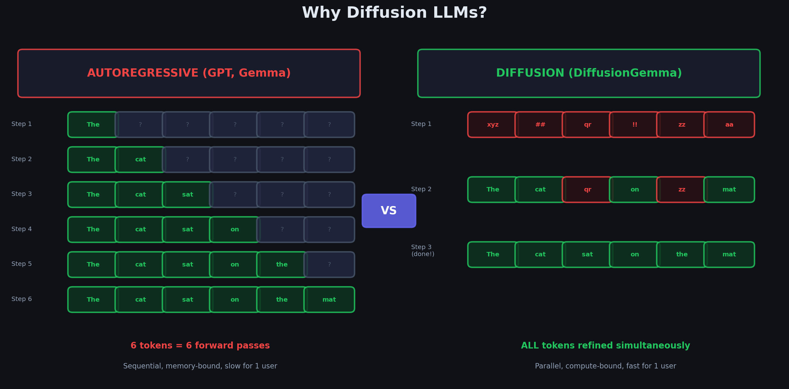
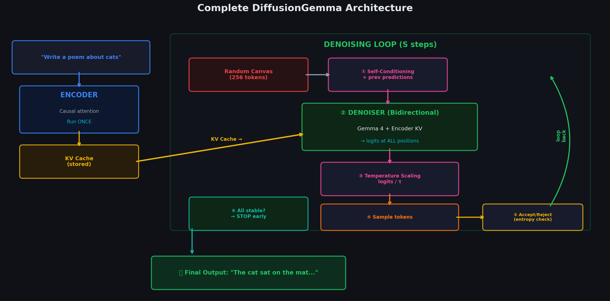
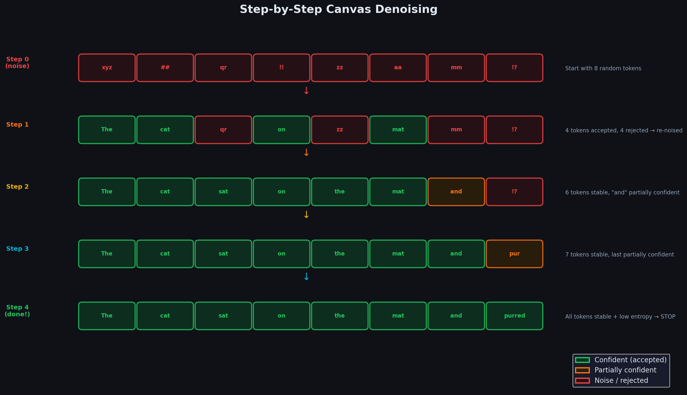

# A Visual Guide to DiffusionGemma

That's exactly what **DiffusionGemma** does. Instead of writing one word at a time (like GPT or Gemma), it generates **256 tokens simultaneously** on a canvas and refines them through iterative denoising — borrowing ideas from image diffusion models like Stable Diffusion, but adapted for text.

This guide walks you through **every piece** of how it works — from the math behind diffusion, to the architectural tricks that make it fast, to the full inference pipeline — with step-by-step derivations, worked numerical examples, and 21 hand-crafted diagrams.

---

## The Core Idea in 30 Seconds

A traditional LLM generates text like a typewriter — one token, then the next, then the next. For 256 tokens, that's 256 sequential forward passes through a 26-billion-parameter model. The GPU spends most of its time *loading weights from memory*, not actually computing.

DiffusionGemma flips this: start with 256 **random** tokens, then iteratively **denoise** them — all at once — until coherent text emerges. In ~16 steps instead of 256.

---

## What Makes This Guide Different

Most explanations of diffusion models stop at the high-level intuition. This guide goes deeper:

- **Full mathematical derivations** — every formula is derived from first principles, not just stated
- **Worked numerical examples** — we trace real numbers through real equations so you can verify each step yourself
- **21 publication-quality diagrams** — visual explanations for every major concept
- **Concrete traces** — we walk through actual 4D vectors, attention matrices, and probability distributions
- **An interactive HTML guide** — open `visual_guide.html` in your browser for a visual-first experience

---

## Reading Path

The guide is organized as a journey from foundations to the full system. Each chapter builds on the previous one. Every file is linked below — click any to start reading.

---

### Chapter 1 — Why Diffusion for Text?

The memory-bound bottleneck of autoregressive models. Why GPUs sit idle during single-user inference. How diffusion changes the compute equation.

| # | Topic | Link |
|---|-------|------|
| 1.1 | Autoregressive vs. Diffusion — the roofline model, latency math, self-correction | [01_autoregressive_vs_diffusion](01_Introduction/01_autoregressive_vs_diffusion/) |

---

### Chapter 2 — Diffusion Fundamentals

The math behind continuous diffusion (as used for images). Forward process, reverse process, the ELBO, and the simplified loss.

| # | Topic | Link |
|---|-------|------|
| 2.1 | Forward Diffusion — Gaussian noise, reparameterization trick, noise schedules | [01_forward_diffusion](02_Diffusion_Fundamentals/01_forward_diffusion/) |
| 2.2 | Reverse Diffusion — denoising, posterior mean/variance, score matching | [02_reverse_diffusion](02_Diffusion_Fundamentals/02_reverse_diffusion/) |
| 2.3 | The Diffusion Objective — ELBO derivation, simplified loss, SNR view | [03_the_diffusion_objective](02_Diffusion_Fundamentals/03_the_diffusion_objective/) |

---

### Chapter 3 — Discrete Diffusion

You can't add Gaussian noise to a word. How diffusion is reinvented for discrete tokens.

| # | Topic | Link |
|---|-------|------|
| 3.1 | From Continuous to Discrete — transition matrices, CTMC, matrix exponential | [01_from_continuous_to_discrete](03_Discrete_Diffusion/01_from_continuous_to_discrete/) |
| 3.2 | Masked Diffusion (MDLM) — absorbing-state noise, connection to BERT | [02_masked_diffusion](03_Discrete_Diffusion/02_masked_diffusion/) |
| 3.3 | Uniform State Diffusion (UDLM) — random-token corruption, self-correction | [03_uniform_state_diffusion](03_Discrete_Diffusion/03_uniform_state_diffusion/) |
| 3.4 | Comparison Table — AR vs. Masked vs. Uniform side-by-side with numerical traces | [04_comparison_table](03_Discrete_Diffusion/04_comparison_table/) |

---

### Chapter 4 — The Architecture

How a single Gemma 4 model plays *two roles* (encoder and denoiser) by switching its attention mask.

| # | Topic | Link |
|---|-------|------|
| 4.0 | Bridge — connecting theory to architecture, the mask trick, cost analysis | [00_bridge_from_theory_to_architecture](04_Architecture/00_bridge_from_theory_to_architecture/) |
| 4.1 | Gemma 4 Base Model — MoE router math, GQA, RoPE, layer anatomy | [01_gemma4_base_model](04_Architecture/01_gemma4_base_model/) |
| 4.2 | Encoder-Denoiser Patch — one model two roles, full numerical trace | [02_encoder_denoiser_patch](04_Architecture/02_encoder_denoiser_patch/) |
| 4.3 | Bidirectional Attention — inside a single layer, causal vs. bidirectional walkthrough | [03_bidirectional_attention](04_Architecture/03_bidirectional_attention/) |
| 4.4 | KV-Cache Sharing — data flow traced through layers, memory cost analysis | [04_kv_cache_sharing](04_Architecture/04_kv_cache_sharing/) |

---

### Chapter 5 — Inference

How all the pieces come together at generation time.

| # | Topic | Link |
|---|-------|------|
| 5.0 | Connecting the Components — full anatomy of one denoising step with numbers | [00_connecting_the_components](05_Inference/00_connecting_the_components/) |
| 5.1 | Self-Conditioning — the model's memory, soft embeddings, numerical trace | [01_self_conditioning](05_Inference/01_self_conditioning/) |
| 5.2 | Multi-Canvas Sampling — block diffusion for long text, KV-cache extension | [02_multi_canvas_sampling](05_Inference/02_multi_canvas_sampling/) |
| 5.3 | The Scheduler — step count, temperature schedule, adaptive stopping | [03_scheduler](05_Inference/03_scheduler/) |
| 5.4 | Entropy-Bounded Sampler — canvas init, acceptance criterion, re-noising | [04_entropy_bounded_sampler](05_Inference/04_entropy_bounded_sampler/) |

---

### Chapter 6 — Training

How to teach a pre-trained autoregressive model to do diffusion.

| # | Topic | Link |
|---|-------|------|
| 6.1 | Training Objective — ELBO for discrete diffusion, weighted cross-entropy, gradient trace | [01_training_objective](06_Training/01_training_objective/) |
| 6.2 | Fine-Tuning from Gemma 4 — timestep conditioning, what changes, what stays frozen | [02_fine_tuning_from_gemma4](06_Training/02_fine_tuning_from_gemma4/) |

---

### Chapter 7 — End-to-End Walkthrough

A complete worked example from query to final text.

| # | Topic | Link |
|---|-------|------|
| 7.1 | Full Pipeline — 3-step numerical trace on a 6-token canvas, every calculation shown | [01_end_to_end_walkthrough](07_Full_Pipeline/01_end_to_end_walkthrough/) |

---

## Key Concepts at a Glance

| Concept | What It Does | Where to Read |
|---------|-------------|---------------|
| **Uniform State Diffusion** | Corrupts tokens with random vocabulary tokens (not masks) | Ch 3 |
| **Encoder-Denoiser Patch** | One model plays two roles by switching the attention mask | Ch 4 |
| **KV-Cache Sharing** | Encoder's cached keys/values feed directly into the denoiser | Ch 4 |
| **Self-Conditioning** | The model uses its own previous predictions as extra input | Ch 5 |
| **Entropy-Bounded Sampler** | Keeps confident predictions, re-noises uncertain ones | Ch 5 |
| **Multi-Canvas Sampling** | Generates text longer than 256 tokens by stitching canvases | Ch 5 |
| **Adaptive Stopping** | Stops denoising early when the canvas has converged | Ch 5 |

---

## Mathematical Notation

| Symbol | Meaning |
|--------|---------|
| $x_0$ | Clean data (original token sequence) |
| $x_t$ | Noisy data at diffusion timestep $t$ |
| $T$ | Total number of diffusion timesteps |
| $q(x_t \mid x_0)$ | Forward process — adding noise |
| $p_\theta(x_{t-1} \mid x_t)$ | Reverse process — learned denoising |
| $\mathbf{Q}_t$ | Transition matrix at step $t$ |
| $\bar{\mathbf{Q}}_t$ | Cumulative transition matrix $\mathbf{Q}_1 \cdots \mathbf{Q}_t$ |
| $K$ | Vocabulary size (256,000 for Gemma) |
| $L$ | Canvas size (256 tokens) |
| $\mathcal{H}(p)$ | Shannon entropy |
| $\text{KL}(q \| p)$ | KL divergence |

---

## References & Further Reading

### DiffusionGemma

| Resource | Description |
|----------|-------------|
| [DiffusionGemma Technical Report](https://storage.googleapis.com/deepmind-media/gemma/DiffusionGemma_Technical_Report.pdf) | The official technical report from Google DeepMind |
| [Introducing DiffusionGemma — Google Blog](https://blog.google/innovation-and-ai/technology/developers-tools/diffusion-gemma-faster-text-generation/) | Google's announcement post with key results and benchmarks |
| [DiffusionGemma Developer Guide — Google Developers Blog](https://developers.googleblog.com/diffusiongemma-the-developer-guide/) | Hands-on guide: serving, fine-tuning, and the Sudoku showcase |
| [A Visual Guide to DiffusionGemma — Maarten Grootendorst](https://newsletter.maartengrootendorst.com/p/a-visual-guide-to-diffusiongemma) | The visual explainer that inspired this guide — beautiful diagrams walking through every concept |
| [DiffusionGemma on Google AI for Developers](https://ai.google.dev/gemma/docs/diffusiongemma) | Official docs: model overview, serving config, and API |
| [DiffusionGemma on Hugging Face](https://huggingface.co/google/diffusiongemma-26b-it) | Download weights (Apache 2.0 license) |
| [DiffusionGemma in vLLM — vLLM Blog](https://vllm.ai/blog/2026-06-10-diffusion-gemma) | How vLLM integrated the first diffusion LLM: per-sequence causal attention, speculative decoding path reuse |
| [DiffusionGemma Explained — Analytics Vidhya](https://www.analyticsvidhya.com/blog/2026/06/diffusiongemma-diffusion-based-open-model-for-faster-text-generation/) | Walkthrough with hands-on llama.cpp local inference |

### Gemma 4 (the base model)

| Resource | Description |
|----------|-------------|
| [A Visual Guide to Gemma 4 — Maarten Grootendorst](https://newsletter.maartengrootendorst.com/p/a-visual-guide-to-gemma-4) | Visual deep dive into Gemma 4's architecture: MoE, PLE, MTP drafters |
| [A Visual Guide to Gemma 4 12B — Maarten Grootendorst](https://newsletter.maartengrootendorst.com/p/a-visual-guide-to-gemma-4-12b) | How Gemma 4 12B removed vision/audio encoders entirely |
| [Welcome Gemma 4 — Hugging Face Blog](https://huggingface.co/blog/gemma4) | Community integration: transformers, llama.cpp, MLX, WebGPU |
| [Gemma 4 Documentation — Google AI](https://ai.google.dev/gemma/docs/core) | Official model cards and architecture details |

### Foundational Papers

| Paper | Why It Matters |
|-------|---------------|
| [Ho et al., 2020 — DDPM](https://arxiv.org/abs/2006.11239) | Foundation of modern diffusion models — the simplified loss |
| [Song et al., 2020 — DDIM](https://arxiv.org/abs/2010.02502) | Deterministic sampling, fewer steps |
| [Austin et al., 2021 — D3PM](https://arxiv.org/abs/2107.03006) | Discrete diffusion with transition matrices |
| [Sahoo et al., 2024 — MDLM](https://arxiv.org/abs/2406.07524) | Masked Diffusion Language Models |
| [Ou et al., 2024 — UDLM](https://arxiv.org/abs/2402.03701) | Uniform-noise discrete diffusion |
| [Arriola et al., 2025 — Block Diffusion](https://arxiv.org/abs/2503.09573) | Multi-canvas generation for long sequences |
| [Sahoo et al., 2025 — Scaling Beyond Masked Diffusion](https://arxiv.org/abs/2602.15014) | Systematic comparison of masked, uniform, and interpolating diffusion at scale |
| [Nie et al., 2025 — Scaling up Masked Diffusion on Text](https://arxiv.org/abs/2410.18514) | Scaling laws for diffusion language models (ICLR 2025) |

### Learning Resources

| Resource | Description |
|----------|-------------|
| [What are Diffusion Models? — Lilian Weng](https://lilianweng.github.io/posts/2021-07-11-diffusion-models/) | The classic deep dive: DDPM, score matching, classifier guidance, consistency models |
| [What are Diffusion Language Models? — Xiaochen Zhu](https://spacehunterinf.github.io/blog/2025/diffusion-language-models/) | Comprehensive overview of the DLM landscape: history, paradigms, future directions |
| [Diffusion Explainer — Interactive Visualization](https://poloclub.github.io/diffusion-explainer/) | Interactive web tool to visualize Stable Diffusion step by step |
| [Awesome Diffusion Language Models — VILA-Lab](https://github.com/VILA-Lab/Awesome-DLMs) | Curated list of papers, frameworks, and benchmarks for DLMs |
| [Diffusion Models in Text Generation: A Survey](https://peerj.com/articles/cs-1905/) | Academic survey of diffusion approaches for text (PeerJ 2024) |

---

*Built with step-by-step math, 21 diagrams, and a lot of attention to making diffusion for text actually make sense.*
